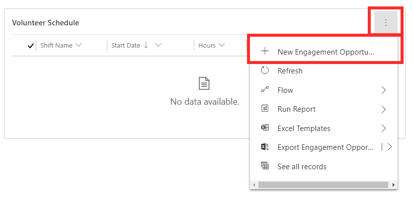

This exercise will take you through the steps of setting up an engagement opportunity. You will create a new engagement opportunity and add in details regarding the location, requirements, and schedule. You will then configure message and post settings for the opportunity.

At the end of this exercise, you will be able to accomplish the following:

- Create a new engagement opportunity

- Add in requirements for the engagement opportunity

- Set up a schedule for the engagement opportunity

- Configure message settings for the engagement opportunity

- Configure post settings for the engagement opportunity

- Publish the engagement opportunity

> [!IMPORTANT]
> Before you begin, to achieve the maximum effect for this lab and the other labs, it is recommended that you have deployed Volunteer Management with the sample data.

## Create a new engagement opportunity

1.  In Volunteer Management, select the **Volunteering** area from the bottom of the screen.

1.  Select **Engagements** from the left navigation menu.

1.  Select **+New** to create a new engagement opportunity.

1.  Enter the following details into the new engagement opportunity form:

    -   **Engagement Title:** Clean Up Day

    -   **Location Type:** On Location

    -   **Short Description:** Clean up waste at Saltwater State Park.

    -   **Multiple Days:** No

    -   **Start Date:** One month from current date

    -   **Has Shifts:** Yes

1.  Save the record.

1.  Select the **Description** tab of the Clean Up Day engagement opportunity record.

1.  Enter in the following details:

    -   **Detailed Description:** This is an initiative to clean up waste at Saltwater State Park to help conserve our environment. We will be providing volunteers with gloves and other tools needed for the clean-up. Volunteers should bring bottled water to drink and wear sturdy shoes.

1.  Select the **Location** tab of the Clean Up Day engagement opportunity record.

1.  Enter in the following details:

    -   **Location Name:** Saltwater State Park

    -   **Street 1:** 25205 8th PI S

    -   **City:** Des Moines

    -   **State/Province:** Washington

    -   **Zip/Postal Code:** 98198

    -   **Country/Region:** USA

    -   **Primary Contact:** Anthony Ivanov

## Set up requirements

1.  Select the **Requirements** tab of the Clean Up Day engagement opportunity record.

1.  Select **+Add Qualification**.

1.  Enter the following details for the qualification:

    -   **Qualification Type:** Background Check

    -   **Required:** No

1.  **Save and close** the qualification.

1.  Select more commands in the Preferences section and select **+Add** **Preference**.

1.  Select **Family Friendly** as the preference type then select **Save and Close**.

## Set up schedule

1.  Select the **Schedule** tab of the Clean Up Day engagement opportunity record.

1.  Select more commands in the Volunteer Schedule section and select **+New Engagement Opportunity Schedule**.

	> [!div class="mx-imgBorder"]
	> 

1.  Enter the following details for the new schedule:

    -   **Shift Name:** Morning Shift

    -   **Start Date:** 7:00am

    -   **End Date:** 11:00am

    -   **Min \# of Participants:** 20

    -   **Max \# of Participants:** 60

1.  **Save and Close** the schedule.

1.  To create another shift, select more commands in the Volunteer Schedule section and select **+New Engagement Opportunity Schedule** again.

1.  Enter the following details for the new schedule:

    -   **Shift Name:** Afternoon Shift

    -   **Start Date:** 12:00pm

    -   **End Date:** 4:00pm

    -   **Min \# of Participants:** 20

    -   **Max \# of Participants:** 60

1.  **Save and Close** the schedule.

1.  Select **Save** on the engagement opportunity record to see the Participants Needed section update.

## Configure message settings

1.  Select the **Message Settings** tab of the Clean Up Day engagement opportunity record.

1.  Select **+New Automated Message**.

1.  Enter the following details into the message settings:

	-   **Send When:** Sign Up Completed
	
	-   **Sent To:** All Volunteers
	
	-   **Subject:** Thank you for signing up
	
	-   **Text:** Thank you for signing up to participate in the upcoming clean-up day. We are currently reviewing applications and will be in touch with you shortly.

1.  **Save and Close** the message setting.

## Configure post settings

1.  Select the **Post Settings** tab of the Clean Up Day engagement opportunity record.

1.  Check that the post settings are configured as the following:

	-   **Public Address:** Yes
	
	-   **Public City:** Yes
	
	-   **Automatically Approve All Applicants:** No

## Publish the engagement opportunity

1.  Select **Save** on the Clean Up Day engagement opportunity record.

1.  In the task bar at the top of the record, select **Publish** \> **Publish to the Web**.

1.  Confirm the publish.

1.  Select **Shift Schedule** from the left navigation bar in Volunteer Management.

1.  Change the calendar to month view and navigate to the month you set up the engagement opportunity for. You should see the shifts appear in the calendar.