This unit will explore the steps involved with setting up an event in Fundraising and Engagement.

## Event setup 

New events can be created via the **Event Setup** area in the Events module of Fundraising and Engagement. The example shown throughout this module will be for a Celebrity Chef Dinner event. The screenshot below shows the creation of a new event.

> [!div class="mx-imgBorder"]
> [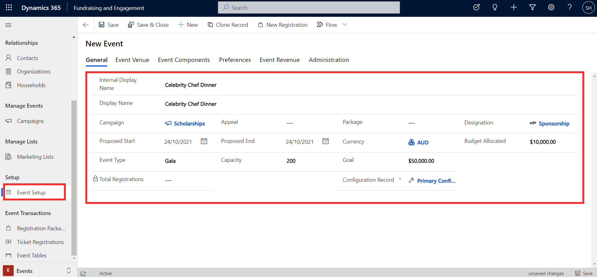](../media/event-setup-view.png#lightbox)

When creating a new event record, you can specify an Internal Display Name, used internally to identify the event and Display Name, which is used externally. The event can be associated to an existing campaign, appeal, package, and designation. It can be given a proposed start and end date. The event can have an allocated budget, and the goal column specifies the fundraising goal for the event. Total registrations will be automatically calculated as registrations are added to the event.

## Event venue

Users can go to the **Event Venue** tab of the record to specify the location for the event. **Venue** is a lookup column to organizations that have been created in Fundraising and Engagement. When you select the venue (organization), the address for that venue will be automatically populated here.

> [!div class="mx-imgBorder"]
> [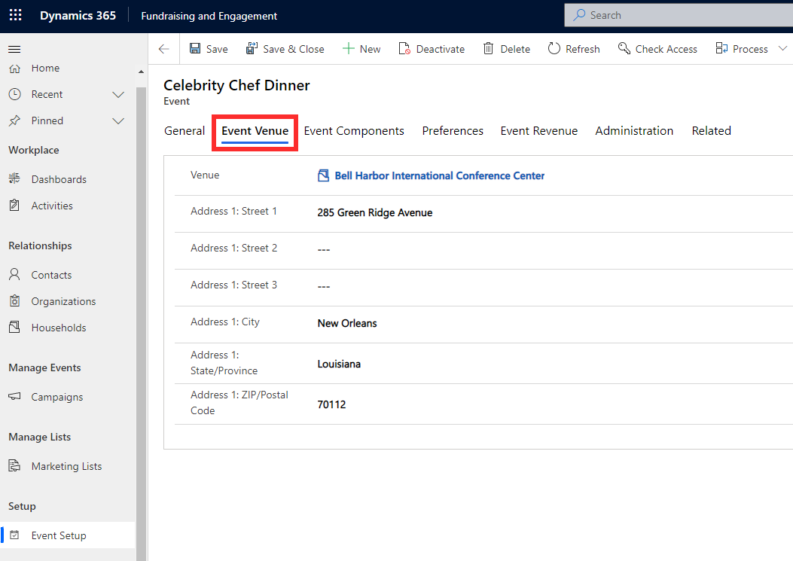](../media/event-venue.png#lightbox)

## Event components

Components include tickets, donations, sponsors, products, and disclaimers related to the event, which can be added to registration packages as they are created. They are set up in the **Event Components** tab.

**Disclaimers** are a way to ensure that attendees are aware of a specific detail related to the event, such as accessibility at the venue. Click **+New Event Disclaimer** in the event components tab to create a new disclaimer record, and enter in a name and description for the disclaimer.

> [!div class="mx-imgBorder"]
> [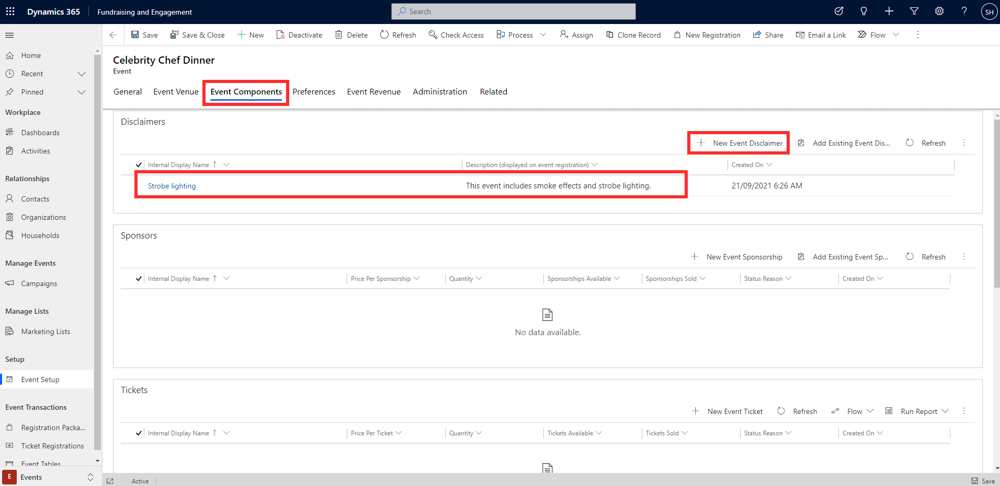](../media/event-components.png#lightbox)

**Sponsors** are used to offer attendees the opportunity to become a paid sponsor for the event. The **+New Event Sponsorship** button in the event components tab allows you to set a name, price, and quantity for each event sponsorship. For example, an organization may want to sign up as a Gold sponsor, which costs \$2000. If you only want to allow three Gold sponsors, enter that as the maximum number in the quantity column of the event sponsorship record.

> [!div class="mx-imgBorder"]
> [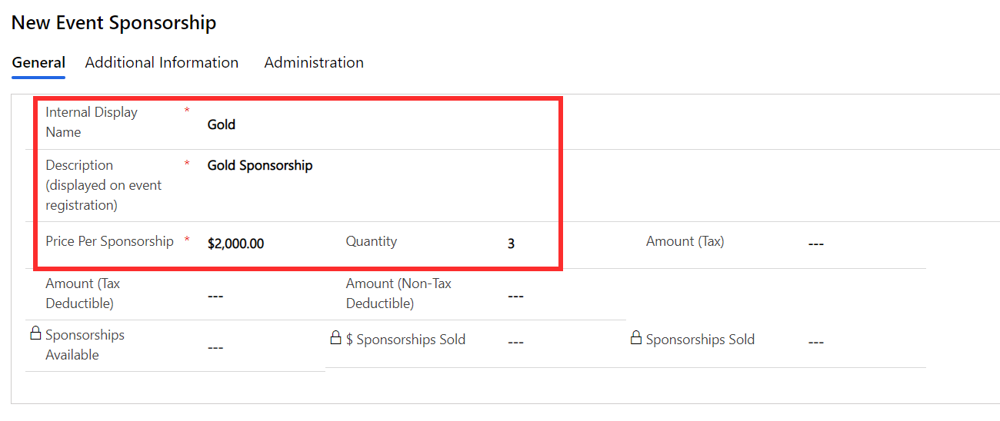](../media/sponsorship.png#lightbox)

The screenshot below shows that two sponsorships, Gold and Silver, have been set up for the event.

> [!div class="mx-imgBorder"]
> [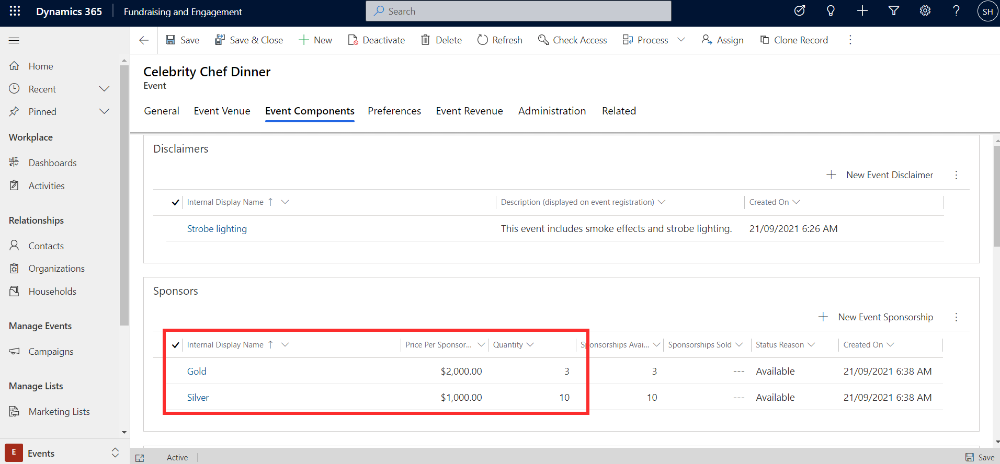](../media/two-sponsorships.png#lightbox)

The **Tickets** area allows you to set up the types of tickets available to attendees, including the ticket name, price, quantity, and maximum number of tickets per registration. To add a new ticket, click **+New Event Ticket** from the event components tab. Tickets can be configured as either an **individual** or **table** ticket. If you are setting up tables for your event, it is important to select the table option here, and enter the number of people at the table in the registrations per ticket column, because this automatically sets up corresponding event table records, which you can use later to allocate registrations to tables.

The screenshot below shows an example of an individual ticket setup. Based on the details provided, each ticket will cost \$100 and there is a total of 160 tickets of this type available. We have limited the number of tickets that can be purchased through a single registration package to 10.

> [!div class="mx-imgBorder"]
> [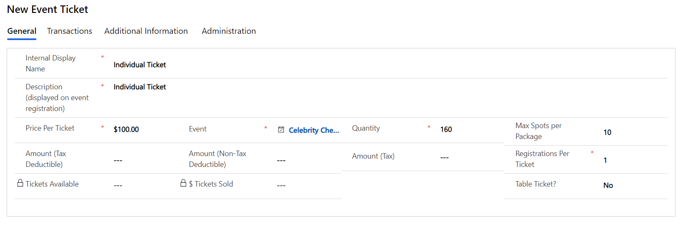](../media/event-ticket.png#lightbox)

In the next example, a table ticket has been created. Based on the details provided, each ticket will cost \$400, which includes four registrations. Thus, each time the Table for four tickets is purchased, four registrations will be created, each linked to a different contact. There is a maximum of 10 of these ticket types available, and only one can be purchased through a single registration package.

> [!div class="mx-imgBorder"]
> [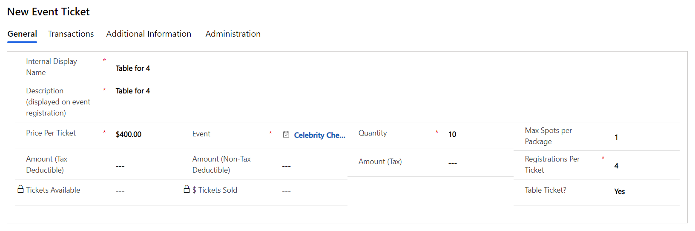](../media/table-ticket.png#lightbox)

**Products** are another type of event component. They provide the ability to offer a product for sale in relation to the event, such as a signed book or event t-shirt, as an avenue for other fundraising. To add a new product, click **+New Event Product** from the Event Components tab and enter the name, price, available quantity, and maximum number permitted per registration for the product.

The example below shows Signed Recipe Book as an available product for the Celebrity Chef Dinner event. The price per book is \$80 and there are 50 copies available. A maximum of three books can be purchased per registration.

> [!div class="mx-imgBorder"]
> [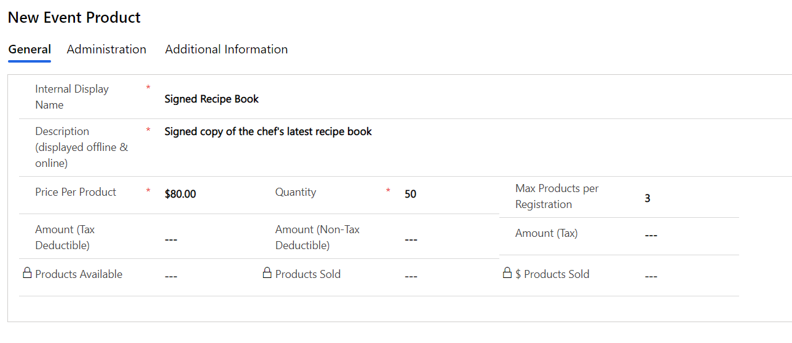](../media/event-product.png#lightbox)

**Donations** provide the ability to offer a donation of a set amount in relation to the event. The **+New Event Donation** button allows users to link a new donation to the event, and provide a name, description, and amount. The screenshot below shows the Support Tanzania donation that has been set up for the value of \$150.

> [!div class="mx-imgBorder"]
> [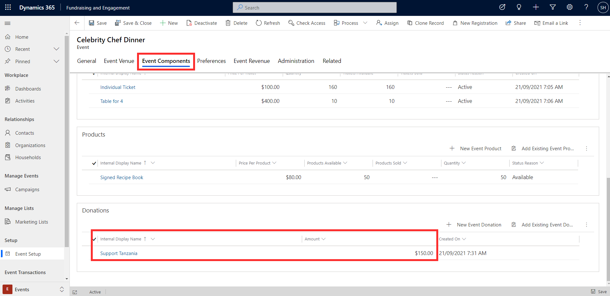](../media/donations.png#lightbox)

## Preferences

The **Preferences** tab on an event record is where users can set up a catalog of attendee preferences related to the event. For example, this is where you can record attendee dietary or accessibility requirements.

> [!div class="mx-imgBorder"]
> [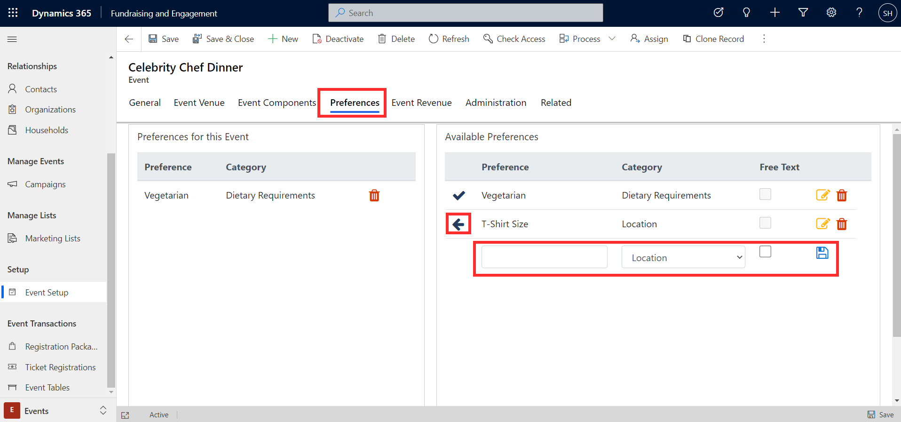](../media/preferences.png#lightbox)

The available preferences section displays a list of preferences that have already been set up for events in Fundraising and Engagement. Clicking the arrow button next to an available preference will add it as a preference for this event, in the section on the left side of the page. More preferences can be added and saved, and existing preferences can also be edited and deleted.

## Event revenue

A summary of the event revenue can be accessed via the **Event Revenue** tab of the event record. These are read-only columns, which are automatically calculated. Details such as total revenue from sponsorships, tickets, products, donations, and packages can be viewed here.

> [!div class="mx-imgBorder"]
> [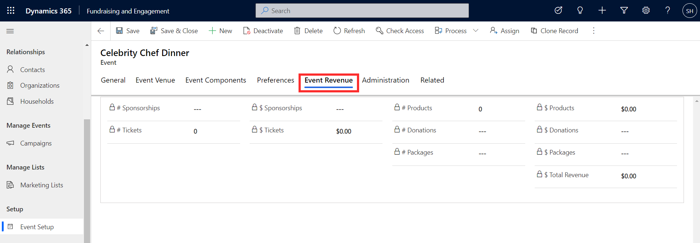](../media/event-revenue.png#lightbox)
