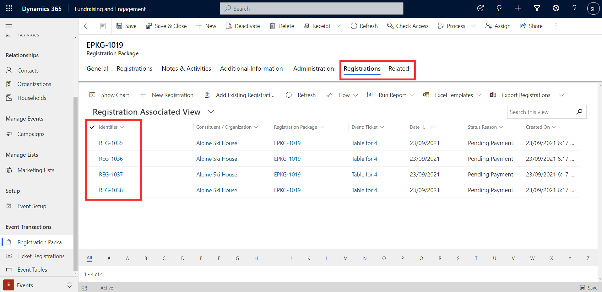
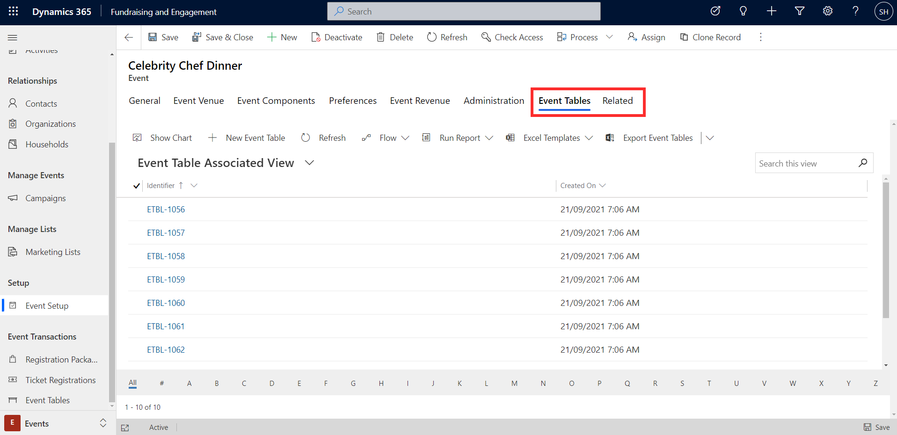
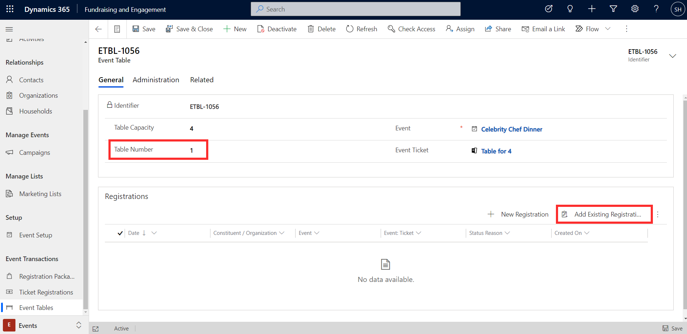
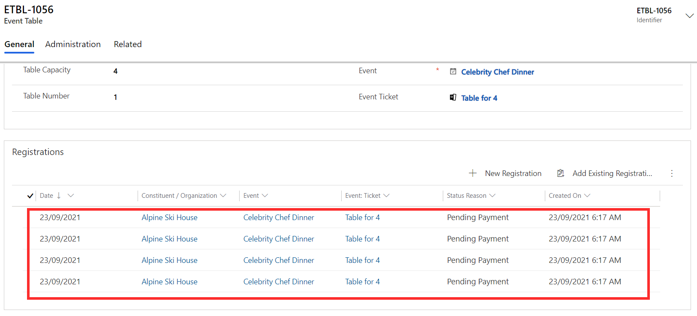
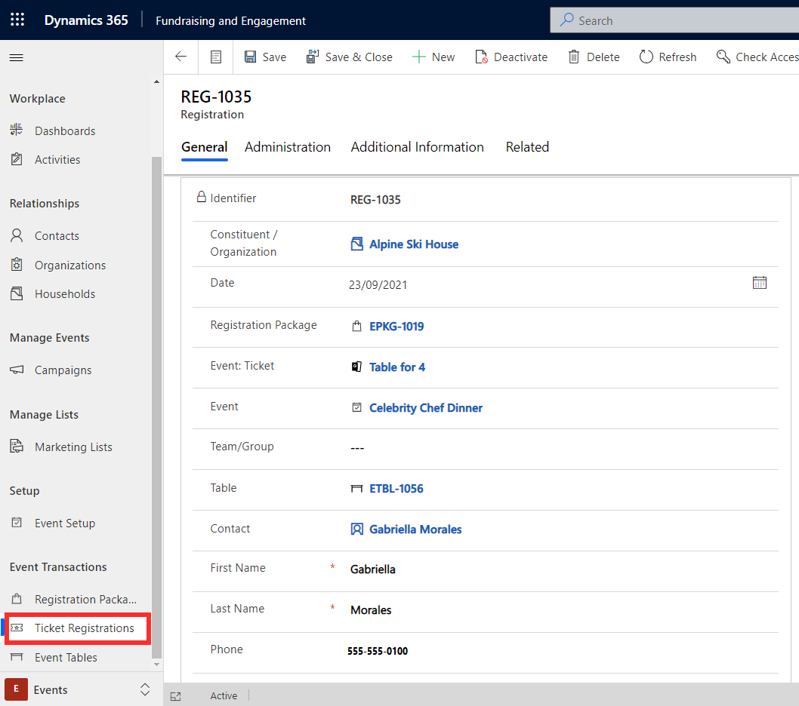

In the example earlier in this module, 10 table-type tickets were created for the Celebrity Chef Dinner event. When you select table in the ticket creation, event table records associated with the event are automatically created. From here, event attendees can be assigned to a particular table.

To assign attendees to a table, first view the registration package from the **Related** > **Registrations** tab on the event. The identifier for each individual registration you will need to add for each individual registration to a table.

> [!div class="mx-imgBorder"]
> 

From the event record, go to the **Related** > **Event Tables** tab to see the list of table records that have been created for the event.

> [!div class="mx-imgBorder"]
> 

Click through to provide a number for each table in the **Table Number** on the table record. Then click **Add Existing Registration** to add individual, existing registrations to a table.

> [!div class="mx-imgBorder"]
> 

In the example below, four registrations included in the previously created Alpine Ski House registration package have been added to the table. Registrations are added by looking up the identifier (Registration ID) noted earlier.

> [!div class="mx-imgBorder"]
> 

## Ticket registrations

Tickets created during the registration process can be viewed from **Ticket Registrations** in Fundraising and Engagement. This provides an overview of each registration. Attendees should be registered by creating a **registration package** as described in this module. Do not create registrations or tickets from here. This view is for visibility and reporting only.

The screenshot below shows the Celebrity Chef Dinner registration record created for Gabriella Morales. Details relating to the registration appear here, such as the attendee's associated registration package, ticket type, assigned table, and event preferences.

> [!div class="mx-imgBorder"]
> 