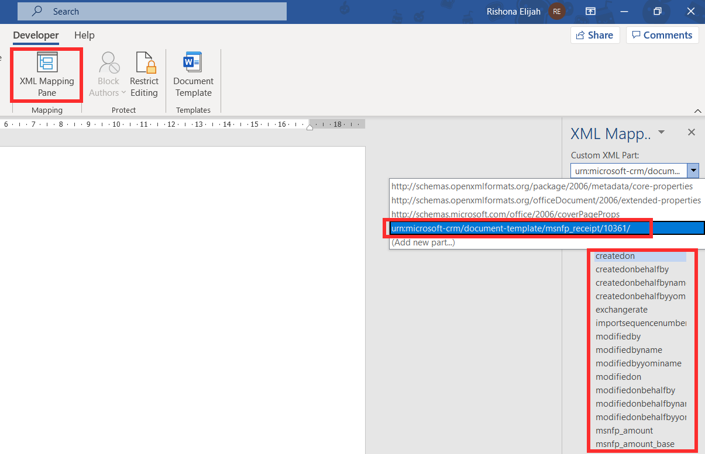

Receipt records in Fundraising and Engagement contain all the receipt information for a transaction. A unique sequential receipt number is generated for each receipt.

A receipt record can be generated directly from a transaction record as shown in the screenshot below. Once the transaction has been processed, the **Generate Receipt** button can be found in the task bar at the top of the record.

> [!div class="mx-imgBorder"]
> 

Pressing this button will create a receipt number with a linked receipt record in the **receipt \#** column.

> [!div class="mx-imgBorder"]
> 

A list of all receipt records can be found in the Receipts area of the navigation menu. On the record, you can view the following information:

> [!div class="mx-imgBorder"]
> 

The **generated / printed** column displays the incremental number of times the receipt has been printed or generated. **Receipt issue date** is the date the receipt was generated. You can indicate in the **email delivery status** column whether the receipt is ready to be delivered.

## Receipt Stacks

Receipt Stacks are an administrative function in Fundraising and Engagement that allow you to group receipts, typically by financial year. Each receipt stack uses a unique prefix to assist in identifying either how, when, or where a receipt is produced. For example, if an organization operates from both California and New York, they may add a prefix of either CA or NY before the receipt number for easy identification. Or to easily identify that a gift was receipted in the financial year of 2022, a prefix of 22 may be added before the receipt number.

All receipt stacks can be accessed via Receipt Stacks from the left navigation menu in the Gifts area of Fundraising and Engagement.

> [!div class="mx-imgBorder"]
> 

You can provide an internal display name, which is the name for the receipt stack as referenced by users. Prefix is used to add to the unique receipt identifier. Starting range refers to the first number that the system will use for receipting gifts, and which increments. Current range will display the most recent receipt number used in the solution. You can also specify the year that the receipt stack pertains to. For example, if a gift was given in 2022, it will search for a receipt stack in that year.

## Receipt Logs

In Fundraising and Engagement, it is possible to access an audit trail of activities that occurred related to receipts. This can be viewed from the Receipt Log area. Receipt logs are automatically updated based on user activity and allows users to see when a receipt is voided or reissued.

> [!div class="mx-imgBorder"]
> 

If the gift is refunded or voided, the receipt can also be voided or reissued via the associated transaction record for the gift. From the transaction, the **Receipt** button in the task bar at the top of the record will give the user the option to either select **Void (Reissued)** or **Void**. This will update the receipt's status and unique identifier to reflect the action taken.

> [!div class="mx-imgBorder"]
> 

## Receipt documents

To print out a receipt or a thank-you letter, organizations must first set up their own template in Fundraising and Engagement. This allows you to customize the document and specify where dynamic columns appear. The steps below show how to upload a receipt template, and the same steps can be applied for uploading a thank-you letter.

Template settings can be found in Fundraising and Engagement Advanced Settings \>Business category \> Templates \> Document Templates.

> [!div class="mx-imgBorder"]
> 

> [!div class="mx-imgBorder"]
> 

Within the Document Template settings, specify the type of document you would like to create. To create a receipt, select Word Template, and the Filter by entity option should be set to **Receipt**. Depending on the purpose of the document template being created, the relevant entity (table) should be selected. Then, click **Select Entity**.

> [!div class="mx-imgBorder"]
> 

You can then download the Word Template which contains the exported entity as XML data. The receipt columns can be found by going to Developer \> XML Mapping Pane in Word and selecting the last option in the Custom XML Part drop down list. Here, you can see the receipt columns which can be mapped within the receipt template on Word.

> [!div class="mx-imgBorder"]
> 

For more information on XML mapping, [refer](https://docs.microsoft.com/en-us/dynamics365/sales-professional/manage-word-templates) to this learning module.

The completed template document can be uploaded by clicking **Upload Template** back in the Advanced Settings.

> [!div class="mx-imgBorder"]
> 

To download and use templates that have been activated, navigate to the record and select Word Templates from the task bar. The example below shows where this can be found on a transaction record to obtain the printed receipt.

> [!div class="mx-imgBorder"]
> 

> [!div class="mx-imgBorder"]
> 

Similarly, to generate a thank you letter, you can click the **Print Thank You** button on a donor commitment record.

> [!div class="mx-imgBorder"]
> 

Documents such as receipts and thank you letters can be automatically emailed to donors by building a flow in Power Automate that utilizes the Dataverse trigger. For example, the workflow could be: When a receipt is created in the receipt data table in Dataverse, email the receipt and thank you documents to the donor. [See here for more information on the Dataverse connector in Power Automate.](/power-automate/dataverse/overview)
