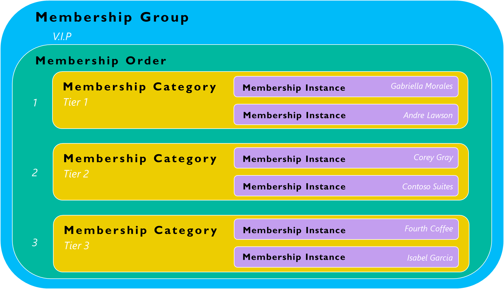

Memberships in Fundraising and Engagement allow a constituent to participate in, or belong to, a specific group. A constituent can hold one or more memberships. Memberships may or may not involve a fee for the constituent.

Memberships in Fundraising and Engagement include the following components:

-   Membership Groups

-   Membership Categories

-   Membership Orders

-   Membership Instances

The following diagram highlights how each of the components relates to one another as a hierarchy. The white text in the diagram refers to an example.

> [!div class="mx-imgBorder"]
> 

-   **Membership groups** allow you to group membership categories together. For example, a nonprofit organization may use memberships as a way to track a constituent's V.I.P. level. Thus, V.I.P. would be the membership group.

-   **Membership categories** can be considered the main membership record. Membership category represents the different types of memberships available within a membership group. Within the V.I.P. group, there are three different classifications for V.I.P.: Tier 1, Tier 2, and Tier 3.

-   **Membership orders** connect membership categories to membership groups. This creates a list of membership options available to the user when processing a membership.

-   **Membership instances** are the full reference list of memberships by constituent. They are what associates a contact or organization record to a particular membership.