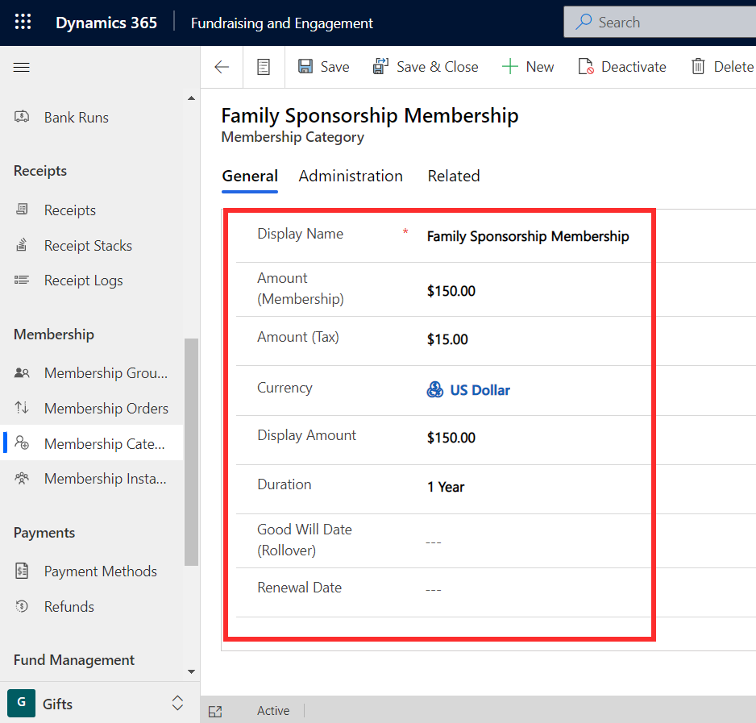
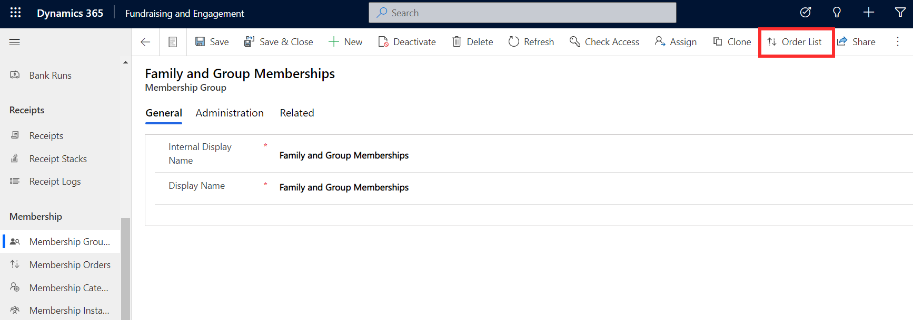
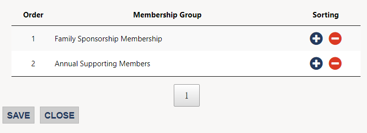

Memberships are managed in the Gifts area of Fundraising and Engagement. Below, you will see how to create a membership category and membership group. Membership orders is the table that connects membership categories and membership groups.

## Create a membership category

Membership categories can be viewed and created via the Membership Categories area. This is where you list the types of memberships you have available.

> [!div class="mx-imgBorder"]
> 

You can provide a name for the membership category, and the cost of the membership if applicable. **Display amount** is a user-friendly display for the membership amount. Duration column is a drop-down to specify the duration of the membership, based on number of months, years, or lifetime, if applicable. Setting this automatically sets the expiry date of the related membership instance. **Good will date (rollover)** is where you can specify the date at which any memberships accepted on or past this will roll over to the next membership cycle.

The **Add to Group** button located in the task bar at the top of the membership category record will open a pop-up window. Here, you can add the membership category to one or multiple membership groups.

> [!div class="mx-imgBorder"]
> 

## Create a membership group

Membership groups can be created from the Membership Groups area of Fundraising and Engagement. The screenshot below shows an example of a membership group called Family and Group Memberships. This is the group we associated the membership category Family Sponsorship Membership to above. Membership group records contain an internal display name and display name. The internal display name will appear on the transaction.

When viewing a membership group record, you can see all the associated membership categories by clicking the **Order List** button in the task bar at the top of the record.

> [!div class="mx-imgBorder"]
> 

This button opens a pop-up where you can order how the related membership categories are presented to users during the transaction or payment schedule process. Sorting is rearranged by using the **+** and **-** buttons next to the membership category name.

> [!div class="mx-imgBorder"]
> 