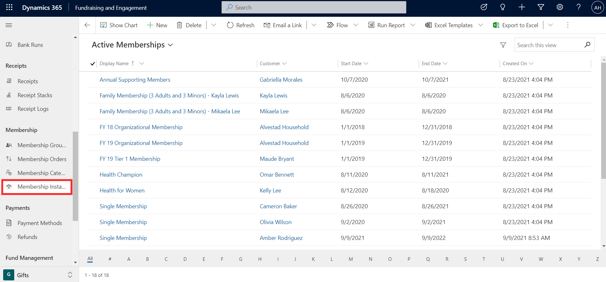

Membership instances provide you with a list of memberships assigned to contacts and organizations in the system. From here, you have visibility and access to reporting on memberships by viewing details such as membership name, related constituent, start date, end date, and date membership was created. For example, it can be used to find all memberships ending on a certain date.

While there is a +New button in the Membership Instances area, memberships should not be created from here. Memberships should be assigned as shown earlier in this module via contact or organization record or through transaction.

> [!div class="mx-imgBorder"]
> 
