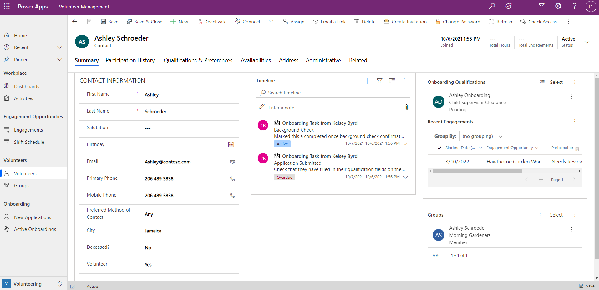
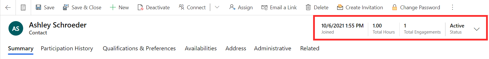
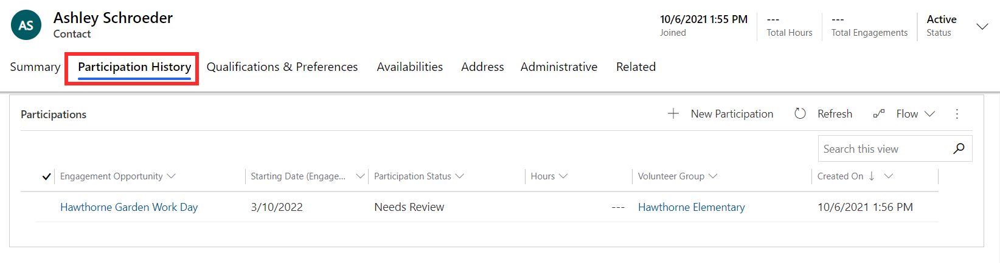
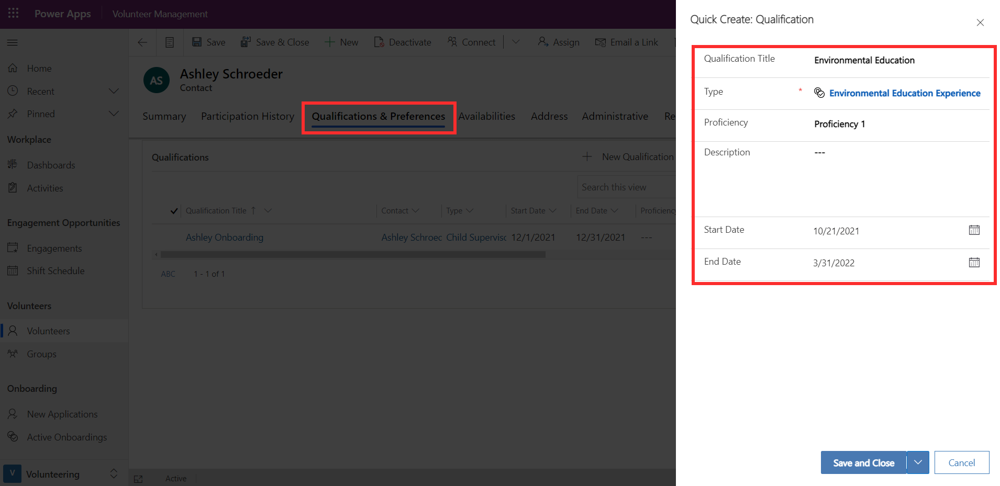
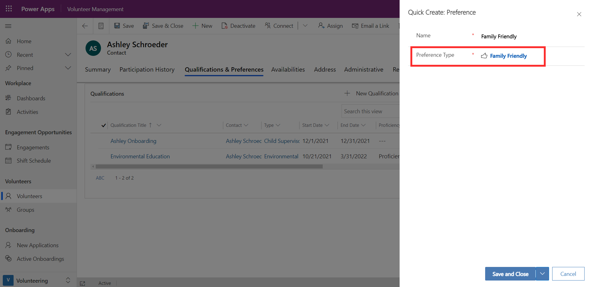
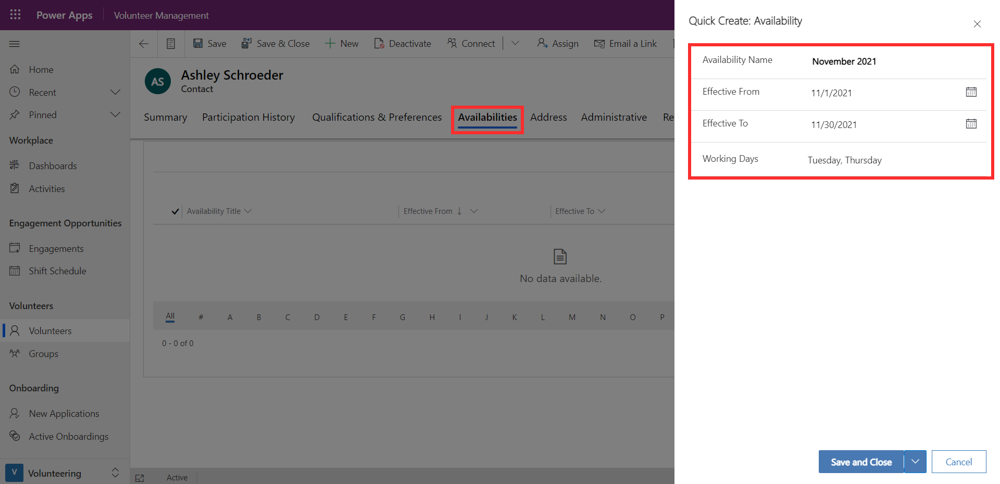

In Volunteer Management, the volunteer is a type of contact record that allows you to access and manage details about the volunteers that your organization engages with. As a volunteer manager, this provides you with a complete profile and history of your volunteers across all their interactions. The screenshot below shows the record of volunteer Ashley Schroeder, which can be accessed from the Volunteer area in the left navigation bar.

> [!div class="mx-imgBorder"]
> 

From the Summary tab, you can view the volunteer's contact and personal information. Their address details are stored in the Address tab.

The timeline section in the Summary tab displays a history of activities and interactions with the volunteer. The timeline is made up of three types of records:

- **Activities**: Includes a timeline of appointments, emails, phone calls, and tasks. For example, if a user had a phone call with the volunteer, the details and discussion points can be recorded as a phone call activity.

- **Notes**: Use notes to capture information about conversations, feedback, important points, or any ongoing information that would be useful to store. You can also add attachments to notes.

- **Posts**: Auto Posts are system-generated and notify you of activity that has occurred.

Any messages manually or automatically sent out from the system to the volunteer will appear in their timeline.

You can also see a snapshot of the volunteer's onboarding qualifications and groups they belong to.

On the top-right corner of the record, you can see the date that the volunteer joined and their current status. It also displays the total hours they've worked and the number of engagements they've been involved in.

> [!div class="mx-imgBorder"]
> 

## Participation history

The Participation History tab on the volunteer's record provides you with an overview of their recent engagements. You can also add them to a new engagement from here.

> [!div class="mx-imgBorder"]
> 

While volunteer managers can update volunteer details from the app, it's also possible for volunteers to update their information themselves from the Volunteer Engagement portal. For more on this, refer to Module: Engage Volunteers with Volunteer Engagement

## Qualifications and preferences

You can see existing qualifications and preferences for a volunteer from their record and add new ones. For example, if Ashley notifies the volunteer manager that she has experience in Environmental Education, they can add the qualification here on the Qualifications & Preferences tab. They add the type of qualification, level of proficiency, start date, and end date for qualifications that expire and need to be renewed.

> [!div class="mx-imgBorder"]
> 

If Ashley tells the volunteer manager that she's interested in Family Friendly engagement opportunities, they can add the preference to her profile.

> [!div class="mx-imgBorder"]
> 

## Availability

To manage when a volunteer is available to participate in engagements, you can add in their availability schedule from the Availabilities tab. For example, if Ashley advises that she's available to participate on Tuesdays and Thursdays during November 2021, an availability schedule can be created for her as shown below.

> [!div class="mx-imgBorder"]
> 
