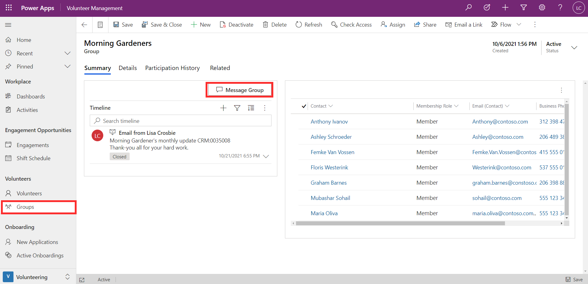
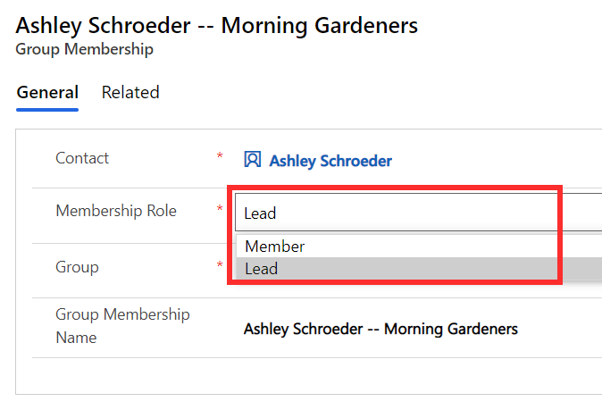
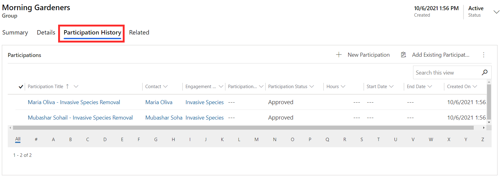

Groups allow you to categorize volunteers together based on a certain characteristic. For example, they could be used to group together volunteers from a particular organization (for example, corporate volunteering days), or those who share a common interest.

The screenshot below shows an example of a group that has been set up for Morning Gardeners. The group provides you with a summary of all members and a timeline of activities. From the timeline, it's also possible to send a message to all the group members.

> [!div class="mx-imgBorder"]
> 

Group members can be allocated a role. The primary member(s) of the group are shown by setting their role to Lead.

> [!div class="mx-imgBorder"]
> 

From the Participation History tab of the group, you can see a list of all engagement activities members have been involved in.

> [!div class="mx-imgBorder"]
> 
