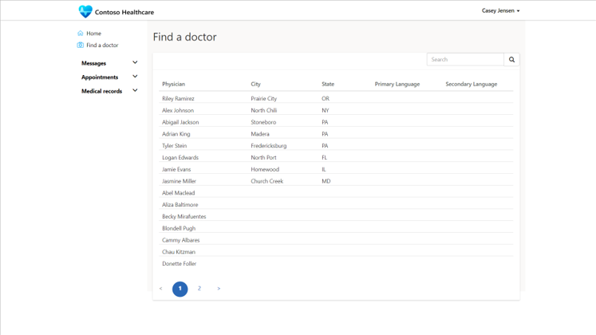
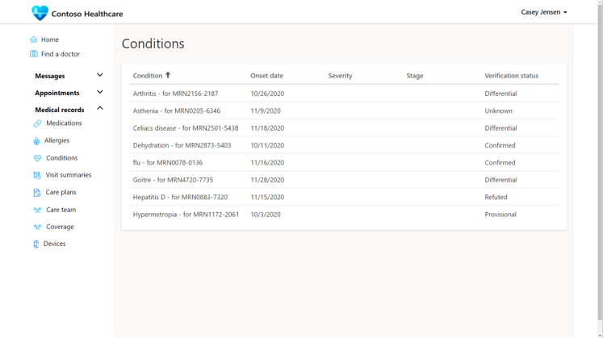
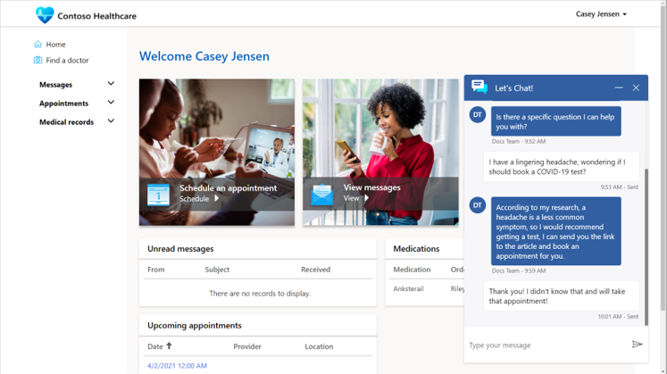

## Introduction

A benefit to both medical organizations and their patients is to provide self-service capabilities to allow patients to schedule appointments, communicate with their care team, and view their own medical information.

> [!div class="mx-imgBorder"]
> 

The Microsoft Cloud for Healthcare Patient Access portal is a Power Apps portals app that allows the ability for patients to interact with their related information securely and privately in the same Dataverse that is used by other Microsoft Cloud for Healthcare apps.

The Patient Access portal can be configured based on the needs of the organization. The patient portal should be simple to navigate and easy to use with minimal training or instruction.

## Find a doctor

The portal can show a list of potentially available medical practitioners for patients to choose. The portal view can be configured to display contact information or instructions for next steps. The doctor will need to be added to the Dataverse contacts table from one the apps such as Care Management app and flagged as a Practitioner to be listed in the directory.

> [!div class="mx-imgBorder"]
> 

## Messages

The messages section allows patients to send and receive secure messages from their health care team. Messages work like email, but the content is protected on the portal for sensitive medical information and communications.

> [!div class="mx-imgBorder"]
> 

## Appointments

The appointments section on the portal allows patients to schedule appointments with someone from the care team. The patient can initiate an immediate virtual appointment (which will use Microsoft Teams) or by booking a scheduled virtual or in-person clinic visit.

Booking an appointment online provides a more efficient way of scheduling an appointment than calling busy switchboards or leaving voice messages. The portal can also navigate the patient to collect some key information before an appointment to better equip a medical practitioner's engagement.

> [!div class="mx-imgBorder"]
> 

The scheduled appointment will appear on the medical practitioner's appointment dashboard in the Microsoft Cloud for Healthcare apps.

## Medical records

The Patient Access portal provides the ability for a patient to view their own medical information as it is tracked by the medical practitioners in the Microsoft Cloud for Healthcare apps. The portal provides privates views to Dataverse to show the following medical information:

- Medications

- Allergies

- Conditions

- Visit summaries

- Care plans

- Care team

- Coverage

- Devices

> [!div class="mx-imgBorder"]
> 

## Live chat with a medical professional

The patient portal also can start a chat with the Azure Health Bot that can be escalated to a live chat with a medical practitioner using the Patient Service Center app. The details of the conversation can be tracked against the patient record in Dataverse.

> [!div class="mx-imgBorder"]
> 

> [!VIDEO https://www.microsoft.com/videoplayer/embed/]
