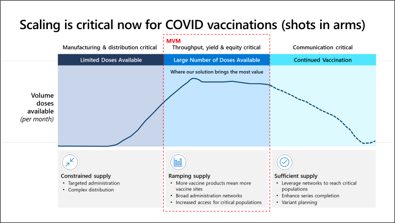
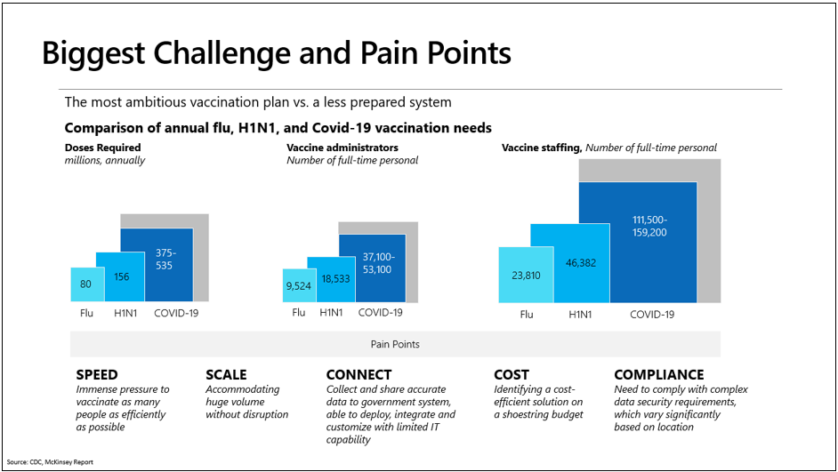

The COVID-19 pandemic is challenging government agencies, healthcare organizations, and vaccination centers to vaccinate communities at an unprecedented pace. This challenge requires a rapid response at an extraordinary scale.

> [!div class="mx-imgBorder"]
> 

Microsoft Vaccination Management is built on Microsoft Power Platform and provides tools to help organizations quickly and more securely roll out vaccination programs. Administrators can quickly set up vaccination sites with simple, customizable tools, share data with external systems in a more secure manner, and evolve to meet community needs.

> [!div class="mx-imgBorder"]
> 

Microsoft Vaccination Management targets the middle-tier market where limited doses and high demand occur. It's not a supply chain management system; rather, it's designed for on-the-ground vaccinators to use the system and deliver vaccinations as quickly as possible. Microsoft Vaccination Management is a turnkey product that is designed to strengthen the COVID-19 vaccination effort.
