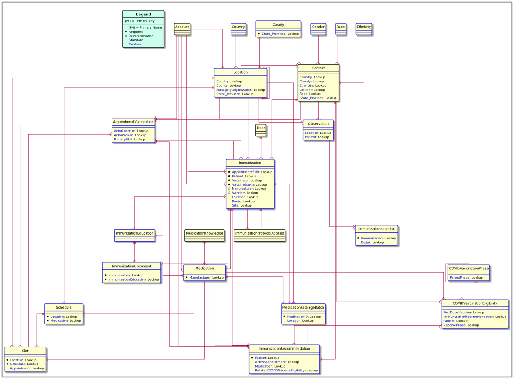
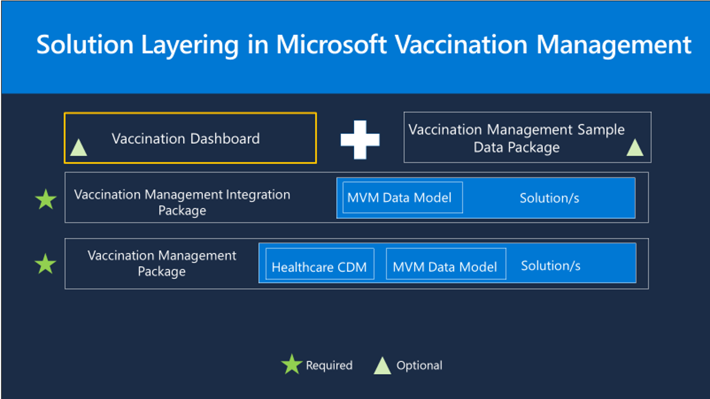

Microsoft Vaccination Management uses several capabilities of Microsoft Power Platform, including Microsoft Power Apps (model-driven apps and canvas apps), Power Apps portals, Microsoft Power BI, and Microsoft Power Automate.

## Capabilities

Microsoft Vaccination Management has the following capabilities:

- **Vaccination Management app** - A model-driven app in Power Apps that is used by vaccination program administrators to set up and manage eligibility phases, vaccines, doses, and schedules. Vaccination program administrators can also see who has registered, review vaccine inventory, view basic reports on appointments, and see the outcomes of vaccinations. The app is composed of three main areas:

    - **Reference Data** - The vaccination program administrator can create and populate data that includes information about vaccines, locations of vaccination sites, and demographics data about registered residents.
      
    - **Management** - The vaccination program administrator can create and populate data that includes information about vaccines and their manufacturer, vaccination providers and their schedules, and vaccination sites and event codes.
  
    - **Registration** - This area contains the following data:

      - Data for eligibility, resident, and appointment is entered by residents in the **Registration and appointment scheduling** portal.

      - Data for vaccination is entered by vaccination frontline volunteers and nurses in the **Frontline worker** app.

- **Registration and appointment scheduling portal** - Microsoft Vaccination Management provides residents with an online portal where they can register to check if they're eligible for the COVID-19 vaccination. Depending on the outcome, residents can do one of the following steps: 

    - If eligible, depending on configuration, the resident can be notified to make an appointment or proceed to schedule an appointment for getting the vaccination.

    - If not yet eligible, the resident can preregister to be notified through email when they become eligible for the vaccination.

- **Frontline worker app** - A canvas app from Power Apps that is used by workers at vaccination sites to distribute and administer vaccinations safely and effectively. With the **Frontline worker** app, these critical workers have the information that they need to check in patients who have registered and booked an appointment, with the option to use touch-free QR code scanning. The app lets the vaccinator manage the details of the vaccine, including the dose number and vaccine batch, and lets the vaccinator note post-vaccine reactions.

- **Vaccination Management dashboard** - Enables healthcare program leaders to gain insights and establish situational awareness about their vaccination program. You can track cumulative and daily vaccinations, view registrations, check on appointments, and monitor analytics at the site level.
 

## Architecture

The following entity relationship diagram illustrates the tables and their relationships in Microsoft Vaccination Management. System-generated tables, relationships, and columns, such as Created By and Modified By, aren't displayed in the diagram.

> [!NOTE]
> This diagram represents Microsoft Vaccination Management 1.1 architecture and not the architecture for the latest Microsoft Vaccination Management 1.2 release. 

> [!div class="mx-imgBorder"]
> 

For more information, see [Microsoft Vaccination Management Foundation tables](/dynamics365/industry/vaccination-management/extend/?azure-portal=true#microsoft-vaccination-management-foundation-tables).

## Solution layering

Each capability in Microsoft Vaccination Management is layered and packaged as a solution.

Each Microsoft Vaccination Management capability follows the same structure and layering. At the base level is the Vaccination Management Package, which includes a set of solutions and configuration data. On top of that layer is the Vaccination Management Integration Package, which includes the Microsoft Vaccination Management data model. The Vaccination Management Dashboard and sample data packages are on top of the other layers.

Each layer in the following diagram shows some components of the Healthcare Common Data Model and the Microsoft Vaccination Management data model on the target tenant.

> [!div class="mx-imgBorder"]
> 

## Personas

The following security roles are included in Microsoft Vaccination Management and are set up for test and demo purposes. Make sure that you have reviewed and thoroughly understand these roles before moving to a production environment or when importing sensitive data.

- **Vaccination Call Center Agent** - For people in your contact center who will be accessing the **Vaccination call center** app to help residents check their eligibility and to make and manage their appointments.
 
- **Vaccination Frontline Nurse** - For people who will be using the **Frontline worker** app to administer and record the vaccination of residents.

- **Vaccination Frontline Volunteer** - For people who will be using the **Frontline worker** app to check in residents at the location or clinic. People in this role can't use the vaccination section of the app to record administration of a vaccination to a resident.

- **Vaccination Program Administrator** - For people who will be configuring the **Vaccination management** app and will have access to all of the app's capabilities.

- **Vaccination Provider Administrator** - For people who are responsible for the provider scenarios, including managing locations, schedules, and vaccine batches in the **Vaccination management** app. People in this role can't delete or edit certain areas of the application, such as eligibility phases.
