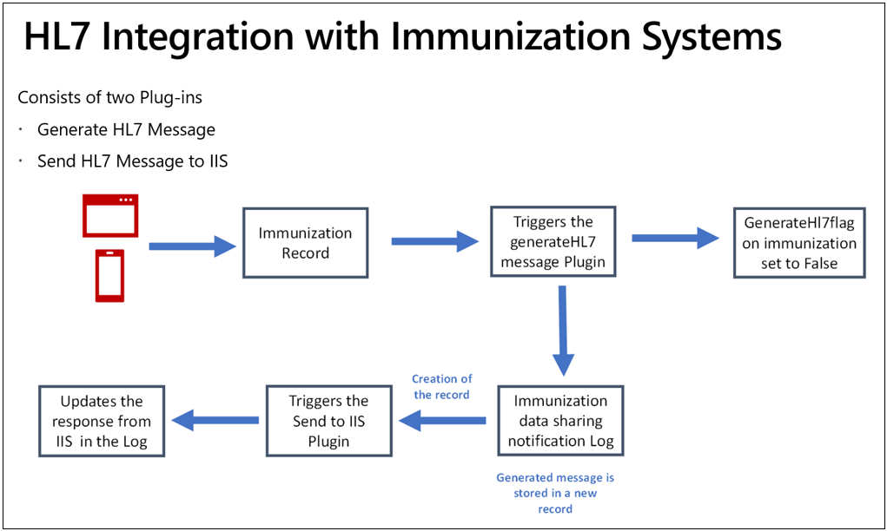

Any healthcare organization that administers COVID-19 vaccinations to residents must report the information to the state. The state's immunization system accepts the data in [HL7 format](http://www.hl7.org/implement/standards/?azure-portal=true). The state agencies store the vaccination information in their databases to track, manage, and report the overall progress of the vaccination program. For example, Centers for Disease Control and Prevention (CDC) stores the vaccination information in [Immunization Information System (IIS)](https://www.cdc.gov/vaccines/programs/iis/func-stds.html/?azure-portal=true). As a healthcare organization that administers COVID-19 vaccinations, you're responsible for understanding the specific state and federal requirements for reporting vaccination information.

HL7 is the message structure to report the vaccination information to state healthcare agencies, and it varies across states and countries. The message generation and sharing feature provides a template and reference design for integration with the state agency's immunization system. As an implementor, you'll need to determine the structure of the message that is being generated and then make necessary modifications to adapt the message structure according to the respective immunization system.

> [!div class="mx-imgBorder"]
> 

1. The HL7 message generation is triggered after the vaccination is administered and the vaccinator selects **Complete vaccination** in the [Frontline worker app](/dynamics365/industry/vaccination-management/check-in-administer/?azure-portal=true). This action creates a vaccination record in Microsoft Dataverse that can be viewed in the **Vaccination Site Management** app under [Vaccination](/dynamics365/industry/vaccination-management/site-management/?azure-portal=true). After the business logic to associate vaccination documents is complete, the **Completed** flag on the vaccination record is set, which will trigger the message generation plug-in.

1. After the message is generated successfully, a **Vaccination Data Sharing Notification Log** is created for the vaccination. This action will trigger the plug-in to send the HL7 message to the state agency's immunization system. The response from the immunization system will be stored in the same record.

1. The message generation can also be triggered by setting the **Generate HL7** flag on the vaccination record in the **Vaccination Site Management** app under [Vaccination](/dynamics365/industry/vaccination-management/site-management/?azure-portal=true). This setting will allow the administrator, in case of errors when sending the data to the state, to fix any data issues that are related to vaccination and then regenerate the message.

Each message generation will create a record in the **Vaccination Data Sharing Notification Log**. The response from the immunization system is also stored in the same record, allowing you to have a log of the number of times that a particular vaccination record was replayed and the issues with each message.

For more information, see [integration immunization systems](/dynamics365/industry/vaccination-management/integration-immunization-systems/?azure-portal=true).
