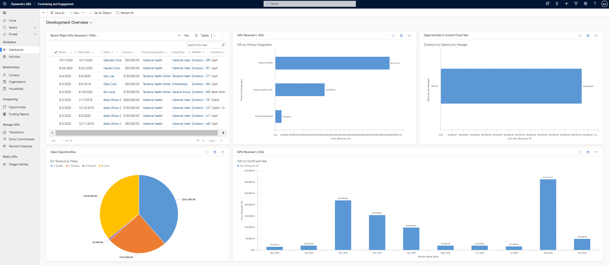

The Development area of Fundraising and Engagement is where you can manage relationships with your donors and work with prospects and opportunities for major moves.

The Development Overview Dashboard makes it easy for you to view and understand major gifts received, and to drill down and select through directly to view more information about donors or gifts.

On the top left of the dashboard, you'll find a list highlighting donors who have recently made a major gift so that you can follow up with a phone call or thank you. Select the name of the donor from this list to view their profile.

Other charts on the dashboard give you insight into major gifts by designation, pipeline analysis for major moves, and gifts received by month and year. Select any of these components to drill down for further information.

> [!div class="mx-imgBorder"]
> 
