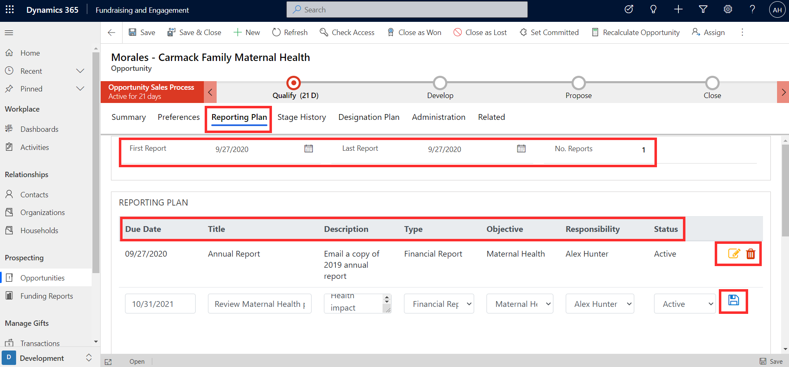
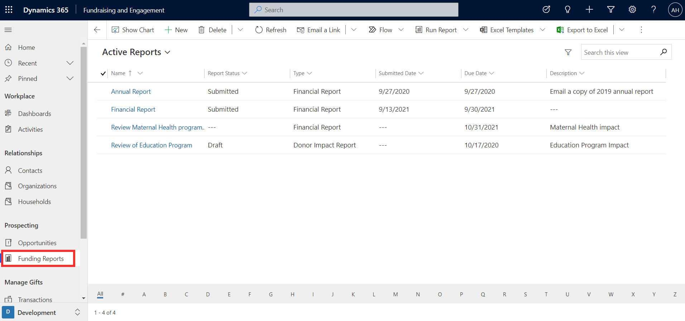
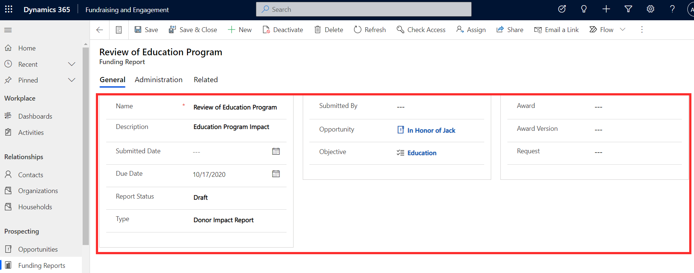

The **Reporting Plan** tab on an opportunity allows you to add and track reporting or other deliverables that need to be completed throughout the process, such as a Financial Report, Program Progress Report, Quarterly Filing, or Donor Impact Report.

Each report in the reporting plan can be aligned to a specific objective and assigned to the user responsible for it, with a due date. Use the save icon when adding new reporting plan entries, and the edit and delete icons to make changes. As you build your reporting plan, you'll see an automated summary of the first and last report dates, and the total number of reports in the plan.

> [!div class="mx-imgBorder"]
> 

You can view the funding reports for all opportunities, together with their statuses, in the **Funding Reports** section of Fundraising and Engagement.

> [!div class="mx-imgBorder"]
> 

Select any funding report to view and update the report status, submitted date, or any other details.

> [!div class="mx-imgBorder"]
> 
