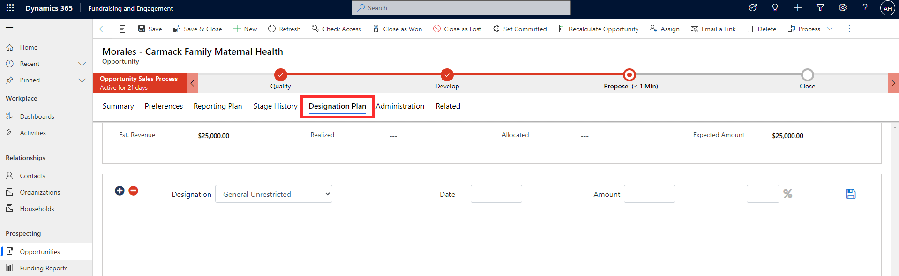
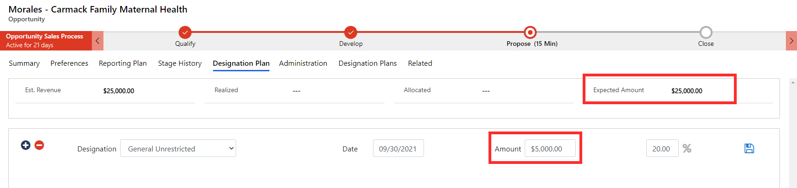
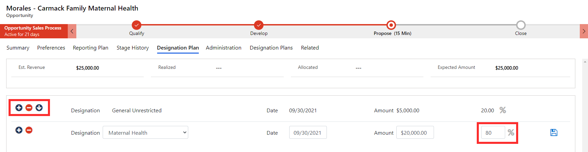
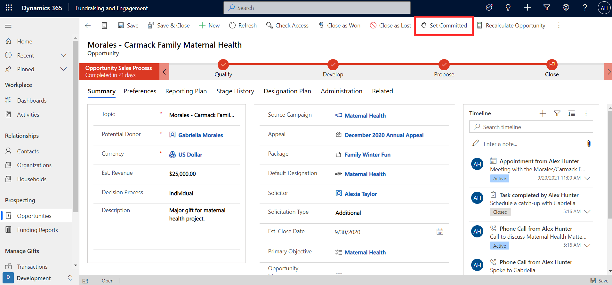
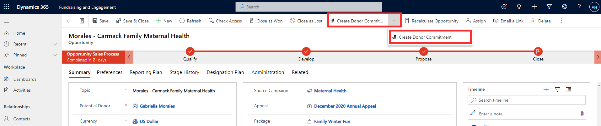
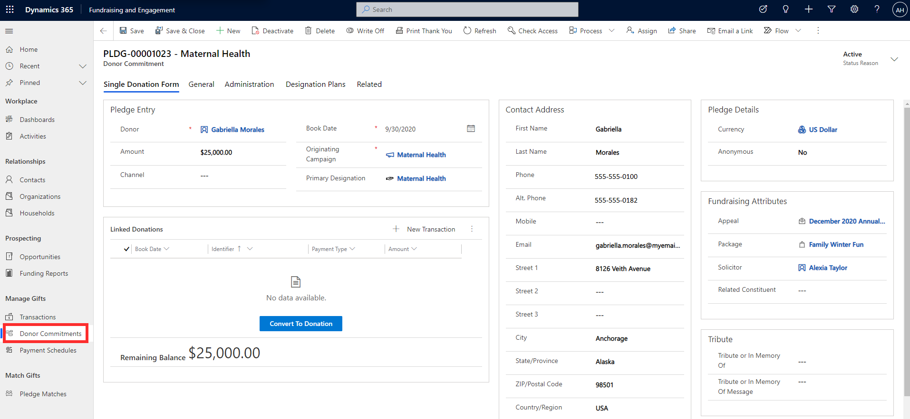
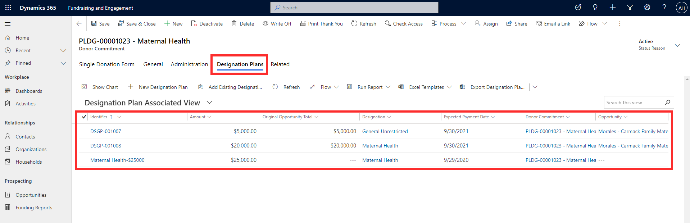

Designation Plans are used in Fundraising and Engagement to specify how funds from a gift will be allocated once payment is received. You can create a designation plan as you work through the process, in preparation for converting the opportunity into a donor commitment.

A designation plan can be created via the **Designation Plan** tab on an opportunity record. The **Expected Amount** of the donation will appear here, and you can build the designation plan by allocating either a % or value of the expected amount across one or more designations. You can also specify the expected payment date.

> [!div class="mx-imgBorder"]
> 

In the example shown below, the opportunity has an expected amount of $25,000. An **amount** of $5,000 has been entered and allocated to the General Unrestricted designation. In turn, the **%** column has automatically updated based on the portion of $5,000 from $25,000. The **Save** icon should be selected to save the designation plan line item.

> [!div class="mx-imgBorder"]
> 

When adding an entry to the designation plan, you can instead enter a value in the **%** column, which will update the amount. The +, - and arrow buttons can be used to add, remove, and reorder the entries respectively.

> [!div class="mx-imgBorder"]
> 

Let's say that the opportunity is now ready to be closed and converted into a donor commitment of $25,000. Select the **Set Committed** button in the task bar at the top of the opportunity record.

> [!div class="mx-imgBorder"]
> 

You'll now see a **Create Donor Commitment** button in the task bar at the top of the opportunity record. Clicking this will create a related donor commitment (pledge) from the opportunity, with all the details linked.

> [!div class="mx-imgBorder"]
> 

The pledge can be viewed from the **Donor Commitments** tab of the opportunity record.

> [!div class="mx-imgBorder"]
> 

Once you reach the **Close** stage and the donor commitment has been received, you can select the **Close as Won** button found in the task bar at the top of the record. If the solicitation was unsuccessful, you can select **Close as Lost.**

The donor commitment created from the opportunity now sits with other donor commitments, ready to be tracked and processed. You can view the full details from the **Donor Commitments** area of Fundraising and Engagement, and see that the details from the opportunity have transferred over to the pledge.

> [!div class="mx-imgBorder"]
> 

The **Designation Plans** tab of the donor commitment record will display each entry of the designation plan as a line item attached to the pledge.

> [!div class="mx-imgBorder"]
> 
