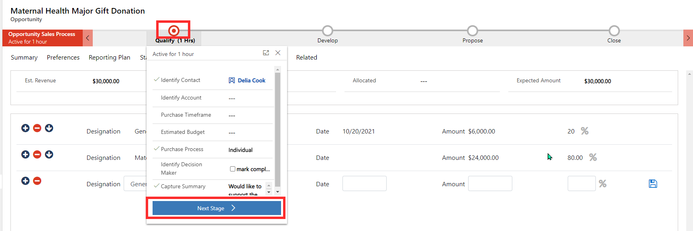

This exercise will take you through the steps of creating an opportunity and converting it into a donor commitment. You'll create a new opportunity, add in preferences, create a reporting plan, and designation plan. The opportunity will then be converted to a donor commitment where you can view both the opportunity and donor commitment on the constituent record.

## Learning objectives

At the end of this exercise, you'll be able to accomplish the following:

- Create a new opportunity

- Add preferences to an opportunity

- Create a reporting plan

- Create a designation plan

- Convert an opportunity to donor commitment

## Sample data

Before you begin, to achieve the maximum effect for this lab and the other labs, we recommend that you deploy Fundraising and Engagement with the sample data. For more information, see the [Deployment Guide](https://aka.ms/fedeploymentguide/?azure-portal=true).

## Create a new opportunity

1. In Fundraising and Engagement, select the **Development** area from the bottom left of the screen.

1. Select **Opportunities** from the left navigation menu.

1. Select **+New** to create a new opportunity.

1. Enter the following details on the New Opportunity form:

    - **Topic**: Maternal Health Major Gift Donation

    - **Potential Donor**: Delia Cook

    - **Currency**: US Dollar

    - **Est. Revenue**: 30,000

    - **Decision Process**: Individual

    - **Description**: Would like to support the Maternal Health initiative for women in Tanzania.

    - **Source Campaign**: Maternal Health

    - **Appeal**: November Appeal

    - **Default Designation**: Should autopopulate to Maternal Health

    - **Solicitor**: Vanessa McBride

    - **Solicitation Type**: Renewal

    - **Est Close Date**: Select one month from the current date.

    - **Primary Objective**: Maternal Health

    - **Opportunity Manager**: Molly Clark

    - **Event**: Contoso.org Gala

    - **Expected Amount**: 30,000

1. Save the opportunity.

## Add preferences to the opportunity

1. Go to the **Preferences** tab on the opportunity.

1. In the Existing Preferences section, select the arrow next to **Family Aid** to add it as an opportunity preference.

1. If not already selected, select the yellow Edit Preference button next to Family Aid and set the Objective to Maternal Health. Select the **save** icon next to the preference.

1. Save the opportunity record.

## Create a reporting plan

1. Select the **Reporting Plan** tab of the opportunity record.

1. Enter in the following funding report details into the reporting plan:

    - **Due Date**: Select one month from the current date.

    - **Title**: Review Maternal Health Program

    - **Description**: Review of the impact on Maternal Health initiative.

    - **Type**: Donor Impact Report

    - **Objective**: Maternal Health

    - **Responsibility**: Select yourself

1. Select the **save** icon next to the report details you just entered.

1. Save the opportunity record.

1. Select **Funding Reports** from the left navigation menu to view the report you just created.

## Create a designation plan

1. Navigate back to your opportunity record. You can select the back arrow or enter the opportunity in the search bar.

1. Select the **Designation Plan** tab of the opportunity record. You'll notice the $30,000 Expected Amount previously entered on the record appears here.

1. For the first plan line item, enter the following details:

    - **Designation**: General Unrestricted

    - **Date**: Select one month from the current date.

    - **%**: 20

1. Select the **save** icon next to the line item.

1. Enter the following details for the next plan line item:

    - **Designation**: Maternal Health

    - **Date**: Select one month from the current date.

    - **Amount**: 24,000

1. Select the **save** icon next to the line item.

1. Save the opportunity record.

## Convert an opportunity to a donor commitment

1. Imagine that the opportunity is now ready to be closed and converted into a donor commitment. Progress the business process flow at the top of the opportunity record through to the **Close** stage. You can do this by selecting the stage and selecting **Next Stage** for each stage. Select **Finish** once it is at the Close stage.

    > [!div class="mx-imgBorder"]
    > 

1. Select the **Set Committed** button located in the task bar at the top of the record.

1. Select **Create Donor Commitment** > **Create Donor Commitment** in the task bar at the top of the record.

1. Close the notification that appears.

1. Save the opportunity record.

1. Select the **Related** tab of the opportunity record and select **Donor Commitments**. You'll see the recently created donor commitment.

1. Double select the donor commitment to open the record.

1. On the donor commitment record, select the **Related** tab. Select **Designation Plans**.

1. You'll see the entry of the designation plan as a line item attached to the pledge.
