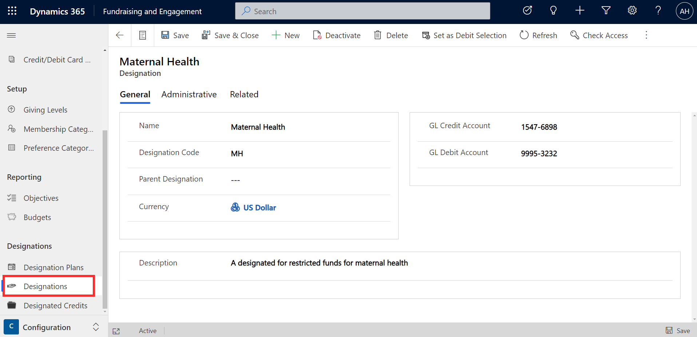
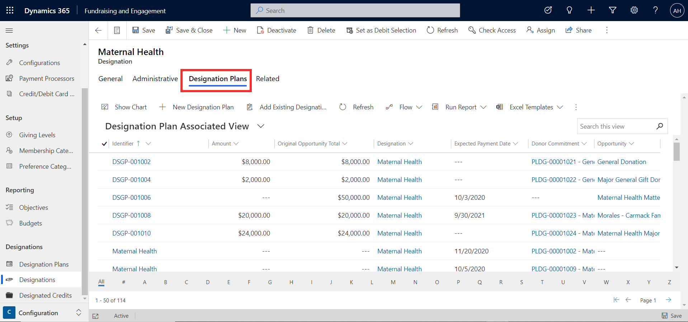
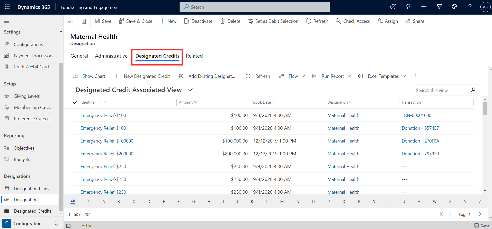

Designations in Fundraising and Engagement are used to indicate how funds raised are to be allocated or spent across the nonprofit's initiatives. Designation records contain information needed to track expected and received revenue to the nonprofit organization's financial system. Designations can be linked to transactions, donor commitments, recurring donations, pledge schedules, opportunities, and events.

An organization can set up designations via the Configuration module of Fundraising and Engagement. The screenshot below shows an example of a designation record.

> [!div class="mx-imgBorder"]
> 

To set up a designation, specify a name that you will see when selecting the designation from other records in Fundraising and Engagement. The designation code can be an abbreviation of the name or used as you wish. Designations can be arranged in a hierarchy, relating back to a larger fund, using the parent designation column. GL Credit Account and GL Debit Account from the finance system can be added here to help with financial reconciliation.

You can view the list of related designation plans and designated credits via the **Related** tab to get visibility of the current and potential future gifts linked to this designation.

**Designation Plans** include donor commitments and opportunities that have been linked to the designation. These are potential or committed future donations.

> [!div class="mx-imgBorder"]
> 

**Designated Credits** are all the transactions that relate to the designation. Each time a transaction is created and linked to a designation, it enables you to report and view the giving against the designation in this way.

> [!div class="mx-imgBorder"]
> 

You can also access a full list of designation plans and designated credits for all designations from the designations area of the menu on the left.
