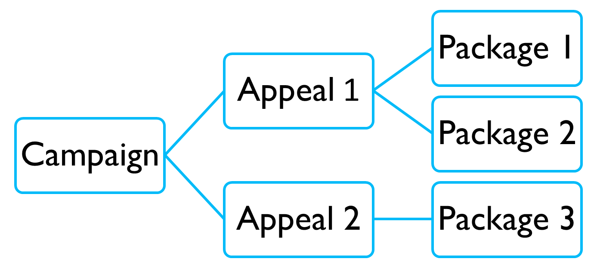
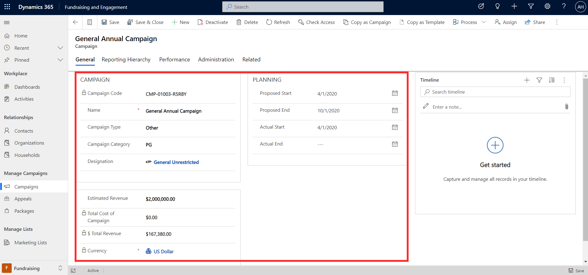
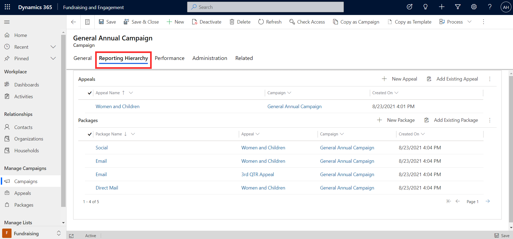
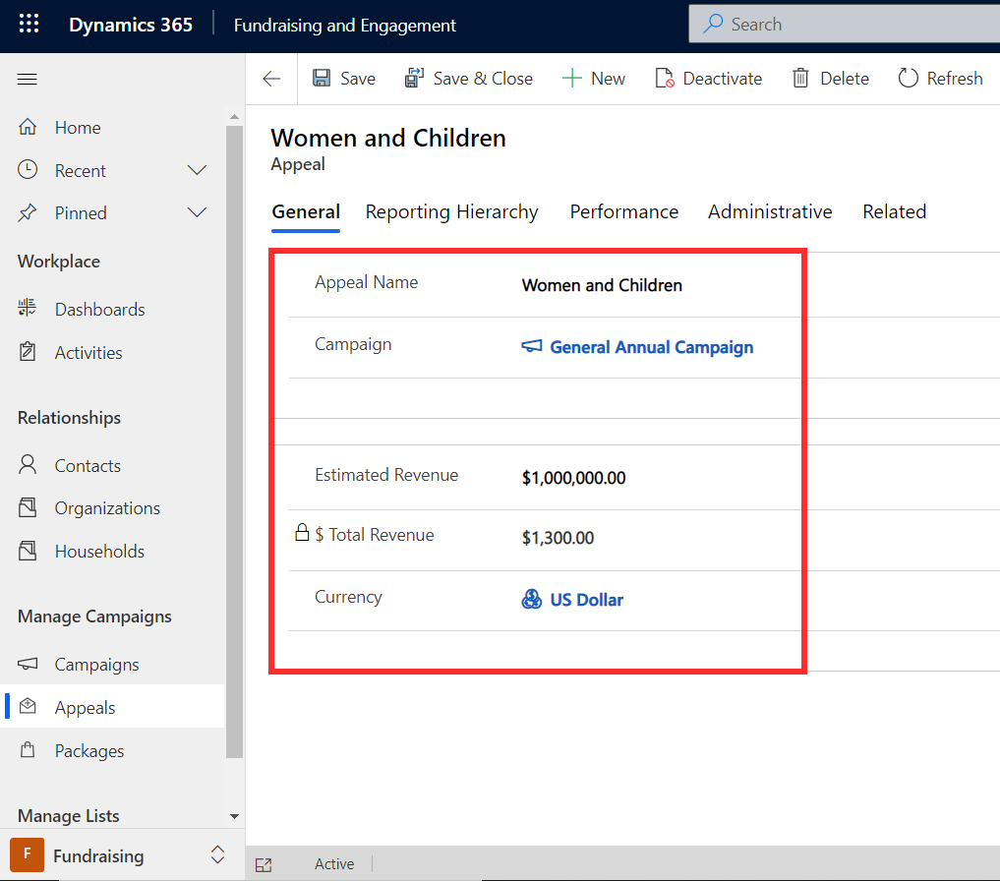
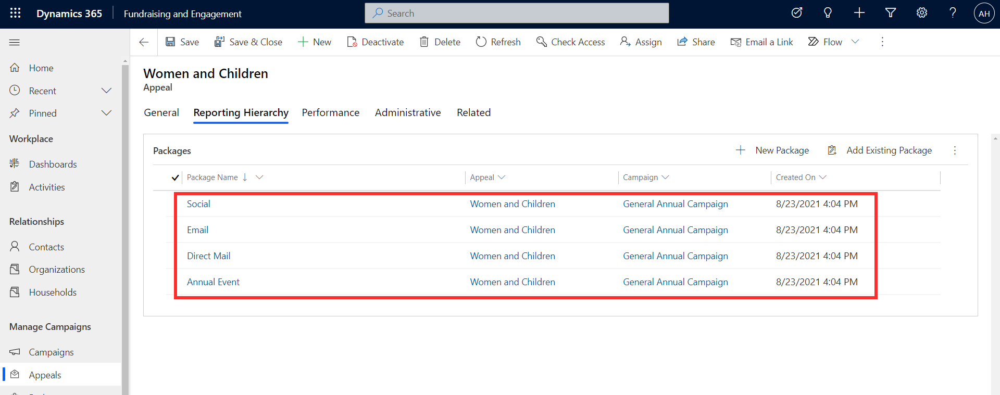
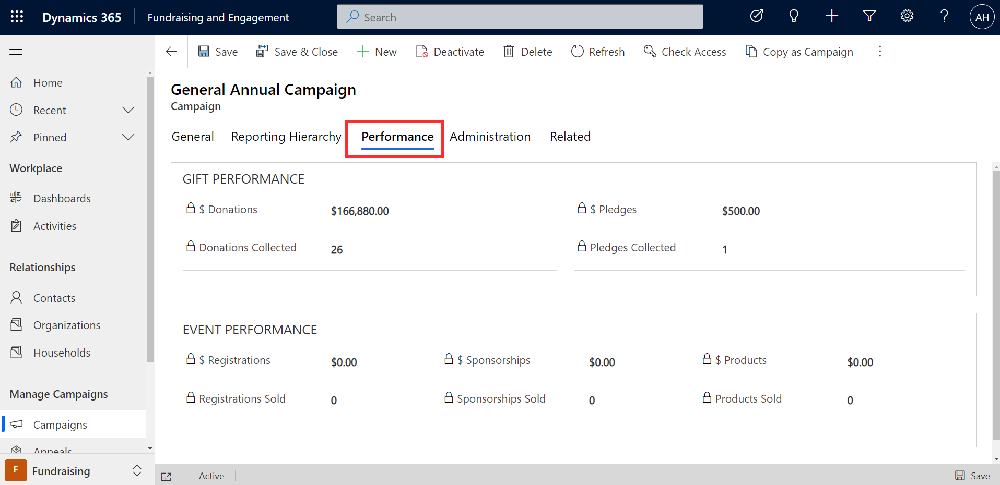
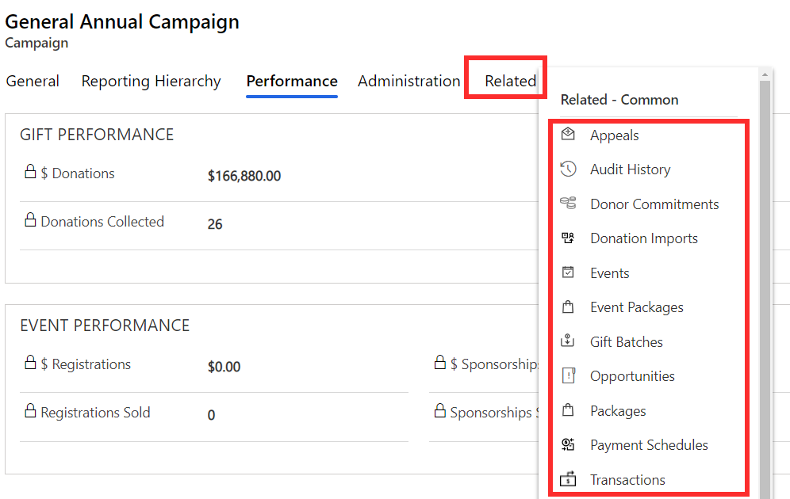
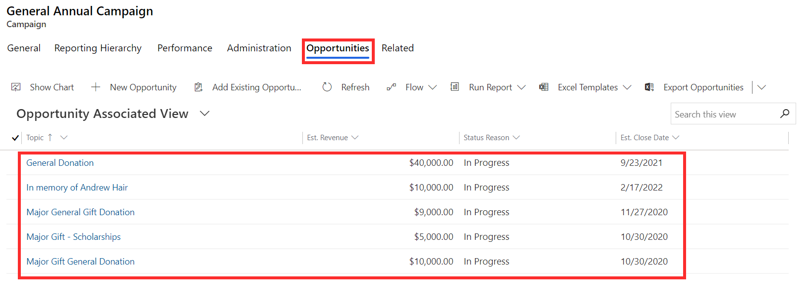

Campaigns, appeals, and packages make up the core building blocks to track and report on the performance of a fundraising initiative. They can be set up and viewed via the Fundraising area of Fundraising and Engagement.

Campaigns, appeals, and packages operate as a hierarchy in the following order:

1. **Campaign:** Campaign records represent a reason why the nonprofit organization is raising funds. A campaign is a container to track your plan, budget, activities, gifts, and results. Campaigns can be set up to link to a default designation.

1. **Appeal:** Appeals are the next level in the hierarchy, under a campaign. They represent the "how" for a campaign, that is, the method and approach used to raise funds for the campaign. For example, an appeal could be an event, direct mail, or digital communication. More than one appeal can be linked to a campaign.

1. **Package:** Packages are a level more specific than an appeal. A package may be a particular email, donation page, or a printed piece for example. Packages can be used for more granular reporting and analysis against an appeal.

> [!div class="mx-imgBorder"]
> 

## Campaigns

The screenshot below shows an example of a General Annual Campaign.

> [!div class="mx-imgBorder"]
> 

To set up campaign records, specify a name for the campaign, and select a type - Annual Giving, Capital, Membership, Operating, Planned Giving, Restricted, Events, or Other. You can configure other options for your organization if needed. Campaign category is another classification that you can use for tracking and reporting across campaigns. If you wish to specify a default designation for your campaign, you can link it in the designation column.

Campaigns enable you to plan a start and end date, and to track gifts received against an estimated revenue for reporting. The total revenue will be automatically calculated from all transactions processed which are linked to the campaign.

The campaign doesn't execute any tasks or marketing activities. It's a container for tracking, planning, and reporting.

## Reporting hierarchy

The **Reporting Hierarchy** tab of a campaign record is where you can set up and view the related hierarchy of Appeals and Packages. These are optional but provide extra levels of drilldown for reporting and analysis when used.

> [!div class="mx-imgBorder"]
> 

The example in the screenshot above shows the General Annual Campaign, which has one appeal, Women and Children, associated with it. Appeals have their own estimated and total revenue calculation, under the hierarchy of the main campaign they're linked to.

> [!div class="mx-imgBorder"]
> 

The Women and Children appeal in the General Annual Campaign then has four packages associated with it. These represent the planned interaction between the donor and the organization in relation to the appeal. For example, here we have packages for email, direct mail, social, and annual event.

> [!div class="mx-imgBorder"]
> 

## Performance

The **Performance** tab on a campaign record allows you to view a snapshot of the campaign performance - the value and number of donations, pledges, and key metrics from related events.

> [!div class="mx-imgBorder"]
> 

For more specific details, the **Related** tab on a campaign allows you to drill down to see the full list of transactions, donor commitments, opportunities, and events related to the campaign.

> [!div class="mx-imgBorder"]
> 

> [!div class="mx-imgBorder"]
> 
