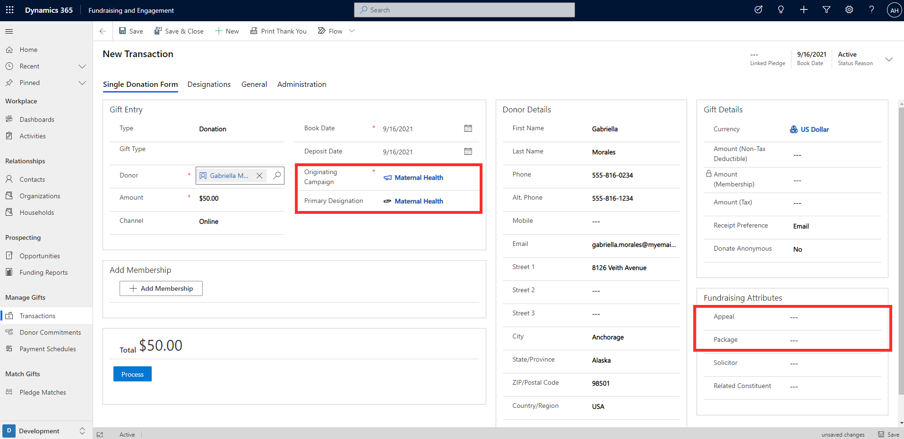
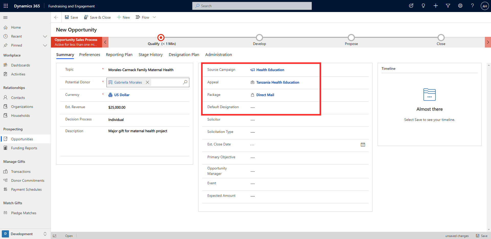
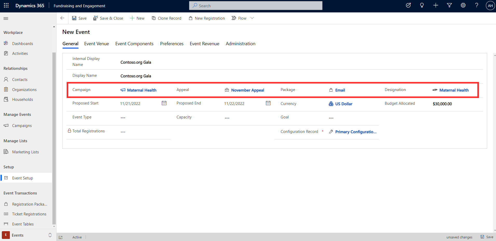

When setting up a transaction, donor commitment, recurring donation, or pledge schedule, you must associate it to a campaign. You can optionally associate a campaign to an opportunity or event. This unit will look at the ways designations and campaigns are used across Fundraising and Engagement.

## Transactions, donor commitments, recurring donations, pledge schedules

The screenshot below shows where campaigns, designations, appeals, and packages can be linked to a transaction record. The same applies to donor commitments and pledge schedules.

> [!div class="mx-imgBorder"]
> 

**Originating Campaign** is a required column. It's optional to specify a **Primary Designation**. Primary designation will autopopulate if a designation has been associated to the selected campaign. **Appeal** and **Package** appear as optional columns in the Fundraising Attributes section. If selected, the options for appeal and package will be filtered based on the selected originating campaign. If the selected originating campaign only contains one appeal and one package, the appeal and package columns will autopopulate based on this value.

## Opportunities

The screenshot below shows where campaigns, appeals, packages, and designations can be linked to an opportunity.

> [!div class="mx-imgBorder"]
> 

**Source Campaign**, **Appeal**, **Package,** and **Default Designation** are optional columns on an opportunity. If a source campaign is specified, the options available for appeal and package will be filtered to the selected campaign. Again, if only one appeal and package exist for the campaign, the value will autopopulate in the column. Default designation will also autopopulate if there's a designation associated to the campaign.

## Events

The screenshot below shows where campaigns, appeals, packages, and designations are linked to an event.

> [!div class="mx-imgBorder"]
> 

**Campaign**, **Appeal**, **Package,** and **Designation** are optional columns when setting up an event. Once Campaign is specified, Designation will autopopulate if one has been associated to the campaign. Options available for Appeal and Package will be filtered to those belonging to the campaign.
