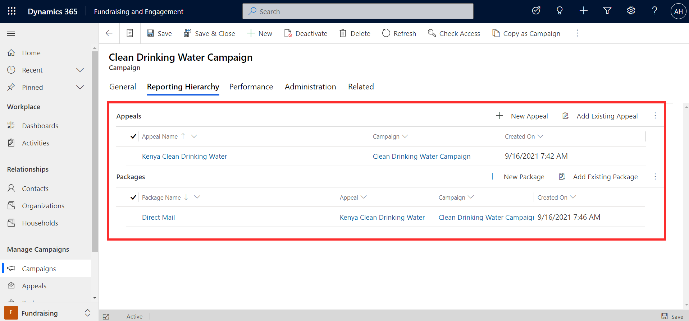

This exercise will take you through the steps of creating a campaign with an appeal and package. You'll create a campaign, then create an appeal for it. You'll then create a package for the appeal to build out the reporting hierarchy.

## Learning objectives

At the end of this exercise, you'll be able to accomplish the following:

- Create a campaign

- Create an appeal in the hierarchy

- Create a package in the hierarchy

## Sample data

Before you begin, to achieve the maximum effect for this lab and the other labs, we recommend that you deploy Fundraising and Engagement with the sample data. For more information, see the [Deployment Guide](https://aka.ms/fedeploymentguide/?azure-portal=true).

## Create a campaign

1. In Fundraising and Engagement, select the **Fundraising** area from the bottom left of the screen.

1. Go to **Campaigns** from the left navigation menu.

1. Select **+New** to create a new campaign.

1. Enter the following details on the campaign form:

    - **Name:** Clean Drinking Water Campaign

    - **Campaign Type:** Other

    - **Estimated Revenue:** 1,300,000

    - **Currency:** US Dollar

    - **Proposed Start:** Enter the current date

    - **Proposed End:** Enter a date two months from the current date.

    - **Actual Start:** Enter the current date

1. **Save** the record.

## Create an appeal in the hierarchy

1. In the campaign record you created, select the **Reporting Hierarchy** tab.

1. Select **+New Appeal**.

1. Enter the following details on the Appeal form:

    - **Name:** Kenya Clean Drinking Water

    - **Campaign:** Should be autopopulated to Clean Drinking Water Campaign

    - **Estimated Revenue:** 40,000

    - **Currency:** US Dollar

1. **Save** the record.

## Create a package in the hierarchy

1. Navigate back to the **Clean Drinking Water Campaign** record. You can do this by selecting the back arrow or the hyperlink that appears on the appeal record.

1. Select the **Reporting Hierarchy** tab.

1. Select +**New Package**.

1. Enter the following details on the Package form:

    - **Package Name:** Direct Mail

    - **Appeal:** Kenya Clean Drinking Water

    - **Campaign:** Should be autopopulated to Clean Drinking Water Campaign

    - **Estimated Revenue:** 20,000

1. **Save** the record.

1. Navigate back to the **Reporting Hierarchy** tab for Clean Drinking Water Campaign record.

1. You'll see the appeal and package you created in the hierarchy.

    > [!div class="mx-imgBorder"]
    > 
