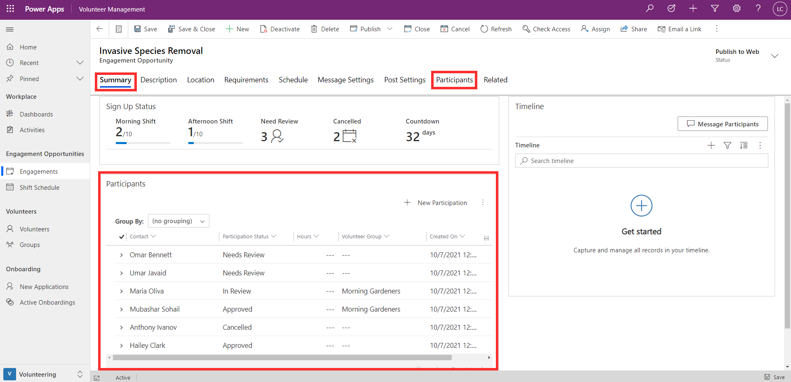
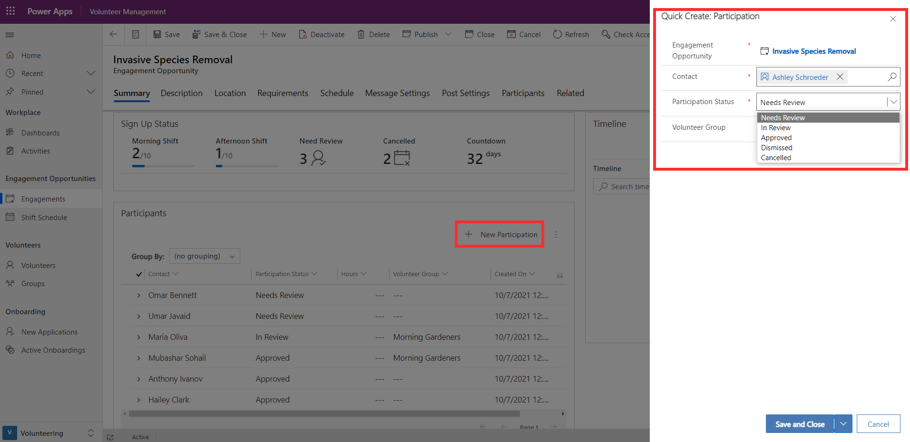
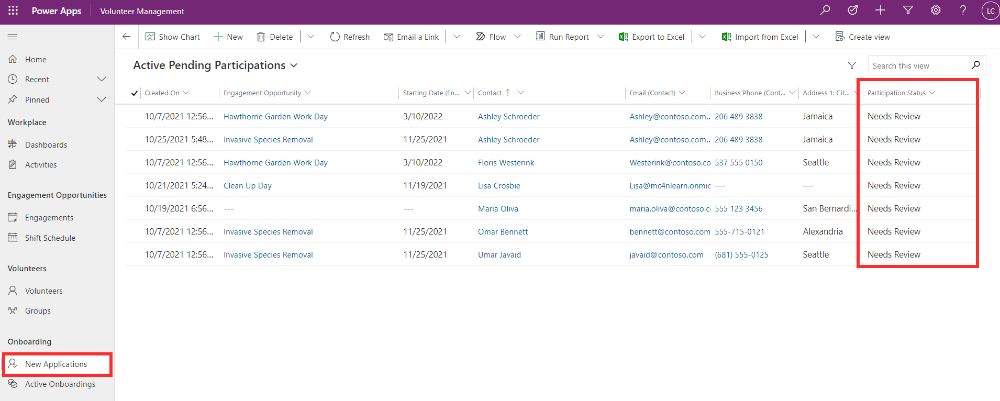
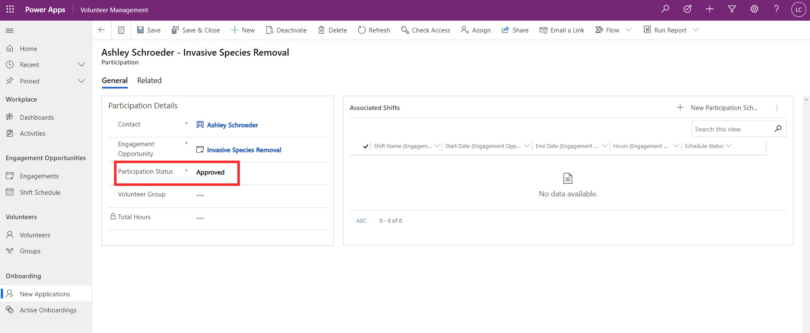
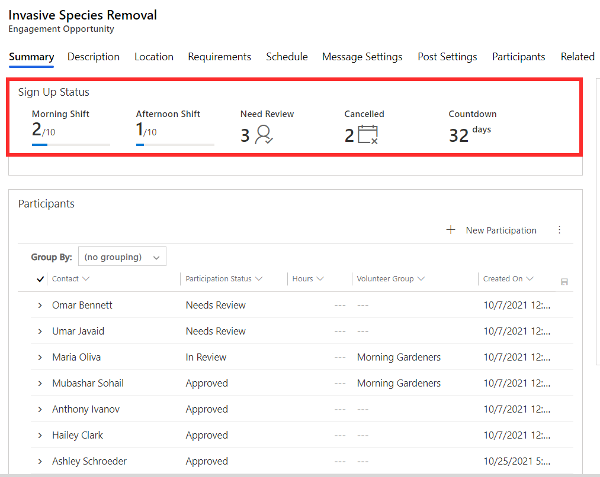

As a volunteer manager, once you have set up an engagement opportunity in Volunteer Management, you're now ready to start receiving applications. Applications for an engagement opportunity can come into Volunteer Management in two different ways. They can be received via the Volunteer Engagement portal or you can enter them directly in Volunteer Management. Whatever the method, all applications are managed using the **participation** record type, which is linked to both the engagement opportunity and the volunteer.

Refer to Module 5 to learn about how applications are received via the portal.

As shown in the screenshot below, you can manage applications for an engagement opportunity, either in the Participants section of the Summary tab, or in the Participants tab.

> [!div class="mx-imgBorder"]
> 

If you're using the Volunteer Engagement portal, applications submitted will automatically appear here.

If you want to add a new application directly in Volunteer Management, you can add it by selecting the +New Participation button. You then link the volunteer making the application via the contact lookup. If you need to create a new volunteer in the database, refer to Module: Manage Volunteers and Groups. Applications have a status indicating where they're up to in the application process. The status of **needs review** is a starting point for a new application. You can select any of these participation rows from here to open it and update the status as the application progresses.

> [!div class="mx-imgBorder"]
> 

To view a list of applications across all engagement opportunities, you can go to the **New Applications** area in Volunteer Management. This displays a list of applications that need review. You can select any participation row here to view the details and update the participation status.

> [!div class="mx-imgBorder"]
> 

Set the status to **in review** while the application review is in progress, and then once the volunteer is ready to be assigned, set the status to **approved**. **Dismissed** or **canceled** can also be used where appropriate.

> [!div class="mx-imgBorder"]
> 

Approved participants can then be linked to associated shifts for the engagement opportunity, either directly in Volunteer Management or via the Volunteer Engagement portal where volunteers can sign up for shifts themselves.

If you have set up automated messaging upon application approval, the volunteer will receive the message when their application is approved. As you receive or approve applications, the sign-up status on the Summary tab of the engagement opportunity updates with the latest numbers.

> [!div class="mx-imgBorder"]
> 
