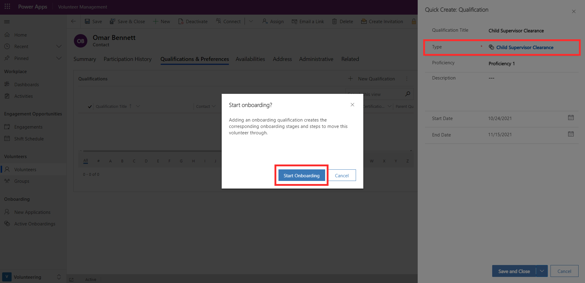
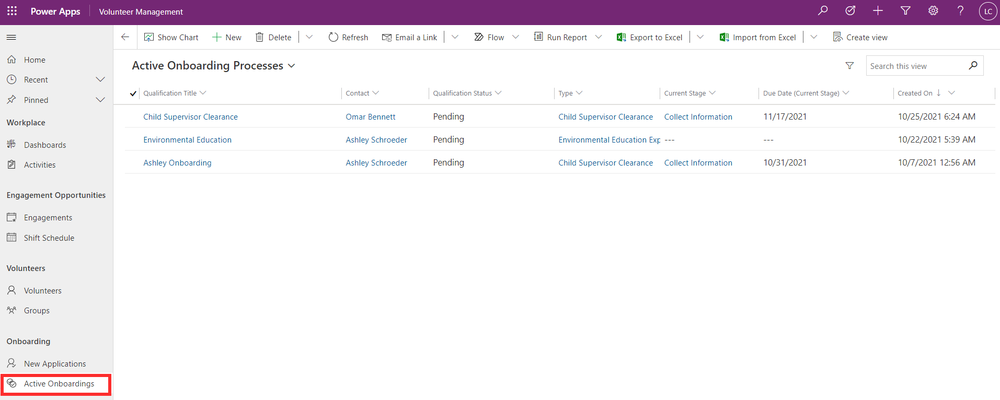
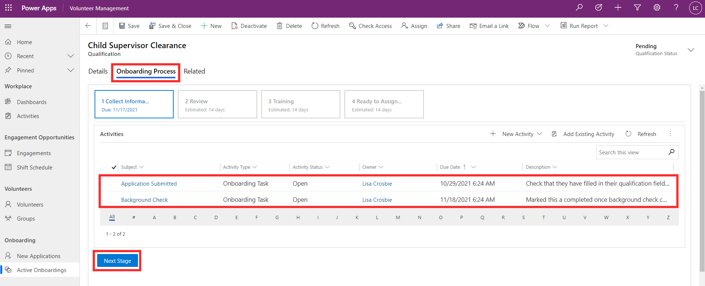
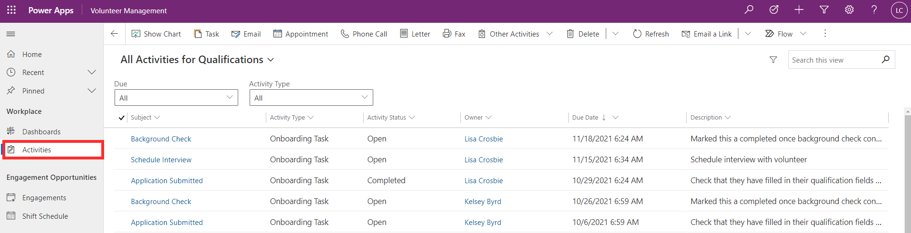
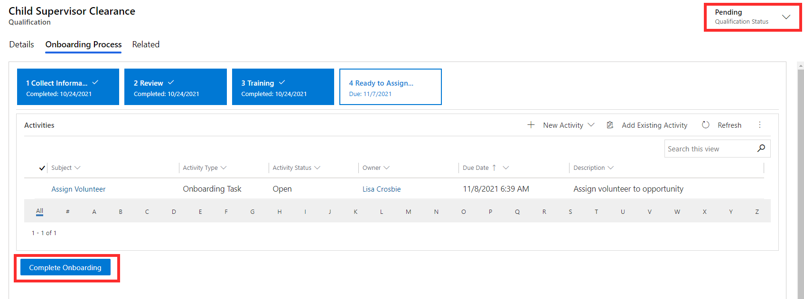

Volunteer Management enables you to set up templates to track the stages and steps involved with onboarding new volunteers, ensuring consistency and visibility of the onboarding process. You can set up a template for each different onboarding process you have. You can add all the tasks, phone calls, and appointments to complete at each stage, assign them to the right people, and set due dates. Onboarding is treated as a special type of qualification in Volunteer Management. For information on how to set up your onboarding templates, refer to Module: Configure settings for Volunteer Management.

For example, let's say that volunteer Omar Bennett requires a Child Supervisor Clearance as part of the onboarding process for the volunteer opportunity he's been assigned to. Child Supervisor Clearance is an onboarding template. It guides the volunteer manager through this process and ensures that all the activities are completed on time.

On Omar's contact record, you can add in the Child Supervisor Clearance qualification. When doing so, the system will prompt you that this is an onboarding process, and confirm that you want to start it.

> [!div class="mx-imgBorder"]
> 

A list of all current onboardings can be accessed from the **Active Onboardings** area in the left navigation menu. Here, you can see details such as:

- Related volunteer
- Qualification status
- Type of qualification
- Current stage of the onboarding process
- Due date

You can sort and filter this view to help manage and prioritize upcoming activities.

> [!div class="mx-imgBorder"]
> 

The Onboarding Process tab of the qualification displays the stages and steps that need to be completed. In this example, Collect Information is the first stage for Child Supervisor Clearance qualification. There are two tasks that need to be completed before progressing to the next stage. Each stage also displays an estimated number of days. You can progress through the process by selecting Next Stage and marking the activities as complete until all the onboarding tasks are complete.

> [!div class="mx-imgBorder"]
> 

Individuals can also view all activities assigned to them across all volunteer qualifications, in the **Activities** area in Volunteer Engagement. From here, you can filter by activity type and due date to work through and complete activities. Managers can use this area to get an overview of all activities for the team.

> [!div class="mx-imgBorder"]
> 

Once the onboarding process is complete, you can select the **Complete Onboarding** button in the last stage of the process. Doing so will update the qualification status to Completed. The qualification status can also be set to Abandoned to cancel the onboarding process if needed.

> [!div class="mx-imgBorder"]
> 
