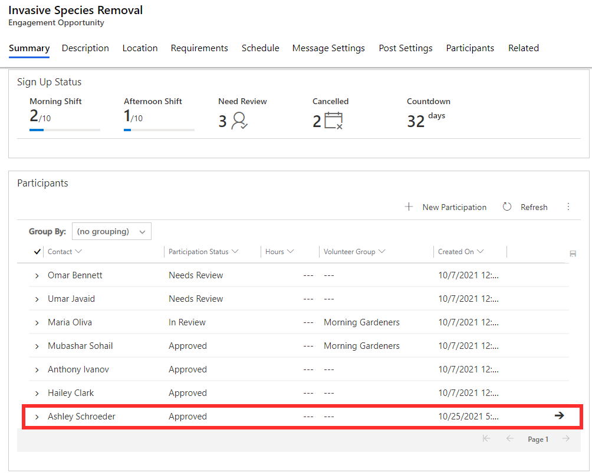
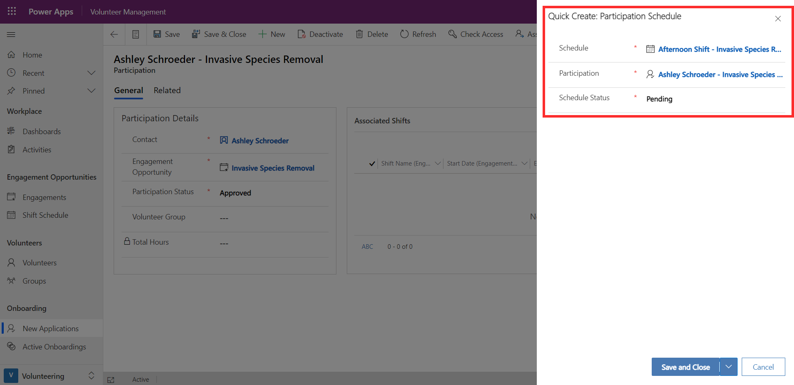

If your engagement opportunity has been set up with shifts, you'll need to add volunteers to a schedule. This can be done from an approved participation record, which can be viewed from the engagement opportunity. For example, to allocate Ashley to a shift, you can select her participation record.

> [!div class="mx-imgBorder"]
> 

Since Ashley's participation status is approved, you can select **+New Participation Schedule**, and add her to a shift by using the schedule lookup. The schedule lookup is a list of shifts that have been set up for the engagement opportunity. If you're using the Volunteer Engagement portal, the volunteer can select and sign up for their chosen shift via the portal at this stage. The schedule status is set to **pending** and can be updated once the engagement is over.

> [!div class="mx-imgBorder"]
> 
