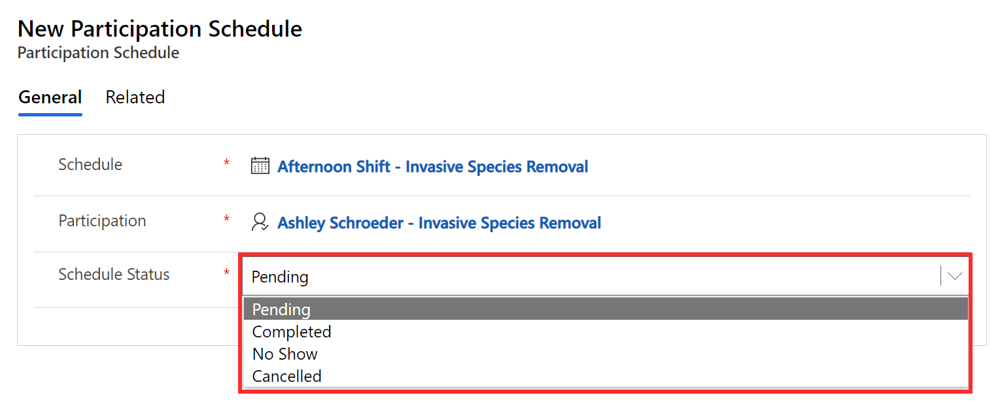
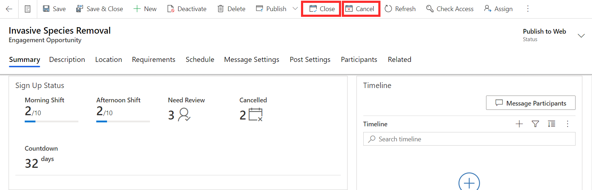
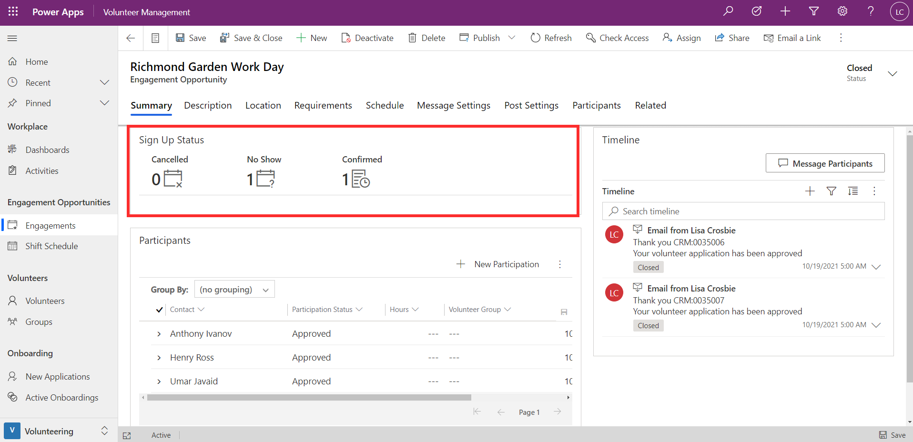

Once the engagement is finished, you can update the attendance of your participants and close the engagement.

From a volunteer's participation record, you can view their participation schedule. The schedule status for the shift can be changed to **completed**, **no show** or **canceled** depending on the outcome.

> [!div class="mx-imgBorder"]
> 

You can also bulk update participation by selecting multiple participation records.

You can close an engagement by selecting the **Close** button, located in the task bar at the top of the engagement opportunity record. If you have set up automated messaging for the completion of the engagement, the message will now go out to the participants. You can instead select **Cancel** if the engagement was canceled or didn't happen for any reason

> [!div class="mx-imgBorder"]
> 

The screenshot below shows an example of an engagement that has been closed. The number of participants who attended, canceled, or didn't show up will appear in the Sign Up Status section.

> [!div class="mx-imgBorder"]
> 
