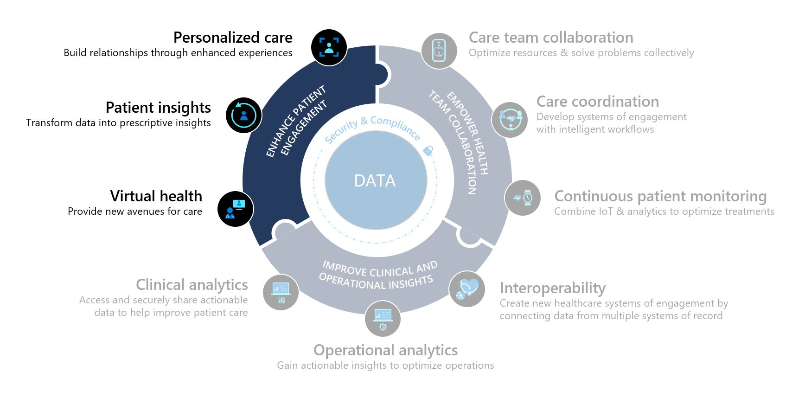

The **Patient Outreach** application in Microsoft Cloud for Healthcare allows healthcare providers to communicate with their communities and patients in a targeted, efficient way. Patient Outreach is a patient campaign management application that helps you organize and automate marketing and outreach to patients.

Key capabilities of Patient Outreach include:

-   **Patient segmentation** - Prebuilt patient segments are based on the industry standard Healthcare Effectiveness Data and Information Set (HEDIS) to provide baseline patient cohorts.

-   **Patient engagement campaigns** - Create healthcare-specific email campaigns that use patient segments based on the HEDIS industry standard.

-   **Event management** - Use provider/payor event management templates for event administration and registration.

## Industry prioritized scenarios

Patient Outreach focuses on the **Enhance patient engagement** priority scenario by creating personalized communication based on patient insights.

> [!div class="mx-imgBorder"]
> 

## Atkins family healthcare story

This lab focuses on the healthcare story of Andrew Atkins.

> [!div class="mx-imgBorder"]
> 

At an annual checkup earlier this year, Andrew Atkins learned that he has hypermetropia, a common eye condition in adults in which nearby objects appear blurry. Lamna Healthcare Company (LHC) has seen a recent influx of patients who want to be more educated on hypermetropia and has decided to increase their patient outreach efforts by hosting a virtual marketing event.

In this lab, you will play the role of a Lamna Healthcare Company marketing administrator and will use the Patient Outreach capabilities in Microsoft Cloud for Healthcare to create a virtual marketing event.
