In this exercise, you will create a patient segment by using the Patient Outreach app in Microsoft Cloud for Healthcare. You can use a **patient segment** to group patients into cohorts based on similar characteristics so that they can be better targeted with marketing communications. In this example, you will create a patient segment for patients with hypermetropia (a vision condition in which nearby objects appear blurry).

1. While signed in to your Microsoft 365 tenant, go to [https://make.powerapps.com](https://make.powerapps.com/?azure-portal=true).

1. Go to **Apps** and open **Marketing**.

    > [!div class="mx-imgBorder"]
    > [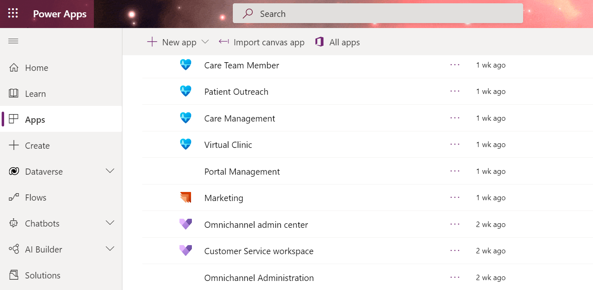](../media/marketing.png#lightbox)

1. In the lower-left corner of the screen, change the dropdown selection from **Outbound marketing** to **Settings**.

    > [!div class="mx-imgBorder"]
    > [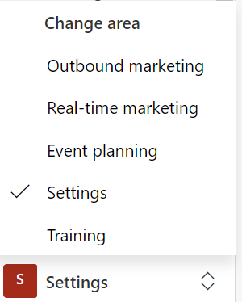](../media/settings.png#lightbox)

1. On the **Settings overview** screen, select **Dataset configuration** under the **Data management** section.

    > [!div class="mx-imgBorder"]
    > [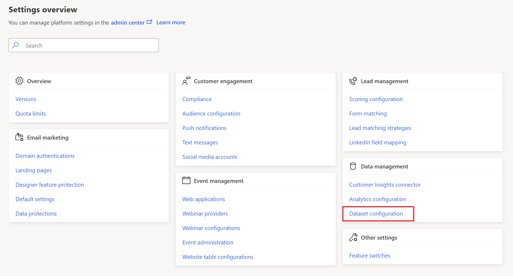](../media/dataset-configuration.png#lightbox)

1. Scroll down and select the **Condition (msemr_condition)** entity.

    > [!div class="mx-imgBorder"]
    > [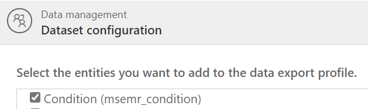](../media/condition.png#lightbox)

1. Select **Publish Changes** in the upper-right corner of the screen. This dataset configuration change will make the Condition entity available for use in dynamic email content and segmentation criteria.

    > [!div class="mx-imgBorder"]
    > [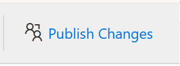](../media/publish.png#lightbox)

    > [!NOTE]
    > While it might take up to 30 minutes for changes to take effect, they are generally ready in a few minutes.

1. Return to **Apps** and open **Patient Outreach**.

    > [!div class="mx-imgBorder"]
    > [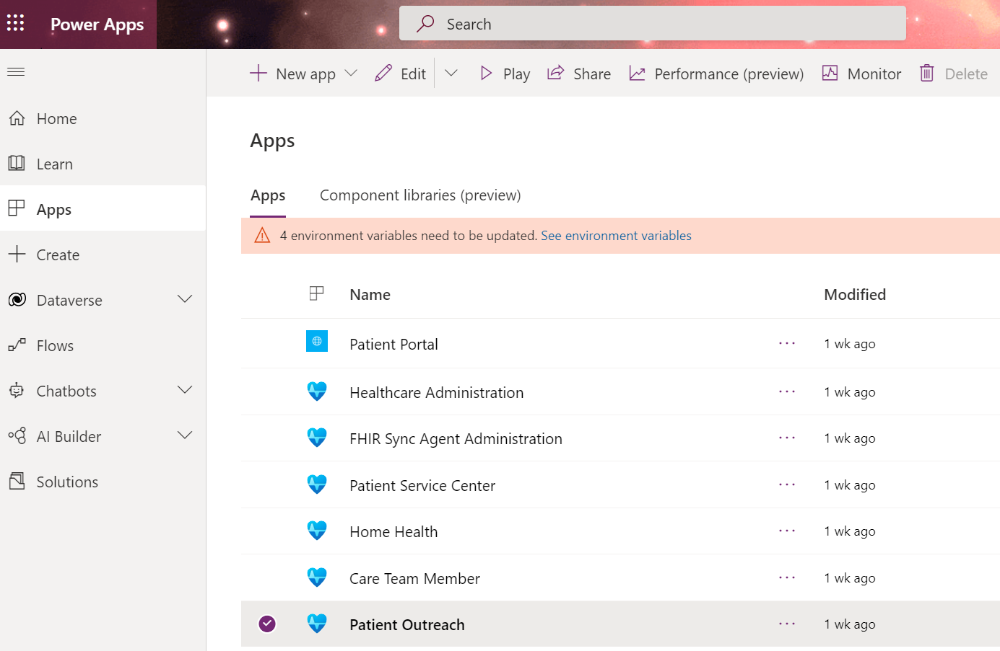](../media/patient-outreach.png#lightbox)

1. Select **Segments** on the left navigation bar to create a new specific group of patients.

    > [!div class="mx-imgBorder"]
    > [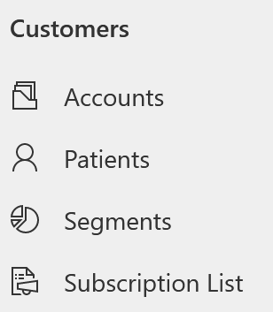](../media/segments.png#lightbox)

1. Select **+ New** to create a new patient segment. Select **+ New Dynamic Segment**.

    > [!div class="mx-imgBorder"]
    > [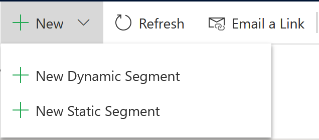](../media/new-dynamic-segment.png#lightbox)

    > [!TIP]
    > Static segments enable you to choose and add segment members manually based on existing lists or search results. Dynamic segments, which you will define by using a set of rules and conditions, are constantly and automatically changing based on information in your database. For this example, because you want your group to change depending on database information, you will select the **Dynamic Segment** option.

1. When prompted to choose a segment template option, select **Skip** because you will create your own segment.

    > [!div class="mx-imgBorder"]
    > [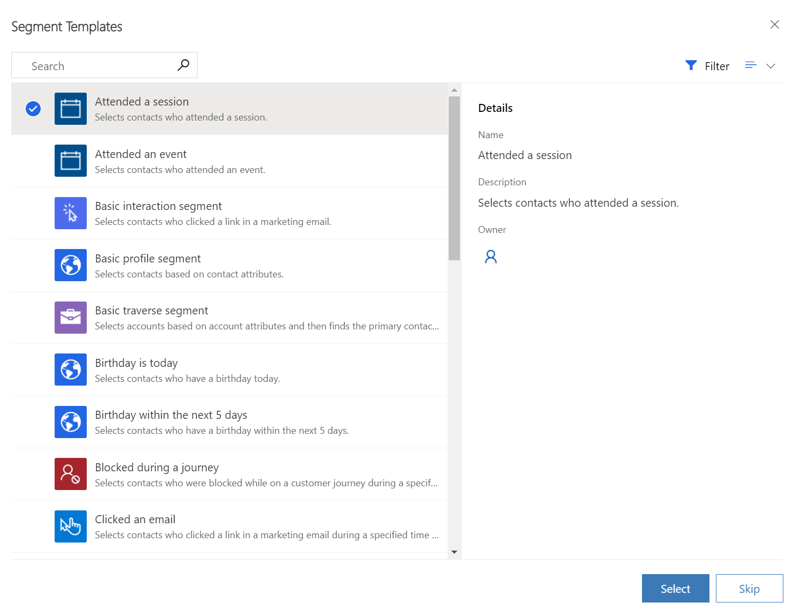](../media/skip.png#lightbox)

1. Name the new segment **Patients with Hypermetropia**.

    > [!div class="mx-imgBorder"]
    > [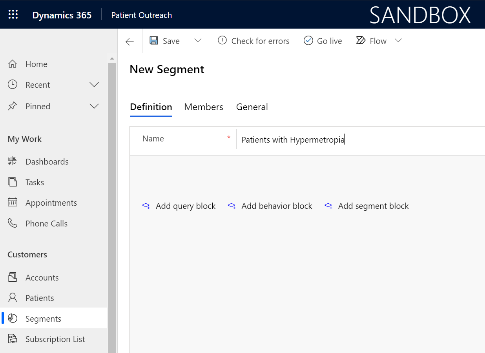](../media/name.png#lightbox)

1. Select **Add query block**.

    > [!div class="mx-imgBorder"]
    > [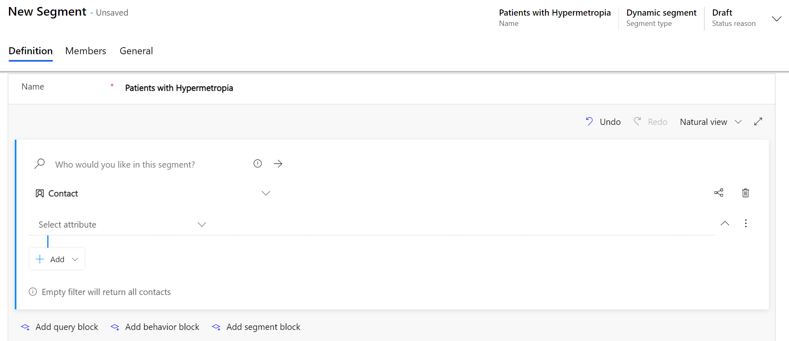](../media/add.png#lightbox)

1. We'll now create a new segment for active patients who have a hypermetropia condition where the contact has a status of **Active**, and the related condition description contains **Hypermetropia**.

    Configure this new segment by following these steps:

    1. Leave **Contact** as the main entity.

    1. In the attribute drop-down, select **Status** from the list of fields.

    1. When the additional fields appear, set condition to Status **Is Active**.

    1. Select **Add > Add related entity**.

        > [!div class="mx-imgBorder"]
        > [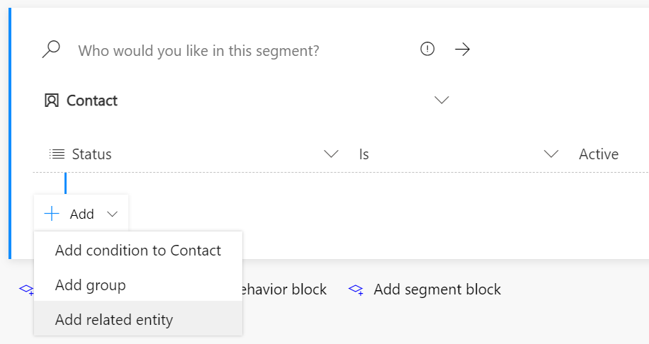](../media/add-related.png#lightbox)

    1. It should default to **AND**. Now we will add the second part of the condition.

    1. In the **Select related entity** dropdown menu, select **Condition (Condition > Contact (Patient))**.

    1. Select the nested **Add > Add condition to Condition**.

        > [!div class="mx-imgBorder"]
        > [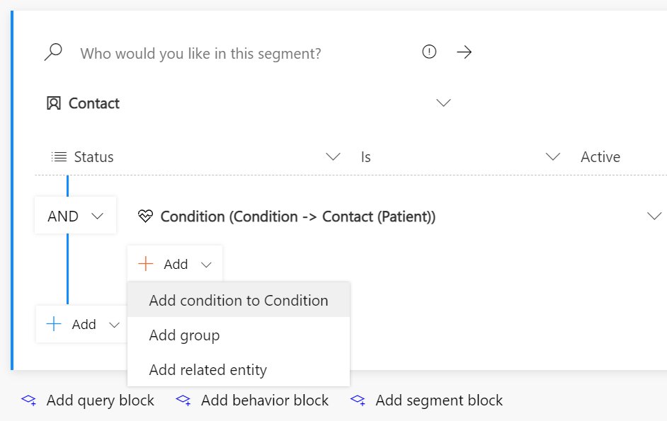](../media/add-condition.png#lightbox)

    1. Select the attribute **Condition (msemr_name)**.

    1. Change the operator to **Contains** and then type **Hypermetropia**.

       > [!div class="mx-imgBorder"]
       > [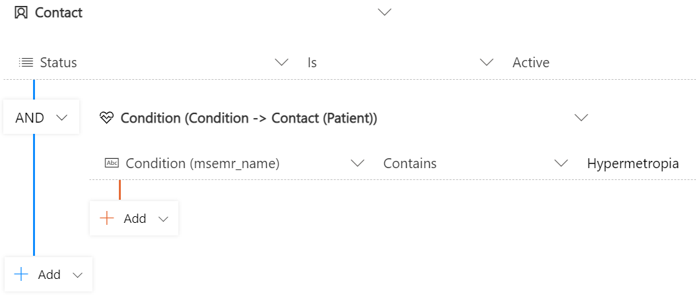](../media/query-block.png#lightbox)

1. Select **Save** and then select **Go live** to publish the segment (you won't be able to use it in a customer journey until it goes live, even if you've saved it).

    > [!div class="mx-imgBorder"]
    > [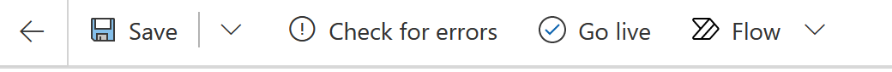](../media/save.png#lightbox)

1. Select **Refresh** on the command bar to refresh the page.

1. Select the **Members** tab to see which patients have been added to the Dynamic segment. Notice Elizabeth Moore in the list, a recipient of our next marketing event outreach email.

    > [!div class="mx-imgBorder"]
    > [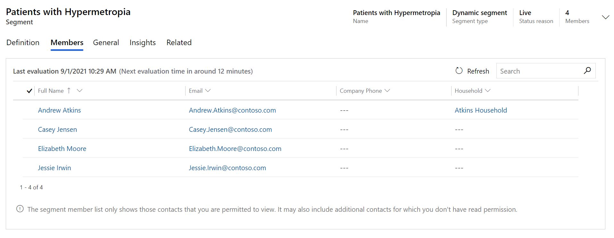](../media/members.png#lightbox)

Congratulations, you have completed the steps to create a patient segment that can be used for patient outreach. This patient segment will be used in the tasks in the next exercise.
