In this exercise, you will create a marketing email that will be used to reach out to the patient segment you created in the previous exercise. Marketing emails are used to directly communicate with the patients that reside in a particular patient segment.

1.  In the Patient Outreach app, scroll down to **Marketing Execution** in the left navigation pane and click **Marketing emails.**

	> [!div class="mx-imgBorder"]
	> [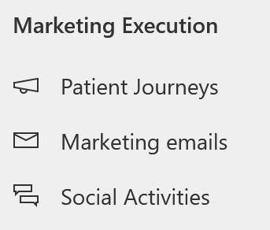](../media/marketing-emails.png#lightbox)

1.  In the **Active marketing emails** view, open **Email invitation - Free Diabetes Prevention Event**.

	> [!div class="mx-imgBorder"]
	> [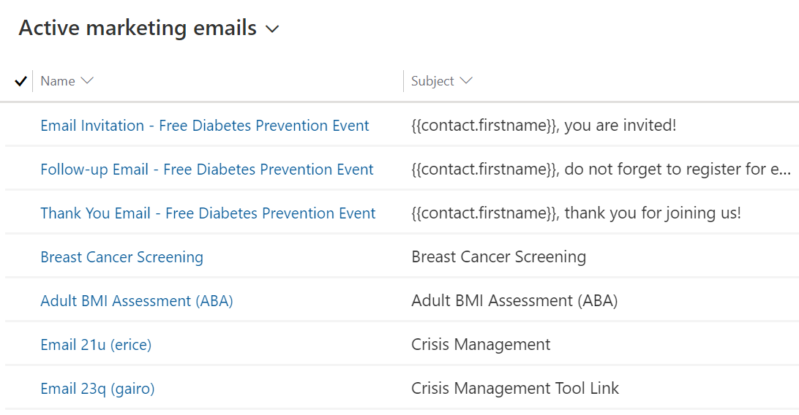](../media/email-invitation.png#lightbox)

1.  Click **Save** on the command bar and then **Save as**.

	> [!div class="mx-imgBorder"]
	> 

1.  Change the **Name** of the event to **Email Invitation - Healthy Eye Seminar Virtual Event** and the **Description** to "**Healthy Eye Seminar Event**". Click **Save and Close.**

	> [!div class="mx-imgBorder"]
	> [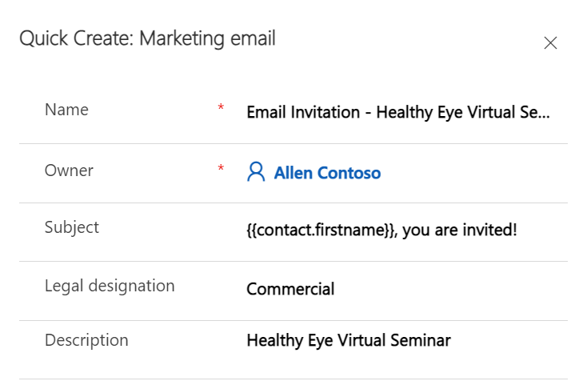](../media/close.png#lightbox)

1.  Navigate back to Marketing emails list and select your newly created segment **Email Invitation - Healthy Eye Virtual Seminar**.

	> [!div class="mx-imgBorder"]
	> [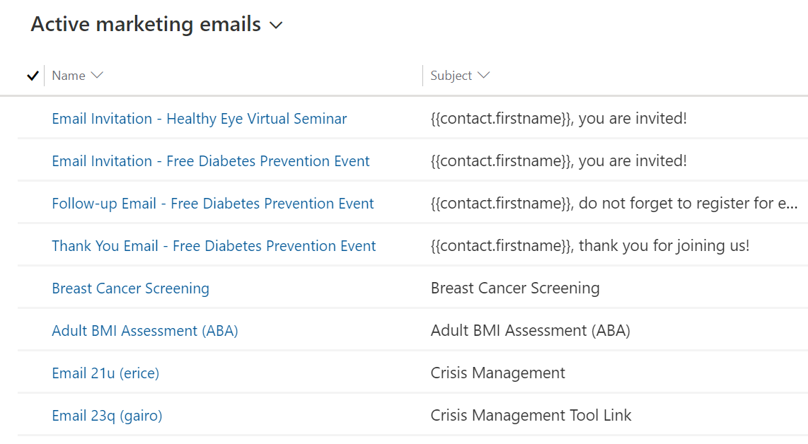](../media/new-segment.png#lightbox)

1.  Click the image in the Designer and click **Replace** in the Edit Image pane. 

	> [!div class="mx-imgBorder"]
	> [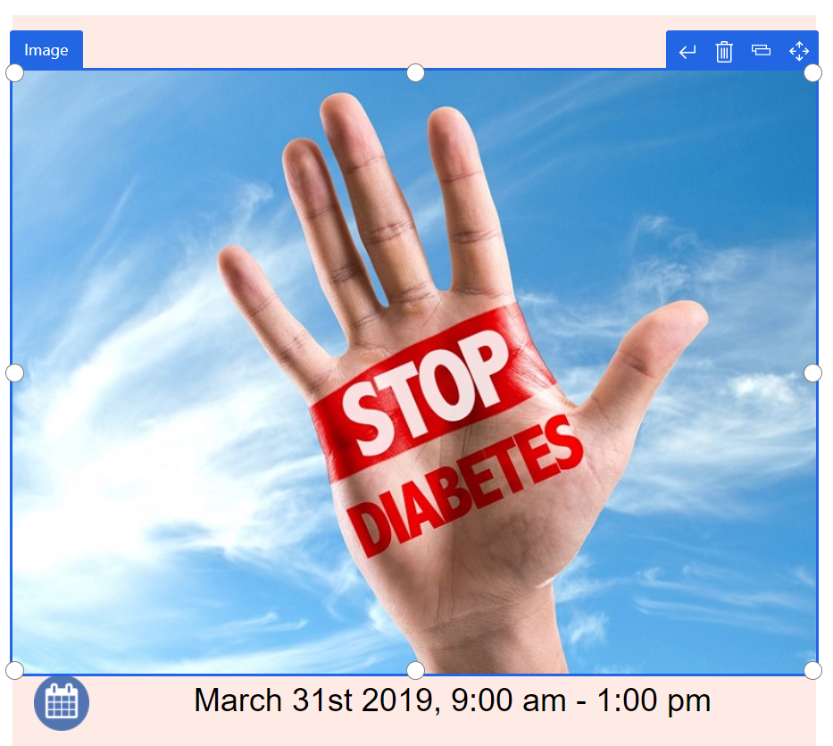](../media/replace.png#lightbox)

1.  Click **Upload to library**.

	> [!div class="mx-imgBorder"]
	> [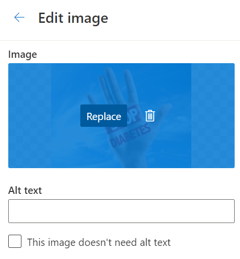](../media/upload.png#lightbox)

1.  **Right click** the image below and **Save as** Glasses.jpg.

	> [!div class="mx-imgBorder"]
	> 

1.  Select **Upload**. Select **Add files**. Find and select the file "Glasses.jpg" which you saved.

	> [!div class="mx-imgBorder"]
	> [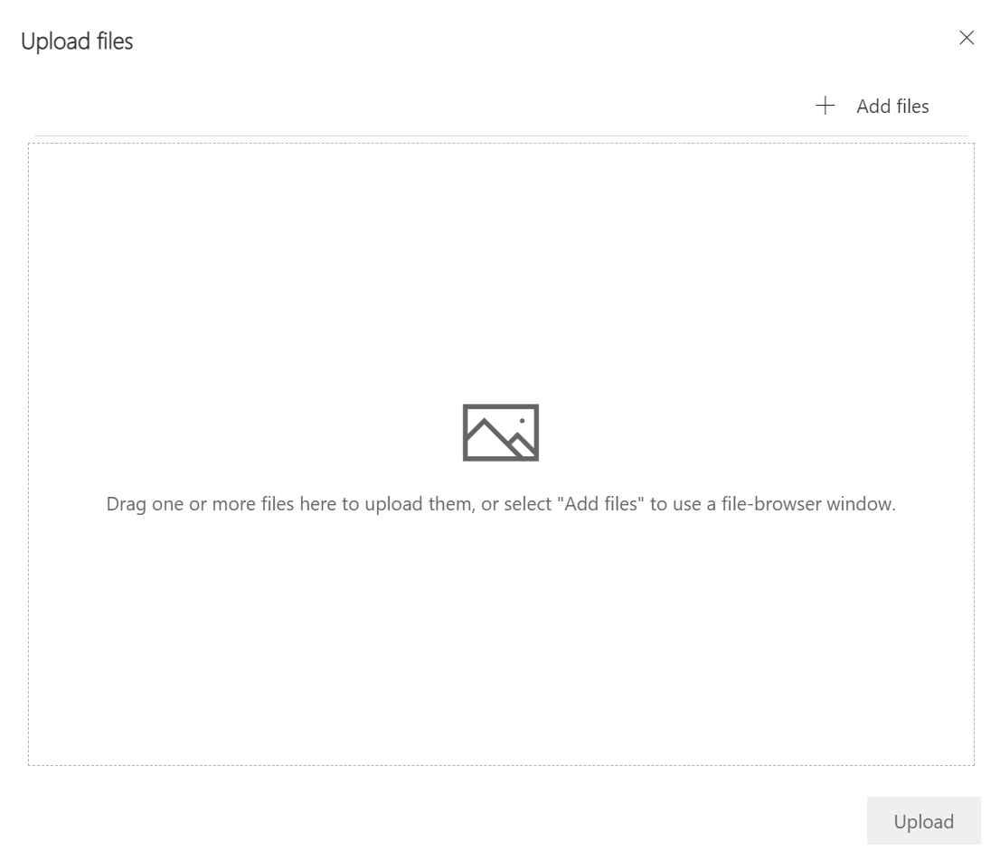](../media/upload-files.png#lightbox)

1. Click **Upload**.

	> [!div class="mx-imgBorder"]
	> [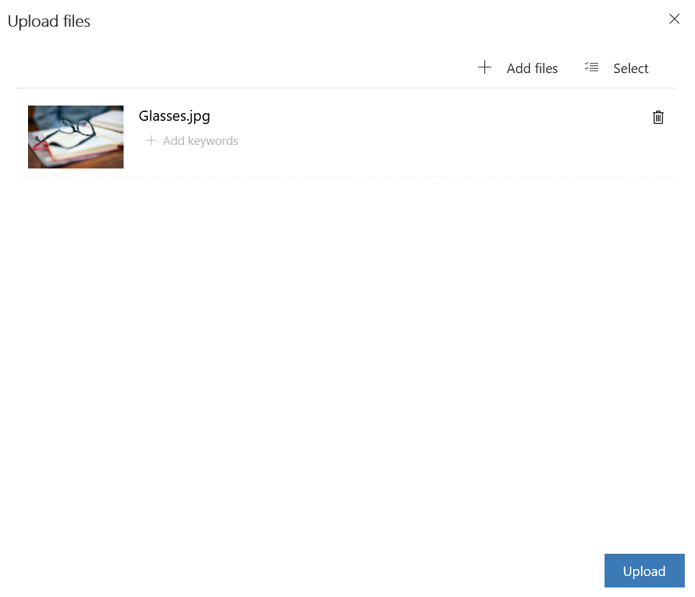](../media/upload-button.png#lightbox)

1. Highlight the image and then click **Select**.

	> [!div class="mx-imgBorder"]
	> [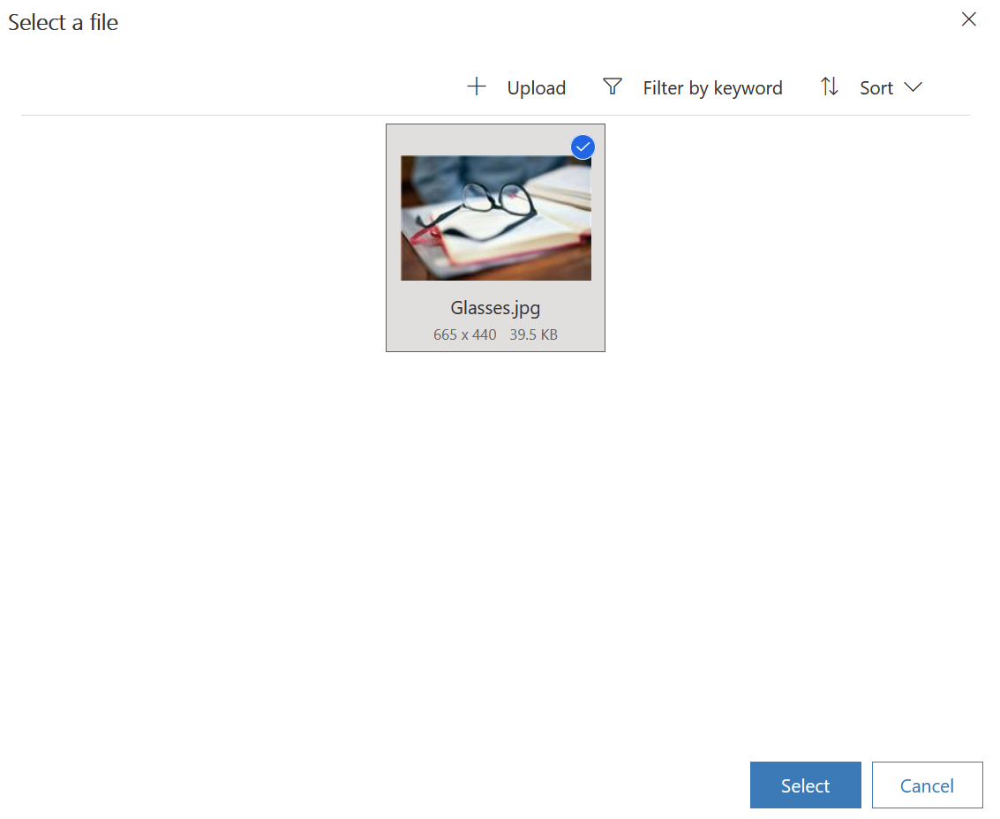](../media/select.png#lightbox)

1. Edit the text of the email as follows:

    a.  **Date**: Pick a date in the future

    b.  **Headline**: Healthy Eye Seminar

    c.  **Description 1**: "Hi, {{contact.firstname}}! You are invited to Lamna Healthcare's Healthy Eye Virtual Event.

    d.  **Description 2**: "Come join us at this virtual event.

	> [!div class="mx-imgBorder"]
	> [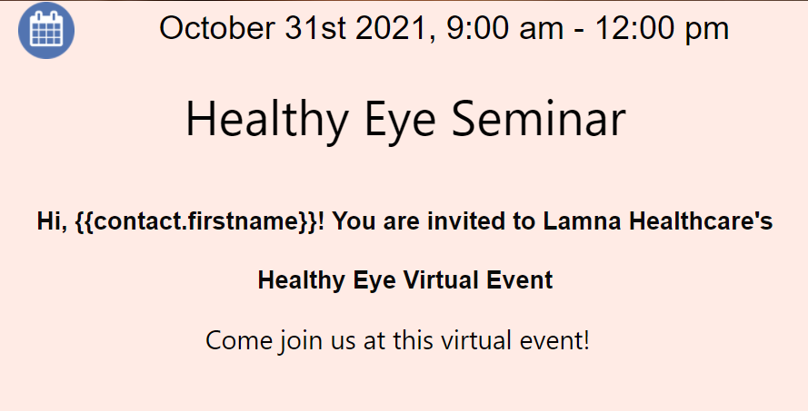](../media/text.png#lightbox)

1. Edit the **footer** text of the email so that it reads **©2021 Lamna Health Event.** Do NOT edit the dynamic text below.

	> [!div class="mx-imgBorder"]
	> [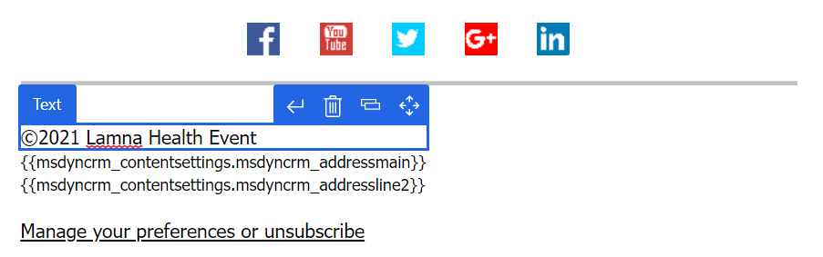](../media/footer.png#lightbox)

14. Click **Save** on the command bar and then click **Go live** so that the marketing email is available for use.

	> [!div class="mx-imgBorder"]
	> [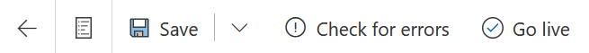](../media/go-live.png#lightbox)

**Congratulations**! You have completed the steps to create a marketing email that can be used for patient outreach. This marketing email will be used in the next set of tasks in the next exercise.

