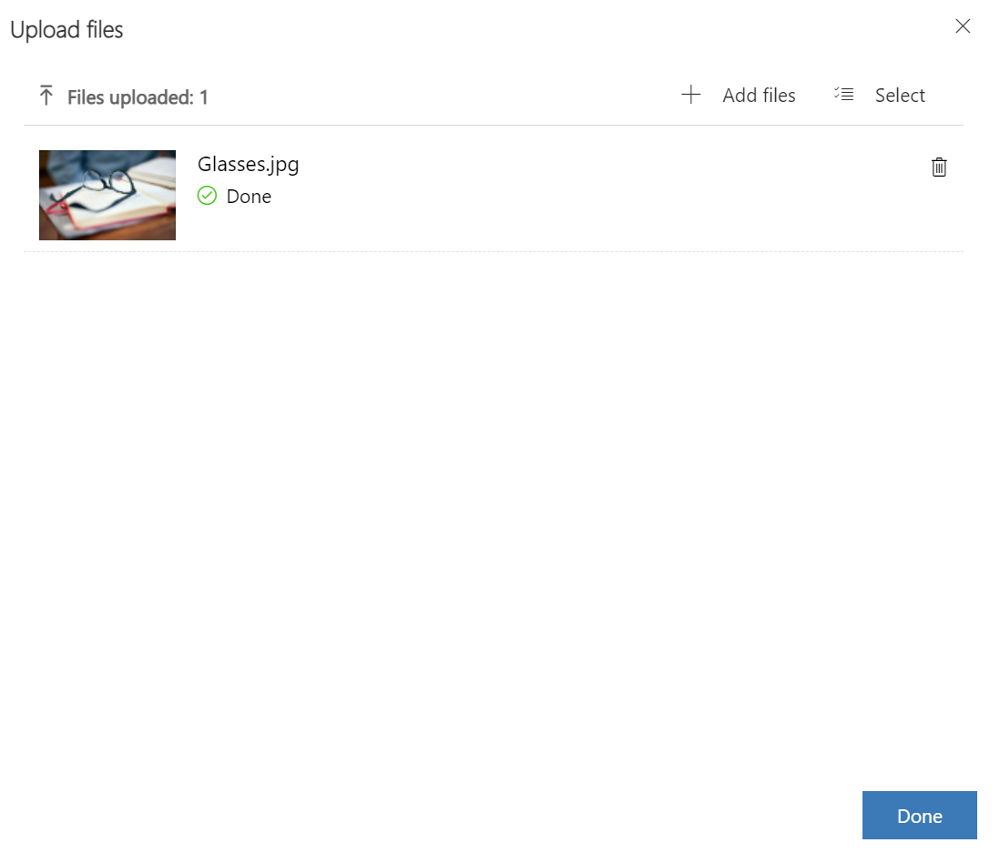

In this exercise, you will create a marketing email that will be used to reach out to the patient segment that you created in the previous exercise. Marketing emails help you directly communicate with patients who reside in a particular patient segment.

1. In the Patient Outreach app, scroll down to **Marketing Execution**. In the left navigation pane, select **Marketing emails**.

    > [!div class="mx-imgBorder"]
    > 

1. In the **Active marketing emails** view, open **Email Invitation - Free Diabetes Prevention Event**.

    > [!div class="mx-imgBorder"]
    > 

1. On the command bar, select **Save > Save as**.

    > [!div class="mx-imgBorder"]
    > 

1. Change the **Name** of the event to **Email Invitation - Healthy Eye Seminar Virtual Event** and the **Description** to **Healthy Eye Virtual Seminar**.

    > [!div class="mx-imgBorder"]
    > 

1. Select **Save and Close**.

1. Return to the **Active marketing emails** list and select your newly created **Email Invitation - Healthy Eye Virtual Seminar** segment.

    > [!div class="mx-imgBorder"]
    > 

1. Select the image in the designer.

    > [!div class="mx-imgBorder"]
    > 

1. Hover over the image in the Edit image pane and select **Replace**. Select **Upload to library**.

    > [!div class="mx-imgBorder"]
    > 

1. Right-click the following image, select **Save as**, and name the image **Glasses.jpg**.

    > [!div class="mx-imgBorder"]
    > 

1. Select **Add files**. Find and select the **Glasses.jpg** file that you saved.

    > [!div class="mx-imgBorder"]
    > 

1. Select **Upload**.

    > [!div class="mx-imgBorder"]
    > 

1. Select the **Done** button.

    > [!div class="mx-imgBorder"]
    > 

1. Edit the text of the email as follows:

    a. **Date** - Pick a date in the future

    b. **Headline** - Healthy Eye Seminar

    c. **Description 1** - Hi, {{contact.firstname}}! You are invited to Lamna Healthcare's Healthy Eye Virtual Event.

    d. **Description 2** - Come join us at this virtual event.

    > [!div class="mx-imgBorder"]
    > 

1. Edit the footer text of the email so that it reads **©2021 Lamna Health Event**. Do not edit the dynamic text that appears below it.

    > [!div class="mx-imgBorder"]
    > 

1. On the command bar, select **Save > Go live** so that the marketing email is available for use.

    > [!div class="mx-imgBorder"]
    > 

Congratulations, you have completed the steps to create a marketing email that can be used for patient outreach. This marketing email will be used in the next exercise. For more information on creating marketing emails, see [Create a marketing email (Dynamics 365 Marketing)](/dynamics365/marketing/create-marketing-email/?azure-portal=true).
