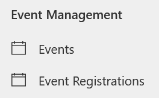
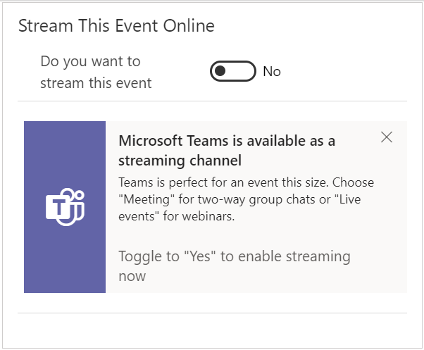
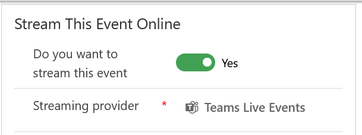
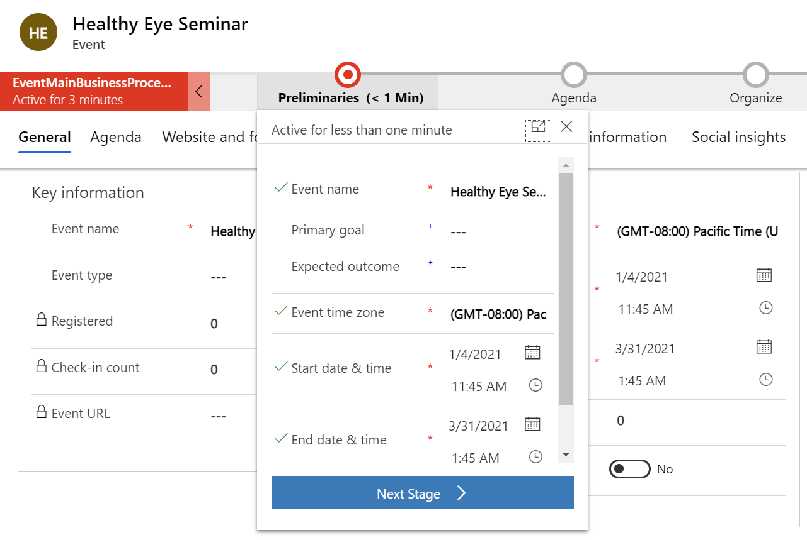
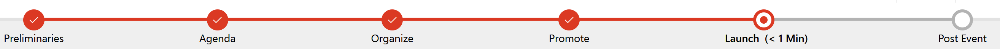
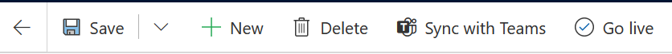
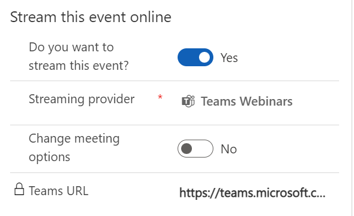
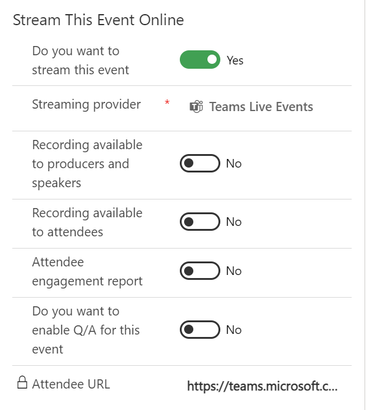

In this exercise, you will create a healthcare-focused, virtual marketing event that corresponds to the patient journey that you created in the previous exercise, where you sent the Healthy Eye Seminar event invite to everyone in the patient segment. The **Marketing Event Management** feature helps you every step of the way, from initial planning and budgeting through promotion and publication, attendee registration, webinar broadcasting, final analytics, lead generation, and evaluation of ROI.

1.  In the Patient Outreach application, select **Events** on the site map under **Event Management**.

	> [!div class="mx-imgBorder"]
	> 

1.  Select **+ New** on the command bar to create a new event.

1.  Enter details for the new event. Enter **Healthy Eye Seminar** in the **Event name** field and enter the same schedule details that you entered for the marketing email in the previous exercise. Make sure that you become familiar with the other fields on the forms as part of the **Preliminaries** event stage.

	> [!div class="mx-imgBorder"]
	> 

1.  Select **Save**.

1.  Because this event will be virtual, in the **Stream This Event Online** section, change the **Do you want to stream this event** toggle to **Yes**.

	> [!div class="mx-imgBorder"]
	> 

	> [!div class="mx-imgBorder"]
	> 

1.  In the Business Process Flow, select the first stage **Preliminaries**. In the flyout menu, select **Next Stage**.

	> [!div class="mx-imgBorder"]
	> 

1.  Advance each stage in the business process flow until you reach the **Launch** stage. Observe the fields that are associated with each stage as you advance through them.

	> [!div class="mx-imgBorder"]
	> 

1.  Select **Go live** on the command bar.

	> [!div class="mx-imgBorder"]
	> 

1.  The Microsoft Teams meeting URL will populate.

	> [!div class="mx-imgBorder"]
	> 

1. You can also choose to change the meeting options. Toggle to **Yes** to enable settings and more fields appear. These allow you to make the recording available to attendees, enable meeting chat, allow reactions, and more.

	> [!div class="mx-imgBorder"]
	> 

Congratulations, you have created a virtual marketing event for patients with hypermetropia by using Microsoft Cloud for Healthcare. For more information, see [Event planning and management overview](/dynamics365/marketing/event-management/?azure-portal=true).
