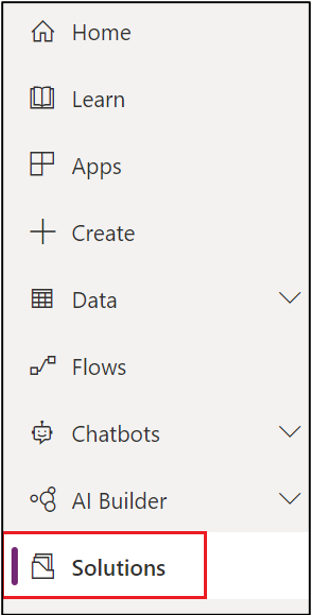
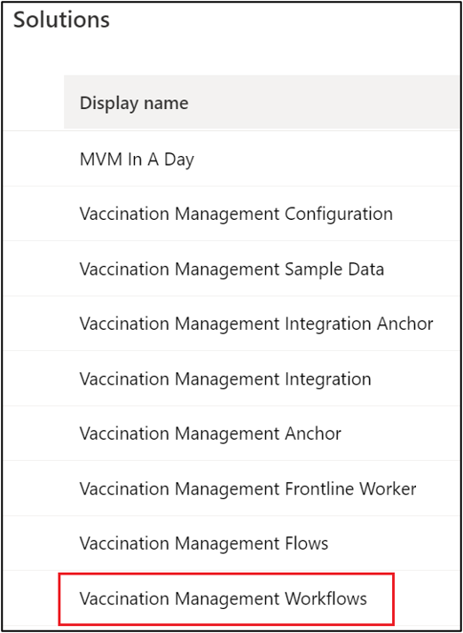
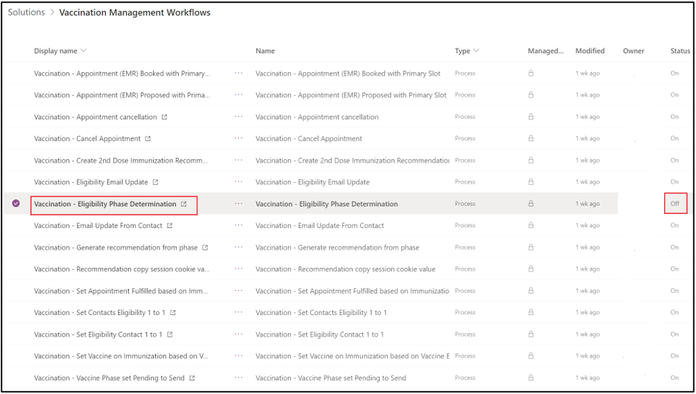
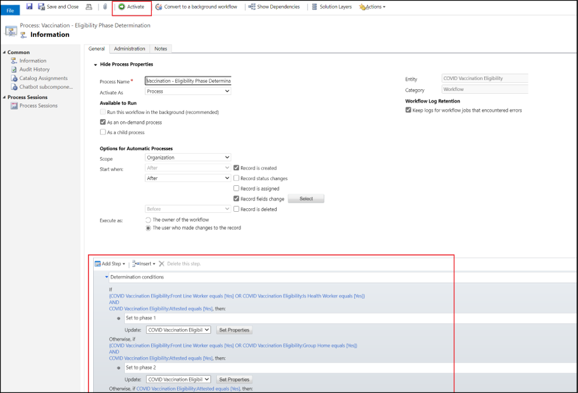

Microsoft Vaccination Management ships with workflows that help you automate certain business processes. After deploying the solution, you need to verify and activate the workflows based on your customer requirements. Most of the workflows are automatically activated.

In this exercise, you'll be playing the role of a system administrator. You will explore the included Microsoft Vaccination Management workflows and activate the inactive workflows.

Before beginning this exercise:

1. Launch an internet browser in **InPrivate** or **Incognito** mode and then go to [Power Apps](https://make.powerapps.com/?azure-portal=true).

1. Sign in by using the credentials that were supplied in the training for your user.

1. Select the correct environment from the **Environments** dropdown list in the upper-right corner.

## Explore and activate the inactive workflows
Follow these steps to explore and activate an inactive workflow in Microsoft Vaccination Management:

1. In the left pane, select **Solutions**. View the list of solutions that are deployed in the environment.

    > [!div class="mx-imgBorder"]
    > 

1. On the **Solutions** page, select **Vaccination Management Workflows**. This solution consists of all workflows that are shipped as part of Microsoft Vaccination Management.

    > [!div class="mx-imgBorder"]
    > 

1. Verify the **Status** on each workflow. If any workflow is turned off, open the workflow, verify the steps, and then select the **Activate** button to turn on the respective workflow, as shown in the next steps.

1. For example, the **Vaccination - Eligibility Phase Determination** workflow is turned off by default. Select to open the **Vaccination - Eligibility Phase Determination** workflow in a new tab in your browser.

    > [!div class="mx-imgBorder"]
    > 

1. In the workflow definition, review the logic in the lower part of the screen. This workflow contains the logic to determine eligibility and set a phase. After reviewing the logic, select **Activate**.

    > [!div class="mx-imgBorder"]
    > 

Congratulations, you have successfully explored and activated all Microsoft Vaccination Management workflows.
