The **Registration and booking** portal is deployed as part of the Microsoft Vaccination Management deployment, but you will be required to complete some post-deployment steps before you use the portal. This exercise explains those post-deployment steps.

## Task 1: Update Bing API key and map settings

The appointment scheduling portal lets you search for appointment locations by using Bing Maps. Update the portal settings to use your Bing Maps keys so that people can use this feature in the **Registration and booking portal**. You can also update the default latitude and longitude settings (which are currently set to the Seattle region) to ensure that the default region of the map is shown appropriately when the maps are displayed for the first time to users.

In this task, you'll learn how to update the Bing API key and other default map settings.

1. Create a [Bing Maps account](/bingmaps/getting-started/bing-maps-dev-center-help/creating-a-bing-maps-account/?azure-portal=true) and [generate an API key](/bingmaps/getting-started/bing-maps-dev-center-help/getting-a-bing-maps-key/?azure-portal=true).

   > [!NOTE]
   > If you are in an official training course, then this step is informational only and no action is required from you because the Bing Maps account would have already been set up and the API key would have been provided to you by your instructor.

1. Go to [Power Apps](https://make.powerapps.com/?azure-portal=true).

1. Select **Apps** on the left navigation pane. View the list of solutions that are deployed in the environment.

    > [!div class="mx-imgBorder"]
    > [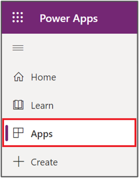](../media/3-1-apps.png#lightbox)

1. Find and select the **Portal Management** app to open it. This app consists of all portal settings and its metadata.

    > [!div class="mx-imgBorder"]
    > [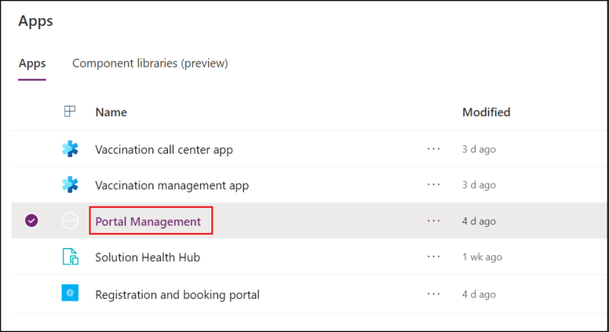](../media/3-2-portal-management.png#lightbox)

1. In the left pane, select **Site Settings**.

    > [!div class="mx-imgBorder"]
    > [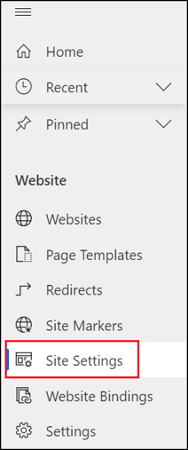](../media/3-3-site-settings.png#lightbox)

1. In the **Name** column, search for names that begin with **Vaccination Management/Map**.

    > [!div class="mx-imgBorder"]
    > [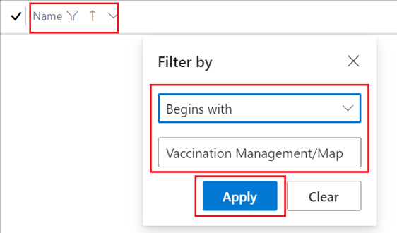](../media/3-4-name.png#lightbox)

1. Select each of the following records and then select edit to update the values as follows:

   - **Vaccination Management/Map/Credentials** - Set the Bing API key that was provided by your lab instructor.

   - **Vaccination Management/Map/DefaultLatitude** - Set the default latitude that the map needs to display on load, for example, **47.6740** for Redmond.

   - **Vaccination Management/Map/DefaultLongitude** - Set the default longitude that the map needs to display on load, for example, **-122.1215** for Redmond.

   - **Vaccination Management/Map/DefaultZoom** - Set the default zoom level to your preferred resolution when the map is loaded. For more information, go to [Map Control: Zoom Levels -> Resolution | Maps Blog (bing.com)](https://blogs.bing.com/maps/2006/02/25/map-control-zoom-levels-gt-resolution/?azure-portal=true).

    > [!div class="mx-imgBorder"]
    > [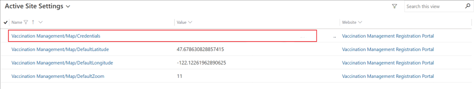](../media/3-5-active-site.png#lightbox)

## Task 2: Update portal binding

By default, the portal points to the starter portal configuration, which is the default template for a blank portal. After deploying the solution, you must change the binding of the portal to point to the new portal configuration instead of the starter portal.

In this task, you'll learn how to update the portal binding after the solution deployment.

1. Go to [Power Apps](https://make.powerapps.com/?azure-portal=true).

1. Select **Apps** on the left navigation pane and then view the list of solutions that are deployed in the environment.

1. Find the **Registration and booking portal**, which is the portal that is used for registering and booking appointments.

   > [!NOTE]
   > The portal name might be different in your environment, but only one **Registration and booking portal** app exists, and it is the one that you need to select.

    > [!div class="mx-imgBorder"]
    > [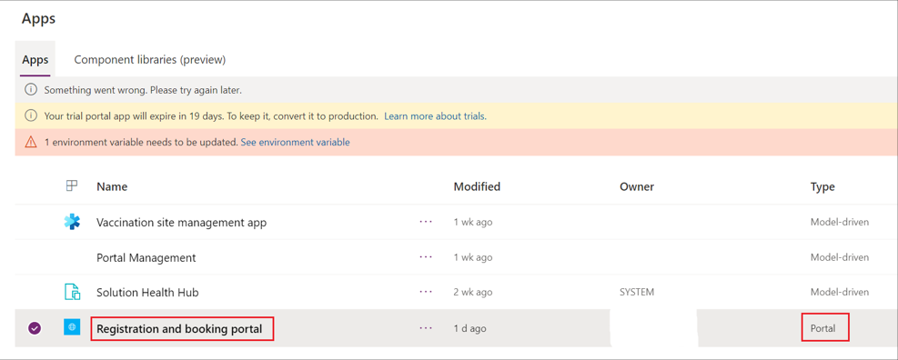](../media/3-6-registration-book-portal.png#lightbox)

1. Select the **More Commands** ellipsis (**...**) and then select **Browse**, which will open the **Registration and booking portal**. You can also select the app name or select **Browse** on the top command bar to open it.

    > [!div class="mx-imgBorder"]
    > [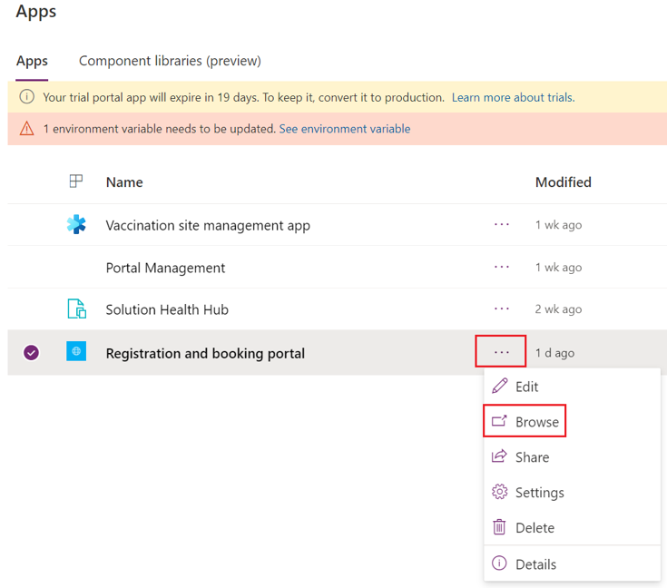](../media/3-7-browse.png#lightbox)

   The starter portal template should appear in the **Registration and booking portal** website.

    > [!div class="mx-imgBorder"]
    > [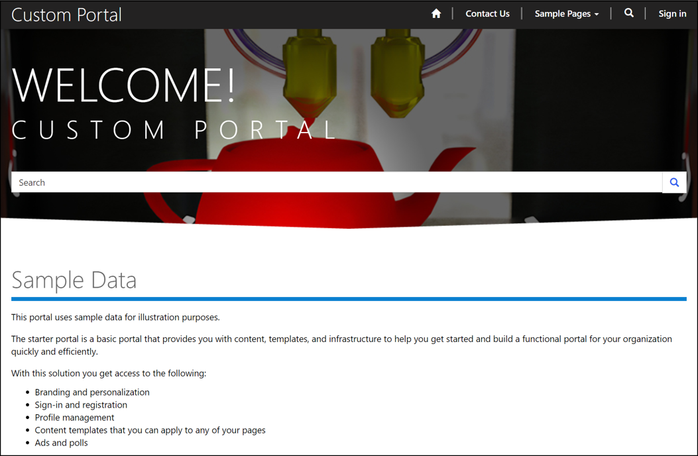](../media/3-8-custom-portal.png#lightbox)

1. Close the **Registration and booking portal** website. Now, you'll configure it to the Vaccination Management Registration Portal template.

1. Return to the **Power Apps** screen in the **Apps** section.

1. Select the **Registration and booking portal** app if it isn't already selected.

1. Select the **More Commands** ellipsis (**...**) and then select **Settings**. The **Portal settings** panel will display in a pop-out window on the right.

    > [!div class="mx-imgBorder"]
    > [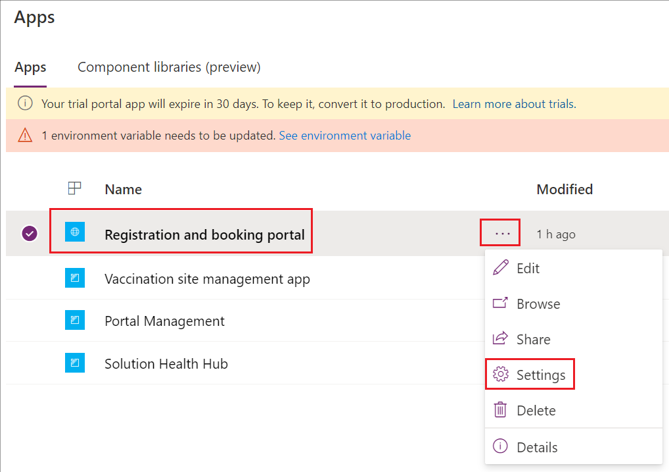](../media/3-9-settings.png#lightbox)

1. In the right pane, select **Administration** to open Power Apps portals admin center in a new tab.

    > [!div class="mx-imgBorder"]
    > [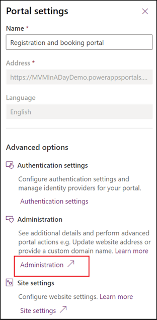](../media/3-10-administration.png#lightbox)

1. The **Power Apps portals admin center** tab will open, where you can do portal administrative tasks.

   The page should open in the **Portal Details** tab of the Power Apps portals admin center.

1. Scroll down to **Update Portal Binding**, open the **Select Website Record** dropdown list, change the current value (**Starter Portal**) to **Vaccination Management Registration Portal**, and then select the **Update** button.

    This action binds the **Vaccination Management Registration Portal** template to this portal URL and shows the proper user interface to the user.

    > [!div class="mx-imgBorder"]
    > 

1. In left pane, select **Portal Actions** and then select **Restart** to restart the portal for the changes to take effect.

    > [!div class="mx-imgBorder"]
    > [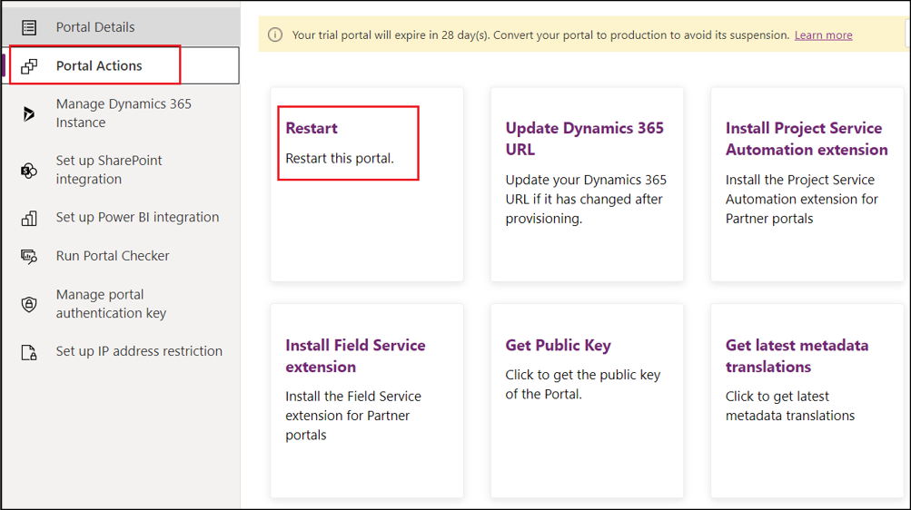](../media/3-12-restart.png#lightbox)

1. When prompted, confirm the **Restart** for the portal.

    > [!div class="mx-imgBorder"]
    > [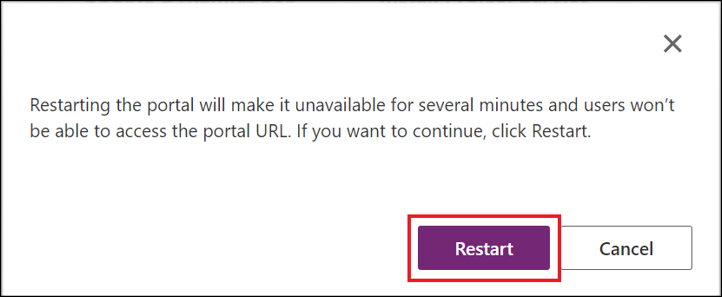](../media/3-13-restart.png#lightbox)

1. Wait 1-5 minutes for the portal to restart.

    > [!TIP]
    > You might also move ahead to the next exercise because you will open the portal later in the next exercise.

1. Return to the **Registration and booking portal**.

    1. Go to [Power Apps](https://make.powerapps.com/?azure-portal=true).

    1. Select **Apps** and then select the **Registration and booking portal** app.

    1. Open the app by selecting the app name or by selecting **Browse**.

        > [!div class="mx-imgBorder"]
        > 

1. If the following error appears, the portal is still restarting.

    > [!div class="mx-imgBorder"]
    > [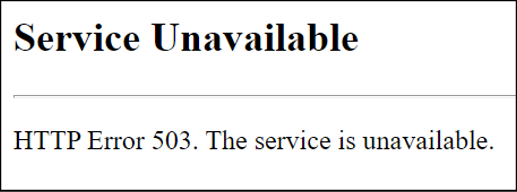](../media/3-14-unavailable.png#lightbox)

1. When the portal is opened and running properly, it should resemble the following image. At this time, copy and store the portal URL (without **https://**) because you'll be using it to update the environment variable in the next exercise.

    > [!div class="mx-imgBorder"]
    > 

## Task 3: Enable the virtual waiting room

The virtual waiting room feature in the **Registration and booking portal** in Microsoft Vaccination Management:

- Allows you to streamline demand during burst load situations.

- Removes the unpredictability element.

- Provides a predictable user experience that users expect from a consumer-grade site.

Enabling this feature will limit the number of people who are allowed on the site through a virtual queue mechanism. When the queue is full, new users are placed in a virtual waiting room and are provided with a default page that is configurable. Every minute, more users are automatically allowed onto the site, depending on the queue length configuration.

As part of this task, you'll learn the steps to enable a virtual waiting room and its parameters. In an actual customer implementation, contact the product group before setting up these parameters so that, based on the expected volumes, the product group can scale the portal and provide the expected parameter values.

1. Go to [Power Apps](https://make.powerapps.com/?azure-portal=true).

1. Select **Apps** on the left navigation pane and then view the list of solutions that are deployed in the environment.

1. Find and select the **Portal Management** app to open it. This app consists of all portal settings and its metadata.

    > [!div class="mx-imgBorder"]
    > 

1. In the left pane, select **Settings**.

    > [!div class="mx-imgBorder"]
    > [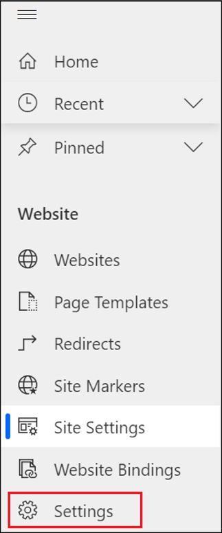](../media/3-16-settings.png#lightbox)

1. Select each of the following records and then select **Edit** to update the values according to the following instructions:

   - On the record ending with **EnableThrottling**:

     To enable the virtual waiting room feature, set the value to **true**.

   - On the record ending with **ThrottlingCounterThreshold**:

     The value in this field indicates the number of users to be allowed within a specified time. In this task, to experience the waiting room feature, set the value to **1**, which means that only one session is allowed each minute and other sessions are expected to be in the virtual waiting room. However, in an actual customer implementation, contact the product group before setting up this parameter so that, based on the expected volumes, the product group can scale the portal and suggest the expected value.

   - On the record ending with **ThrottlingTimeout**:

     The value in this field indicates the time limit within which the maximum number of users are to be allowed. In this task, to experience the waiting room feature, set the value to **00:01:00**, which means that one session is allowed each minute.

    > [!div class="mx-imgBorder"]
    > [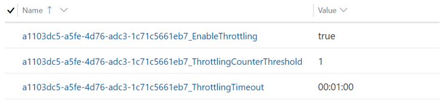](../media/3-17-values.png#lightbox)

1. Return to the **Registration and booking portal**.

    1. Go to [Power Apps](https://make.powerapps.com/?azure-portal=true).

    1. Select **Apps** and then select the **Registration and booking portal** app.

    1. Open the app by selecting the app name or by selecting **Browse**.

    > [!div class="mx-imgBorder"]
    > 

   The portal should resemble the following image.

    > [!div class="mx-imgBorder"]
    > 

1. Immediately copy and paste the portal URL into a different browser so that you can view the virtual waiting room page. If you're a bit late, then try opening the portal in different tab pages, which should show the difference.

    > [!div class="mx-imgBorder"]
    > [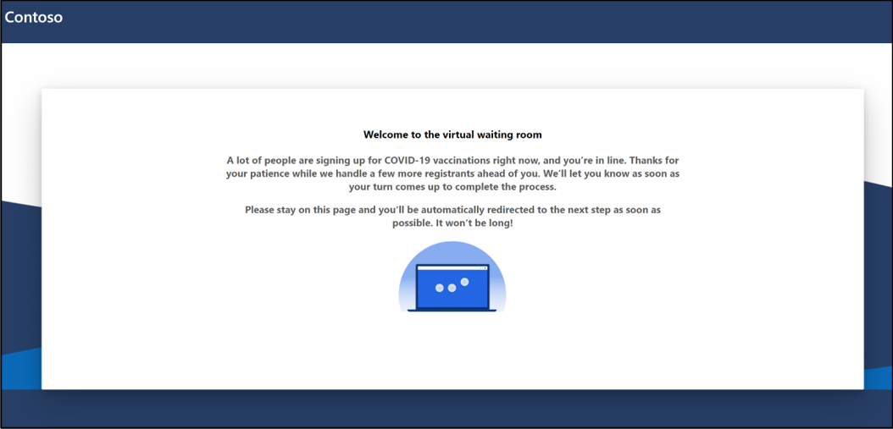](../media/3-18-wait.png#lightbox)

1. Wait for a minute on the same page and then you'll see the actual home page of the registration portal.

    > [!div class="mx-imgBorder"]
    > 

1. Return to the **Portal Management Settings** page.

    1. Find and select the **Portal Management** app to open it. This app consists of all portal settings and its metadata.

        > [!div class="mx-imgBorder"]
        > 

    1. In the left pane, select **Settings**.

    1. Disable the virtual waiting room feature by updating the value to **false** on the record ending with **EnableThrottling**.

Congratulations, you have successfully completed the post-deployment steps to configure the **Registration and booking portal**. After you have updated the bindings and restarted the portal, the website should now show as Vaccination Management Registration Portal template rather than Starter Portal. You've also learned the steps to enable the virtual waiting room feature.
