[Microsoft Exchange Online](https://www.microsoft.com/microsoft-365/exchange/exchange-online/?azure-portal=true) isn't a bulk email service, and has a limit of 10,000 emails per day per mailbox, which won't suffice for typical email volumes required for vaccination management scenarios, so it requires customers to have their own bulk email service as per their choice and compliance needs that they can use to send emails for various scenarios including registration confirmation, booking invitations, appointment confirmation and cancellations, appointment reminders, and immunization records. While the actual number of emails sent will vary for each deployment based on your registration and vaccination volumes, the number of emails can be *excessively high per day during peak times*.

Customer implementations can extend the [standard Power Automate flows](/dynamics365/industry/vaccination-management/configure-security-portal-flows/?azure-portal=true#configure-power-automate-flows) in Microsoft Vaccination Management (MVM) to integrate Microsoft Vaccination Management with the third-party bulk email provider of their choice.

Some of the popular bulk email services like [SendGrid](https://azuremarketplace.microsoft.com/marketplace/apps/SendGrid.SendGrid?tab=Overview&azure-portal=true) have standard Power Automate connectors that can be used by customers or other bulk email services can be integrated by building a Power Automate custom connector.

In this exercise, you'll learn to extend an email flow to integrate with SendGrid Service as an example to send higher volumes of emails.

See the following documentation to learn more about the [Sending limits in Exchange](/office365/servicedescriptions/exchange-online-service-description/exchange-online-limits/?azure-portal=true#receiving-and-sending-limits).

## Task 1: Extend an Email flow to integrate with Bulk email service

In this task, you'll learn to use SendGrid connector as an example to send higher volumes of emails.

See the following documentation to learn more about the [SendGrid Connector](/connectors/sendgrid/?azure-portal=true).

> [!div class="mx-imgBorder"]
> [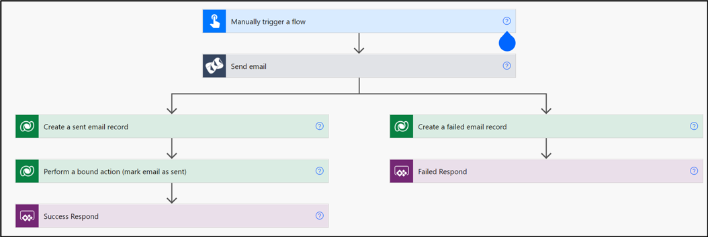](../media/5-1-flow.png#lightbox)

1. Create a SendGrid account either directly in [SendGrid](https://sendgrid.com/?azure-portal=true) or via [Azure portal](/azure/sendgrid-dotnet-how-to-send-email/?azure-portal=true#create-a-sendgrid-account) and then create an API key.

    > [!Note]
    > If you are in an official training course, then this step is just informational and no action is required, because the SendGrid account is already set up and the API key is provided to you.

1. Navigate to [Power Apps](https://make.powerapps.com/?azure-portal=true).

1. In the left pane, select **Solutions** and then you can view the list of solutions deployed in the environment.

    > [!div class="mx-imgBorder"]
    > [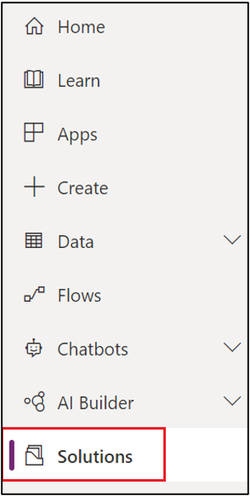](../media/4-15-solutions.png#lightbox)

1. On the **Solutions** page, select **MVM In A Day** solution.

    > [!div class="mx-imgBorder"]
    > [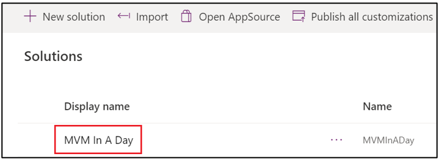](../media/5-2-day.png#lightbox)
1. In the **MVM In A Day** solution, select **+ Add existing > Cloud flow** in the command bar.

    > [!div class="mx-imgBorder"]
    > [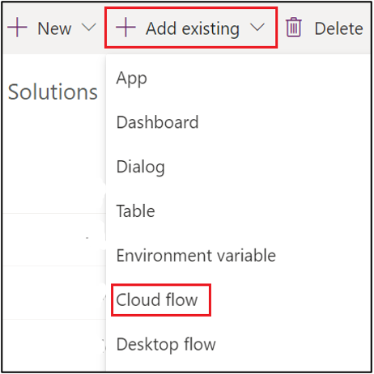](../media/5-3-add.png#lightbox)

1. On the right pane, select **Send Email (Phase Opening)**, **Send Email (Registration)**, **Send Email with Attachment (Base)**, and **Send Email (Generic)** flows, and select **Add** to add them into the solution.

    > [!div class="mx-imgBorder"]
    > [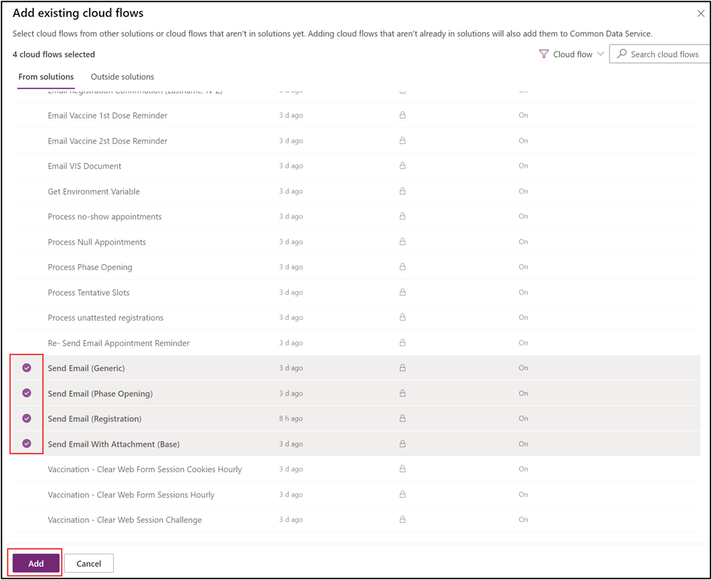](../media/5-4-cloud-flows.png#lightbox)

1. On the **Send Email (Registration)** flow, select **More Commands** (...), then **Edit** to open and edit the flow in a new tab in the browser.

    > [!div class="mx-imgBorder"]
    > [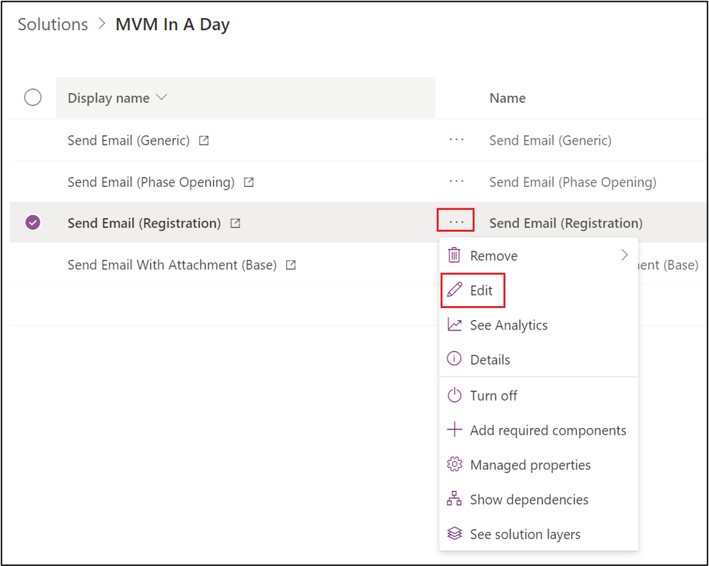](../media/5-5-edit.png#lightbox)

1. Select the **+** button to add a new step in between **Manually trigger a flow** step and **Send an email** to the flow.

    > [!div class="mx-imgBorder"]
    > [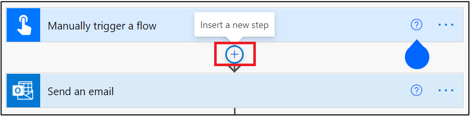](../media/5-6-insert.png#lightbox)

1. Search and add a SendGrid's **Send email (v4)** action and rename it to **Send email.**

    > [!div class="mx-imgBorder"]
    > 

1. Provide a **Connection name** (For example, MVM In A Day SendGrid), enter the API Key in the **SendGrid API key** and then select **Create** to establish a connection with SendGrid server.

    > [!Note]
    > If you are in an official training session, use the SendGrid API key provided by your lab instructor.

    > [!div class="mx-imgBorder"]
    > [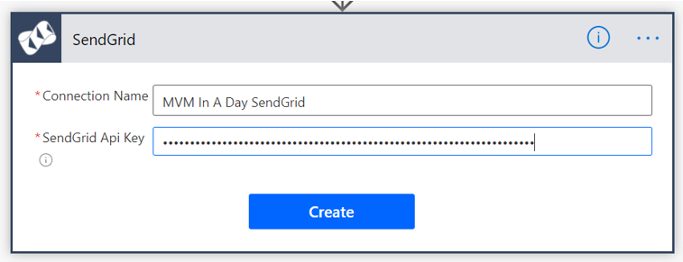](../media/5-8-send-grid.png#lightbox)

1. Provide the details as mentioned below:

    - **From**: Use a no-reply email address.

        > [!Note]
        > If you are in an official training session, use the no-reply email address provided by your lab instructor.

    - **To**: Add a dynamic content **Email**.

    - **Subject**: Add a dynamic content **EmailSubject**.

    - **Email body**: Select the **</>** symbol on the format bar in Email body and replace the code with the dynamic content **EmailBody**.

    > [!div class="mx-imgBorder"]
    > [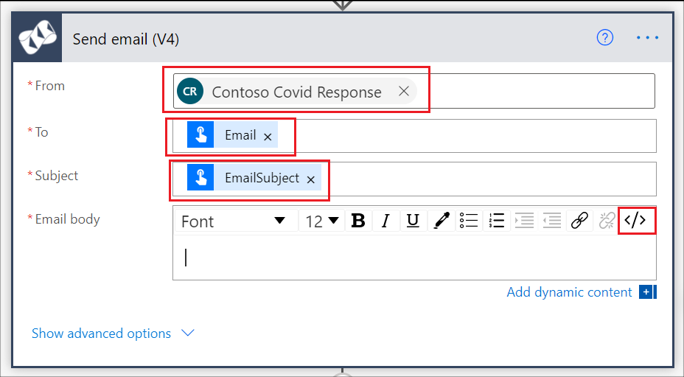](../media/5-9-send.png#lightbox)

    > [!div class="mx-imgBorder"]
    > [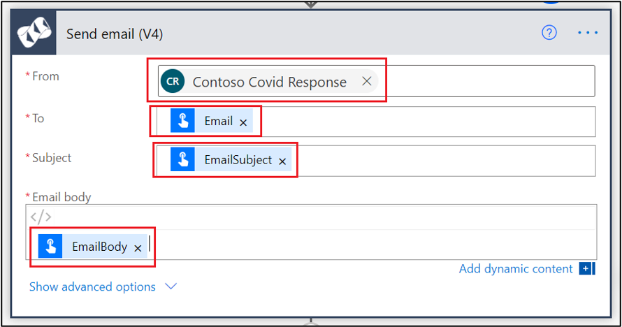](../media/5-10-send.png#lightbox)

1. Select **More commands** (...), then **Settings.**

    > [!div class="mx-imgBorder"]
    > [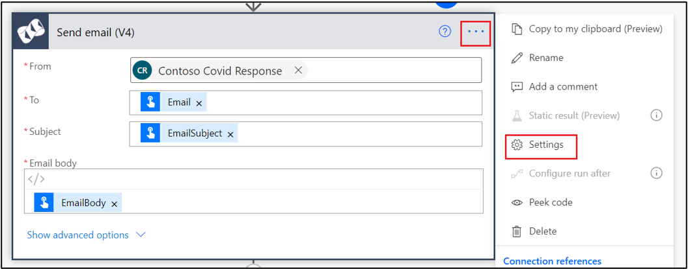](../media/5-11-settings.png#lightbox)

1. Set up a retry policy on this step so that the step will run again if there are any intermittent failures based on settings defined below:

    - **Type:** Select **Exponential interval.**

    - **Count:** Set the retry count to **25**.

    - **Interval**: Set the interval in ISO 8601 format. For example, for one minute, update it to **PT1M**.

    - **Minimum Interval**: Set the minimum interval in ISO 8601 format. For example, for one minute, update it to **PT1M**.

    - **Maximum Interval:** Set the maximum interval in ISO 8601 format. For example, for one hour, update it to **PT1H**.

    > [!div class="mx-imgBorder"]
    > [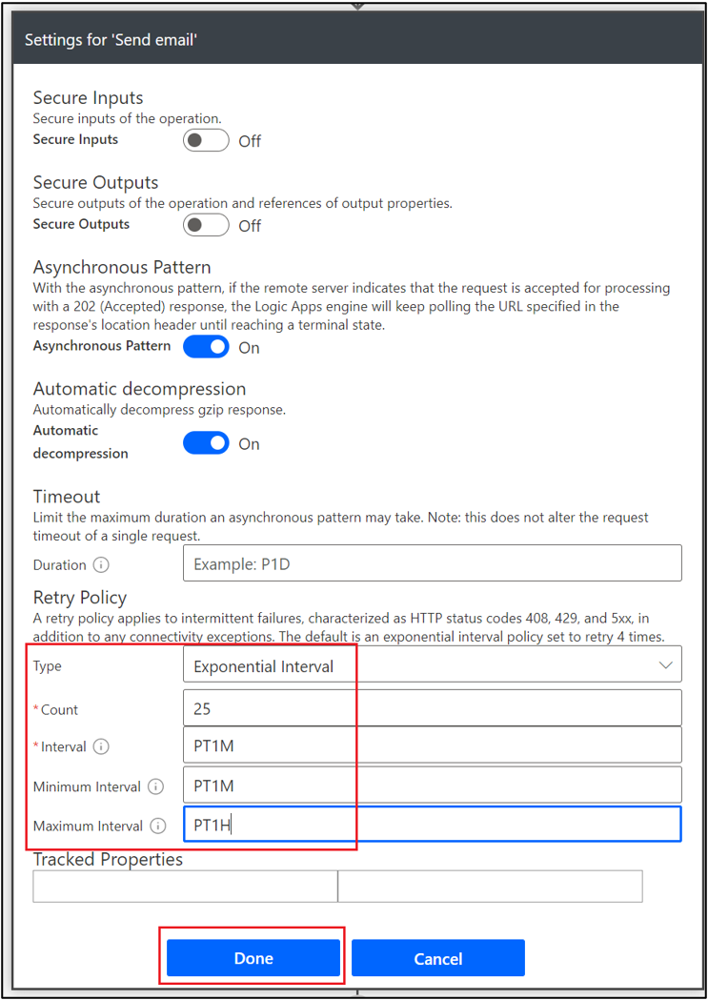](../media/5-12-retry.png#lightbox)

1. Delete the **Send an email** step by selecting **More commands** (...), then **Delete.**

    > [!div class="mx-imgBorder"]
    > [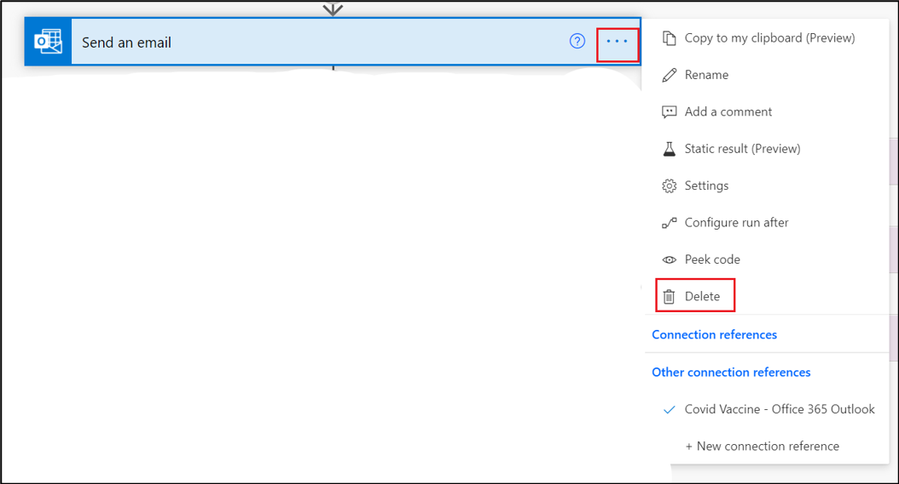](../media/5-13-delete.png#lightbox)

1. On the **Create a failed email record** step, select **Configure run after**.

    > [!div class="mx-imgBorder"]
    > [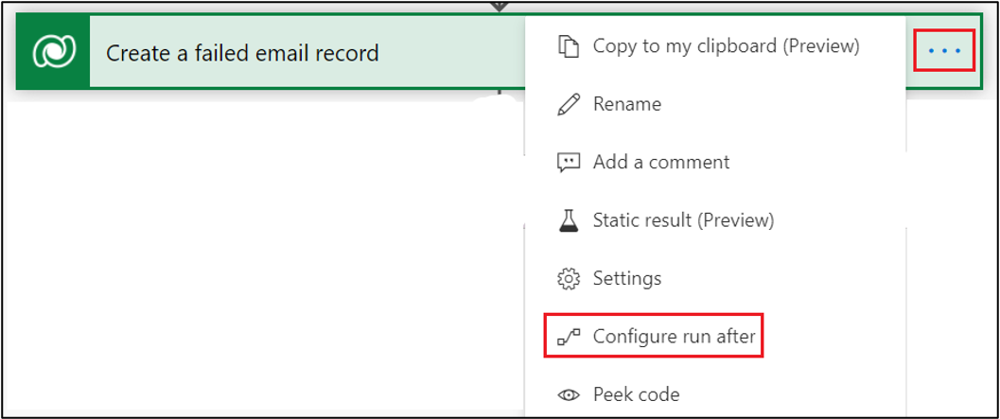](../media/5-14-failed.png#lightbox)

1. Select the three statuses as shown in the below screenshot and then select **Done** so that this set of step runs only when the email run step has failed, skipped, or timed out.

    > [!div class="mx-imgBorder"]
    > [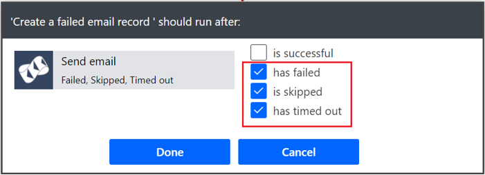](../media/5-15-fail-skip.png#lightbox)

1. Select **Save** button on top edge of the flow editor and make sure there are no errors in the flow checker.

    > [!div class="mx-imgBorder"]
    > [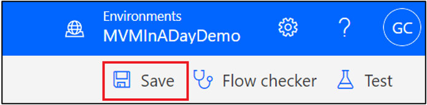](../media/5-16-save.png#lightbox)

1. Select **<-** to navigate to the overview screen.

1. Select **Edit** on the **Run only users** section.

    > [!div class="mx-imgBorder"]
    > [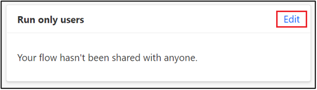](../media/5-17-run.png#lightbox)

1. Select **Use this connection (MVM In A Day SendGrid)** from the drop-down list and then select **Save** so that this connection will be used when this child flow is used in the parent flows.

    > [!div class="mx-imgBorder"]
    > [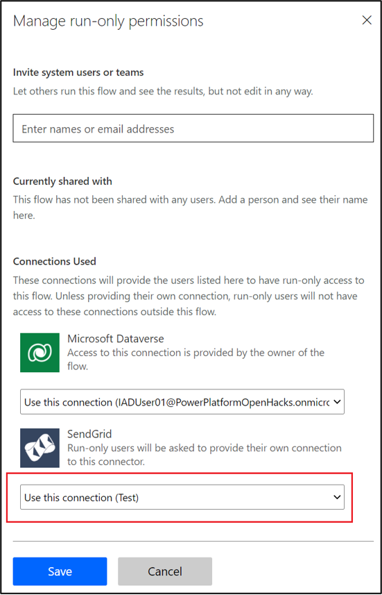](../media/5-18-manage.png#lightbox)

1. If the **Status** of the flow is **Off**, then select **Turn on** to enable the flow. You can skip this step if the flow is already enabled.

1. (Optional Step) You can use the same steps mentioned in this task to replace the Office 365 Outlook connector with SendGrid connector on the other email flows: **Send Email (Phase Opening)**, **Send Email with Attachment (Base)** and **Send Email (Generic)**.

## Task 2: Test the Power Automate flow changes

In this task, you'll test the Power Automate flow changes done as part of this exercise by registering in the **Registration and booking portal** and verify the email.

1. Navigate to [Power Apps](https://make.powerapps.com/?azure-portal=true).

1. To test the email flow, select **Apps** on the left navigation bar and then you can view the list of Apps deployed in the environment.

    > [!div class="mx-imgBorder"]
    > [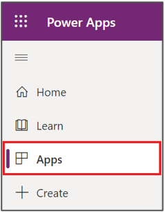](../media/5-19-apps.png#lightbox)

1. Find the **Registration and booking portal** and select it to open the portal in a new tab page in the browser. This is the portal used for Registration and booking appointments.

1. Select **Start registration** in the portal.

1. Don't set **Yes** for any of the questions in the questionnaire.

1. After filling the questionnaire, provide all the required resident details and, make sure to provide a last name starting in between A-M.

1. At the end of the page, enter the year in **Date of birth** as 1990 and provide a valid email address.

1. At the end of review page, mark the confirmation checkbox and then select **Complete registration** button.

    > [!div class="mx-imgBorder"]
    > [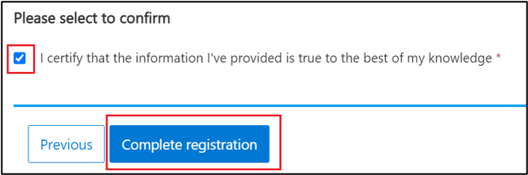](../media/5-20-confirm.png#lightbox)

After one to three minutes, **Email Registration Confirmation (Lastname: A-M)** will pass the required details to its child flow, **Send Email(Registration)** to send an email to the resident. You'll also receive a registration confirmation email to the email address provided in the registration and booking portal within three minutes.

> [!div class="mx-imgBorder"]
> [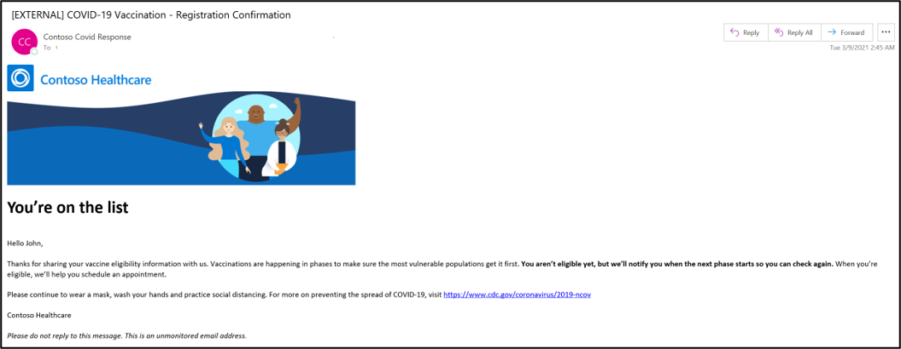](../media/5-21-confirmation.png#lightbox)

1. If you haven't received the registration email by five minutes after submission, then:

    - Check for the e-mail in your Junk folder.

    - If you can't find the registration email in your junk folder, then verify whether the steps in Exercise 1, Task 1, Steps 4 and 5 were followed and then redo this task.

    - If you can't find the registration email even after following the above steps, then open the latest executions in **Email Registration Confirmation (Lastname: A-M)** and **Send Email(Registration)** flow history to debug it further.

1. You can also verify the **28-day run history** for the execution status and detailed run history in the **Email Registration Confirmation (Lastname: A-M)** and **Send Email(Registration)** flows.

1. If you're receiving the same e-mail every three minutes, then it could stem from an incorrect setup of values in the Flow. Turn off the **Send Email(Registration)** flow immediately and compare all the values set in your **Send Email(Registration)** flow as part of Exercise 4, Task 1, Steps 15 and 16. If you don't see any difference, then open the latest execution from **Send Email(Registration)** flow history to debug it further. Don't turn on the flow again until you have found the difference in the setup and corrected it.

**Congratulations!** You've learned to integrate a bulk email service with MVM Email flows.
