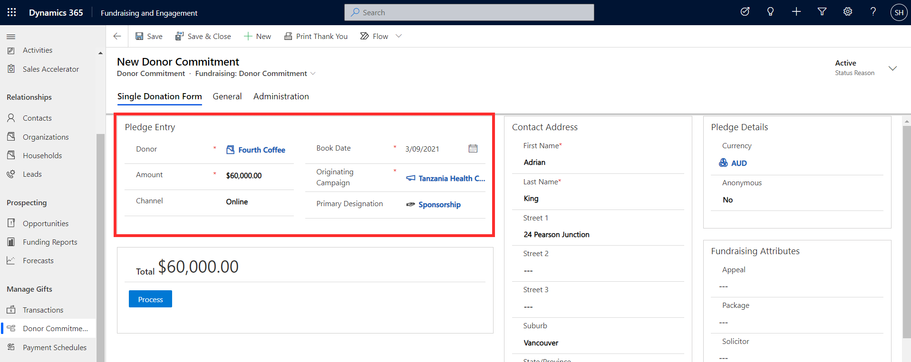
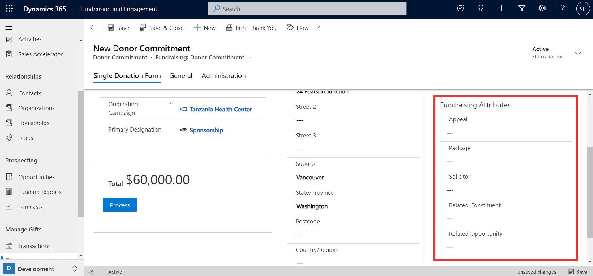
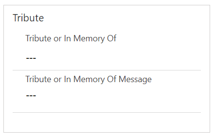
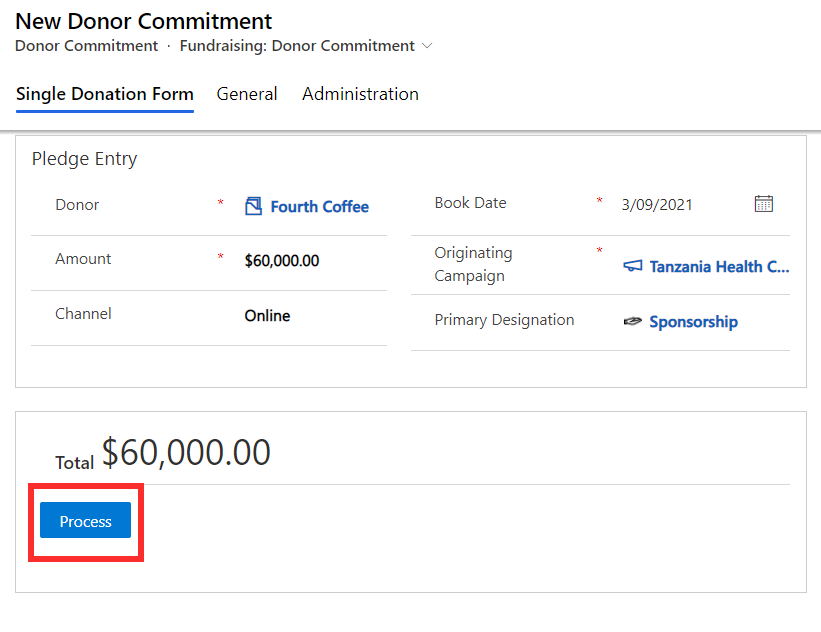
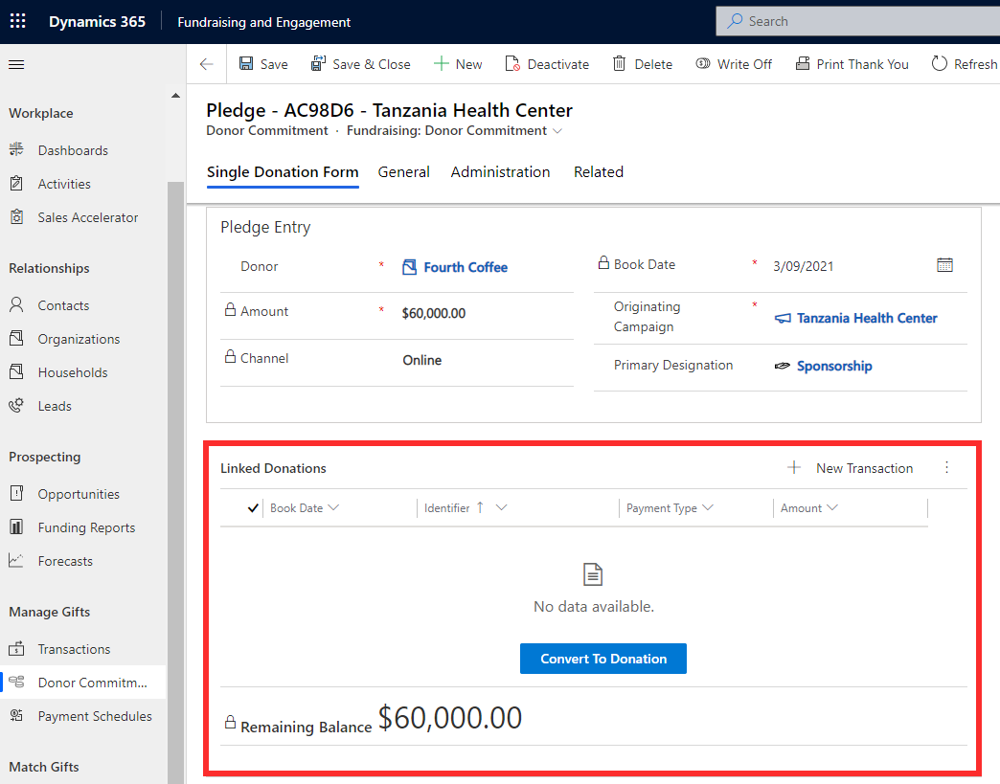
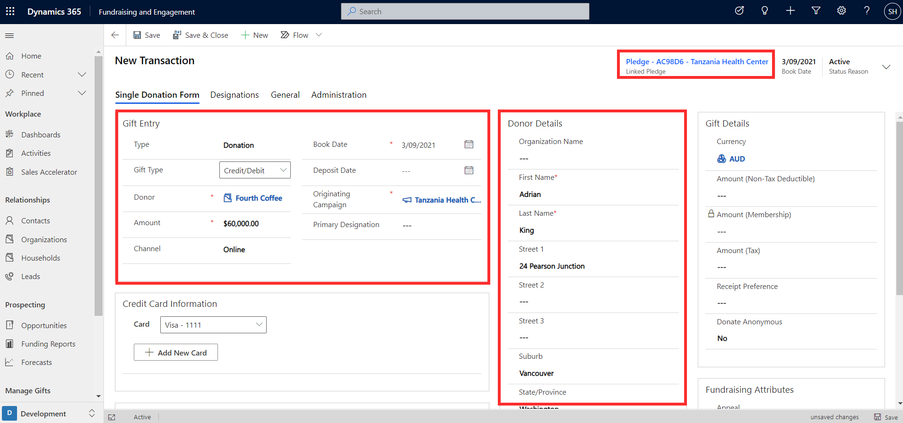
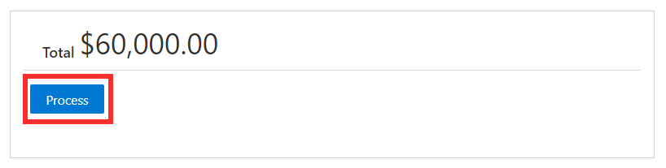
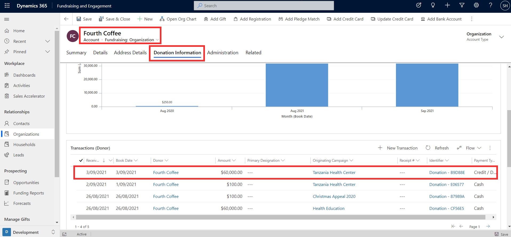

A donor commitment represents the actual or prospective agreement between a donor and your organization for the donor to make a gift to the organization in the future, also known as a pledge. Donor commitments can be recorded against a contact or organization in Fundraising and Engagement, and then converted to a transaction once the pledge is fulfilled.

## Create a donor commitment for a one-off donation

A donor commitment record can be created to track a constituent's one-off donation pledge, recording the pledge amount, book date, and originating campaign. Other details including the source can be added if you wish to use them to track and report. Once the donor is specified, their contact address details will autopopulate in the form.

> [!div class="mx-imgBorder"]
> 

Donor commitments are linked to a campaign and a designation. Campaigns allow you to track and report on activities, responses, and gifts in response to your fundraising efforts in a particular area. Designations allow you to connect debit and credit GL codes to gifts, to indicate how funds will be allocated and to help with reconciliation with the financial system.

The Fundraising Attributes section on a donor commitment record, as with transactions, allows you to store related appeal, package, solicitor, constituent, and opportunity information to enable more connections in your data and more detailed campaign tracking.

> [!div class="mx-imgBorder"]
> 

Tribute information can also optionally be recorded against a donor commitment if the pledge was made in tribute or memory of someone.

> [!div class="mx-imgBorder"]
> 

Once the donor commitment is ready to be created, clicking the **Process** button will create a new record, but no transaction record will be created yet. The record will remain as a donor commitment until it's ready to be converted to a donation.

> [!div class="mx-imgBorder"]
> 

Certain columns become read-only and will be locked on the donor commitment record. Read-only columns include the donor details, contact address, and pledge amount.

## Convert a donor commitment into a donation

Once a pledge is ready to be fulfilled, the donor commitment record can be converted into a donation. This will create a new transaction record for the donation. The donor commitment record displays a list of linked donations (that is, transactions) related to the pledge. Pressing the **Convert to Donation** button will generate a corresponding donation record.

> [!div class="mx-imgBorder"]
> 

Before processing the new transaction record, details for the transaction can be added and changed. As shown in the screenshot below, the linked pledge (donor commitment record) can be seen on the top right of the screen. Gift entry and donor details will be autopopulated. You can edit the autopopulated information on the transaction record, including the amount of the donation.

> [!div class="mx-imgBorder"]
> 

Clicking **Process** on the transaction record will generate the transaction and process it through the payment gateway.

> [!div class="mx-imgBorder"]
> 

The transaction record will now appear in the donation information tab of the donor's contact or organization record.

> [!div class="mx-imgBorder"]
> 
