There are two types of payment schedules that can be created in Fundraising and Engagement:

- **Recurring donation**: If a constituent signs up for regular giving, this is recorded as a recurring donation, for example $10/month for 12 months, or $10/month ongoing with no end date. You can manage the donation amount, the payment frequency, and the date range according to a donor's preferences. Once the recurring donation is saved in Fundraising and Engagement, the recurring donation process (in Azure) will automatically create a transaction record for each payment at the scheduled time and process the payment.

- **Pledge schedule**: If a constituent pledges to give multiple gifts in the future (typically for a grant or major gift), this is recorded as a pledge schedule. When it's saved, multiple donor commitments (one for each pledged payment) are created, linked back to the payment schedule. These donor commitments are converted into transactions one by one or in a batch, when the donor indicates they're ready to pay.

## Create a recurring donation

To set up a recurring donation for a constituent, a new payment schedule record must be created in Fundraising and Engagement.

> [!div class="mx-imgBorder"]
> [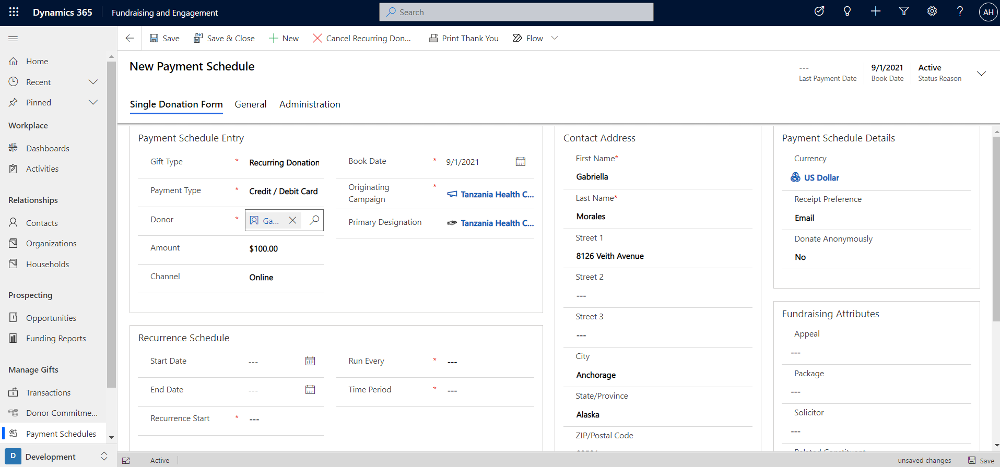](../media/4-1-new-payment-schedule.png#lightbox)

In the Payment Schedule Entry section, the gift type should be set to **Recurring Donation** to set up regular giving.

> [!div class="mx-imgBorder"]
> 

The Recurrence Schedule section of the payment schedule record allows you to set up the frequency of the payments. In the example below, the payment of $100 has been set up to process every month on the first of the month.

> [!div class="mx-imgBorder"]
> [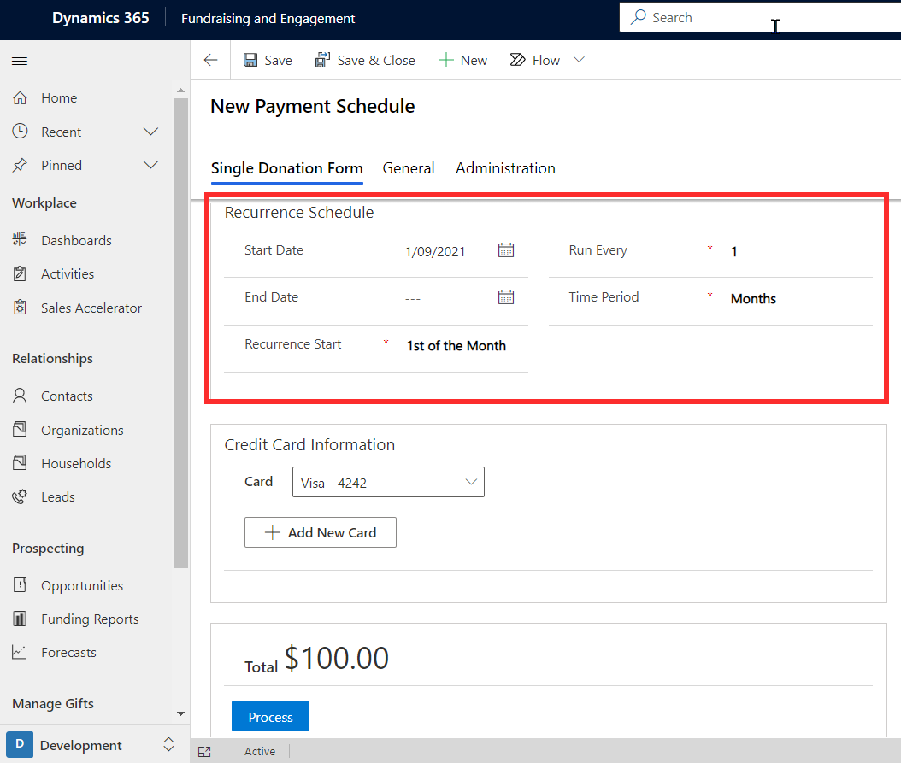](../media/4-3-recurrence-schedule.png#lightbox)

The end date is optional and can be specified if the schedule should end by a certain date. Recurrence start is the day the payments will be processed each time.

## Transactions related to recurring donations

Clicking **Process** on the payment schedule will save the payment schedule. Transaction records will then be created as each payment in the schedule occurs. It will continue until stopped or the end date is reached.

> [!div class="mx-imgBorder"]
> [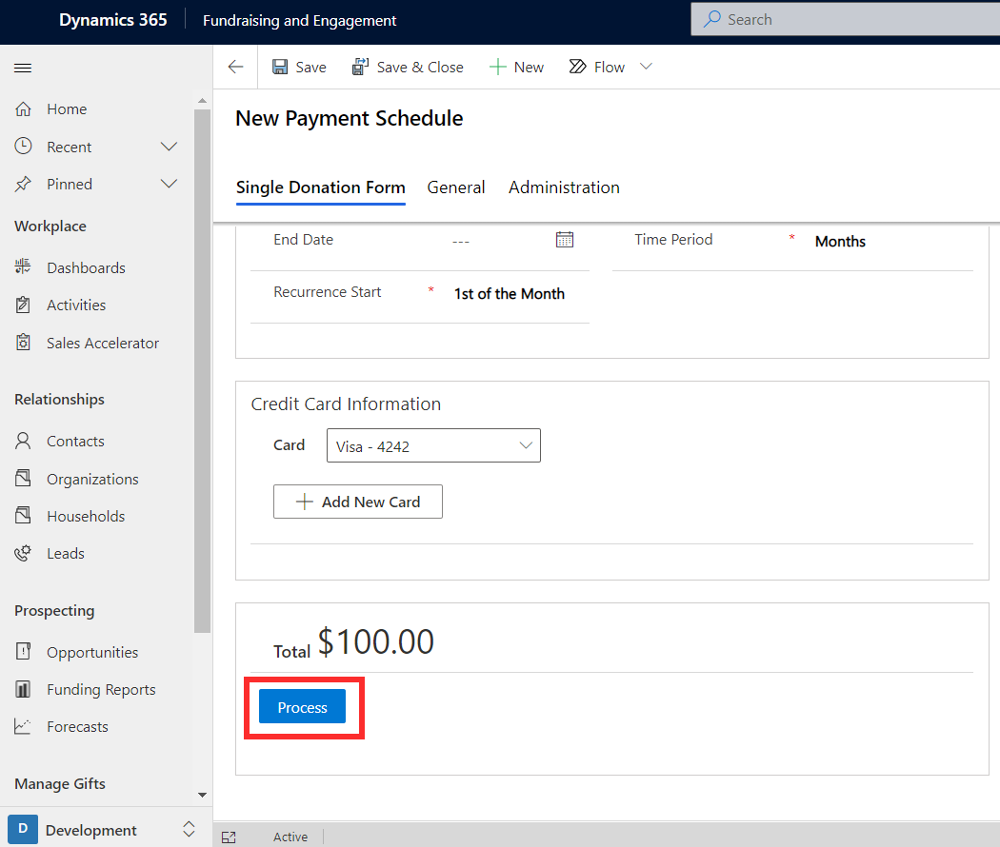](../media/4-4-process.png#lightbox)

When you view a payment schedule record, you can see and interact with details about the next transaction and a list of recent transactions. For example, if a schedule was created for a donation of $100 a month, a new transaction record will be created based on the next payment date. You can also select **Charge Donation Now**, which will immediately process the next payment in the schedule.

> [!div class="mx-imgBorder"]
> [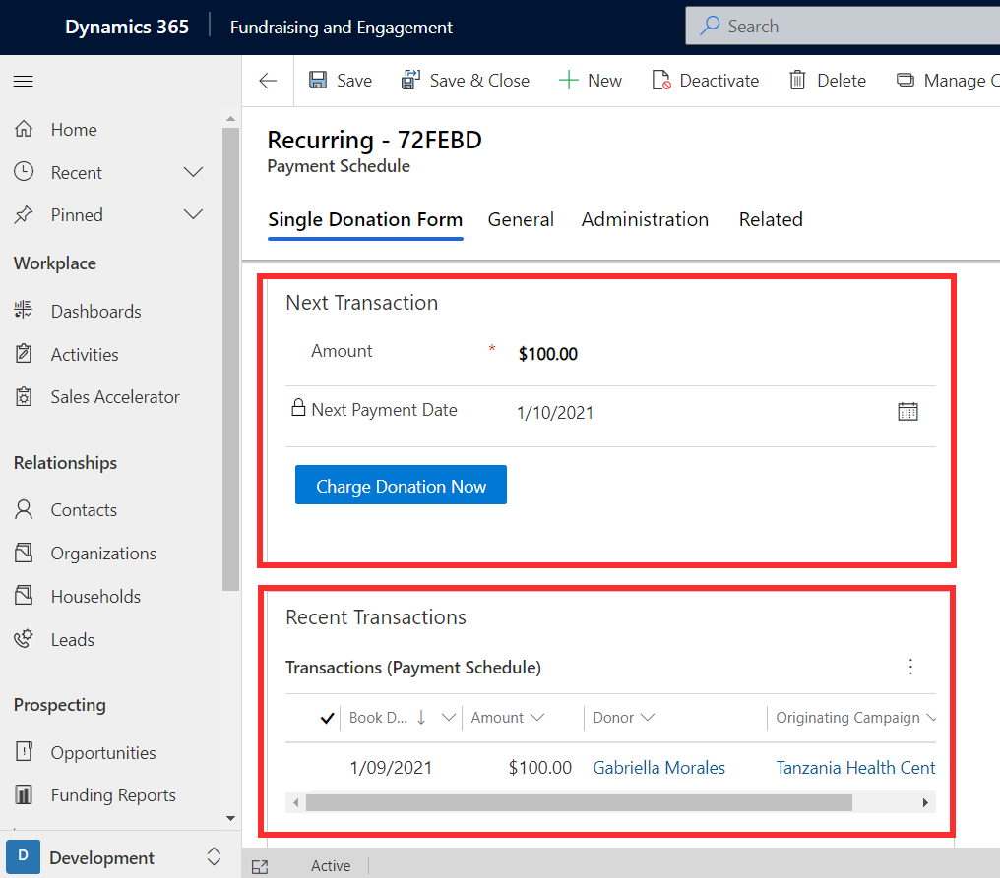](../media/4-5-charge-now.png#lightbox)

## Change or cancel a recurring donation

The amount of a donation set up in a recurring donation payment schedule can be changed at any time. You can access the payment schedule record and change the value in the amount column. This will change the donation amount for all future payments.

> [!div class="mx-imgBorder"]
> [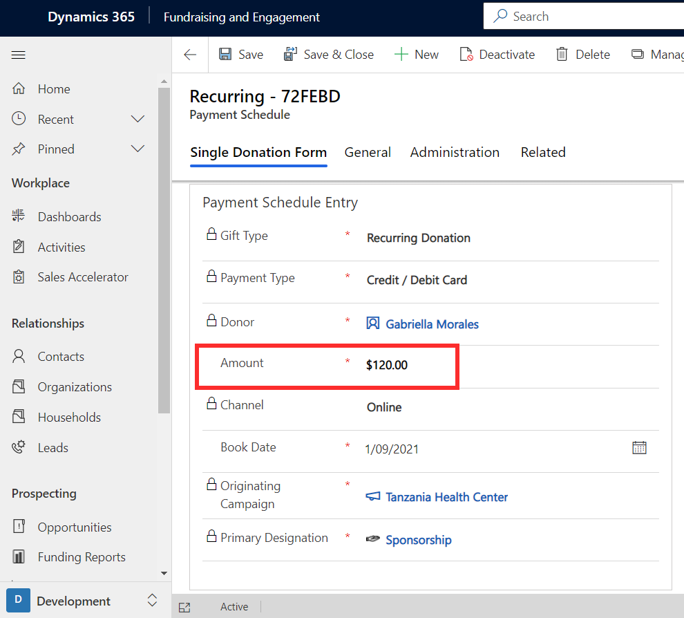](../media/4-6-amount.png#lightbox)

However, the recurrence schedule remains read-only and cannot be edited.

> [!div class="mx-imgBorder"]
> [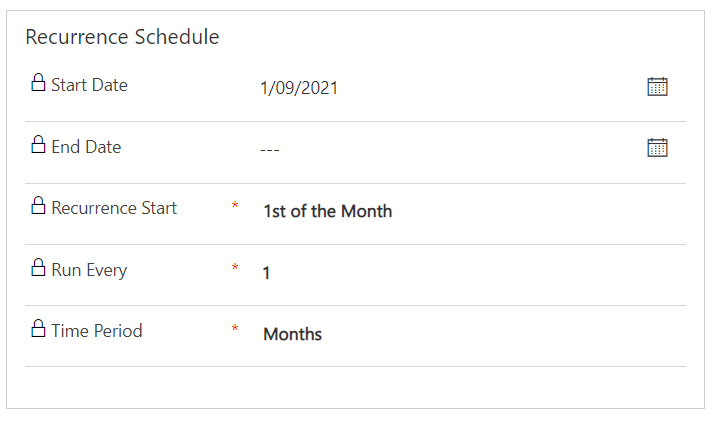](../media/4-7-schedule.png#lightbox)

To cancel a recurring donation, you can select the **Cancel Recurring Donation** button located in the task bar of the payment schedule record.

> [!div class="mx-imgBorder"]
> [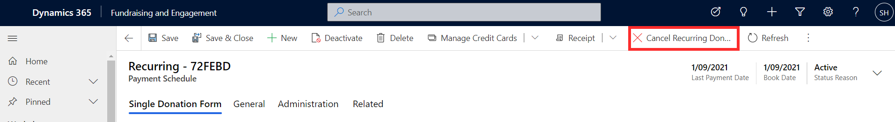](../media/4-8-cancel.png#lightbox)

## Create a pledge schedule and pledge allocation

A pledge schedule is composed of individual allocated amounts or installments as donor commitments. It represents how a total pledge amount will be allocated over a pre-determined period of time. Once the funds have been received, you must convert the individual pledge installment into a donation in Fundraising and Engagement.

To set up a pledge schedule for a constituent, create a new payment schedule record.

> [!div class="mx-imgBorder"]
> [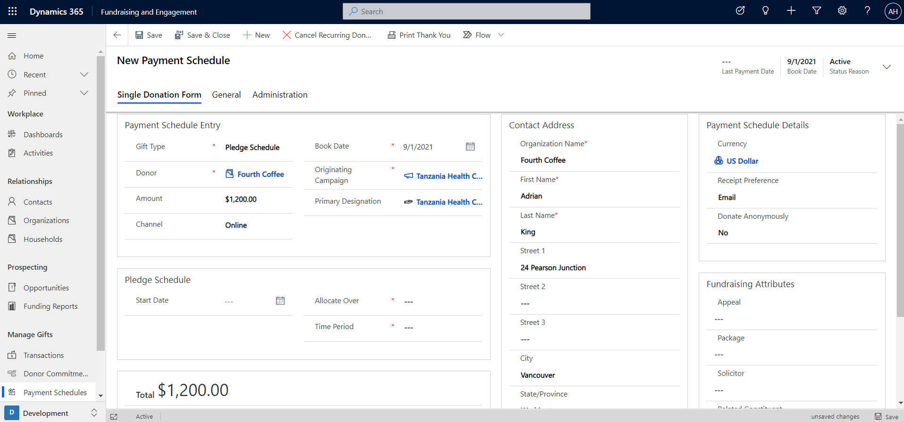](../media/4-9-pledge-schedule.png#lightbox)

In the Payment Schedule Entry section of the payment schedule record, the gift type must be set to **Pledge Schedule**.

> [!div class="mx-imgBorder"]
> [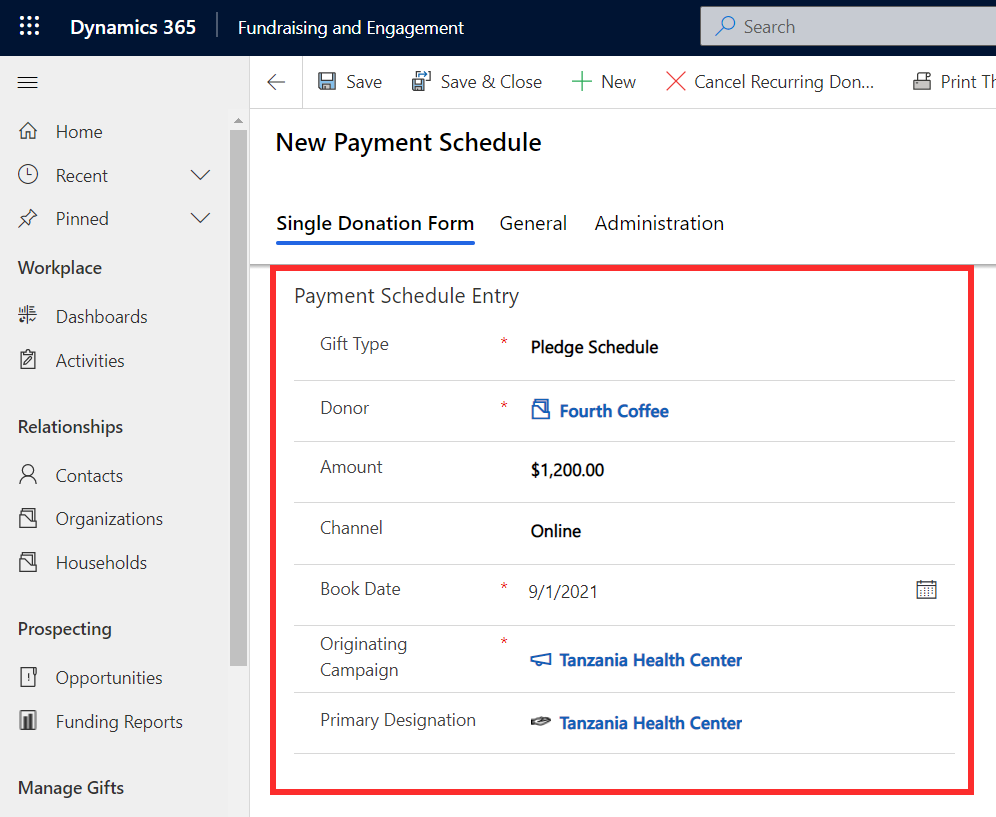](../media/4-10-schedule.png#lightbox)

The Pledge Schedule section of the record is where the frequency of the pledge is set up. In the example of the screenshot above, the amount of $1200 is the total pledge.
Setting up the frequency will allocate this amount over a period of time. Based on the schedule specified in the screenshot below, a pledge of $1200 will be allocated over 12 months, that is, $100 a month for 12 months.

> [!div class="mx-imgBorder"]
> [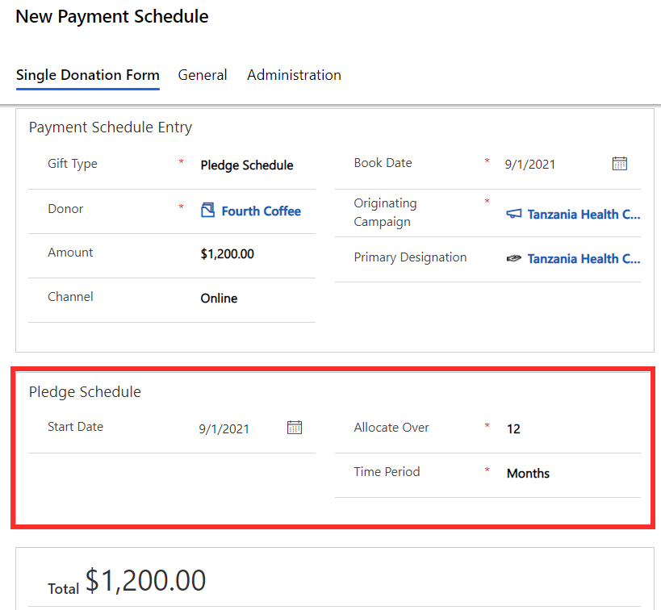](../media/4-11-allocate.png#lightbox)

Clicking the **Process** button on the payment schedule record will save the pledge and create multiple pledge allocation (donor commitment) records. A transaction is **not** created at this point. Most columns on the payment schedule record will become locked and read-only, such as the gift details, schedule, and constituent's contact details.

> [!div class="mx-imgBorder"]
> [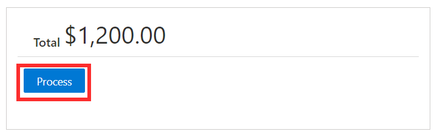](../media/4-12-process.png#lightbox)

> [!div class="mx-imgBorder"]
> [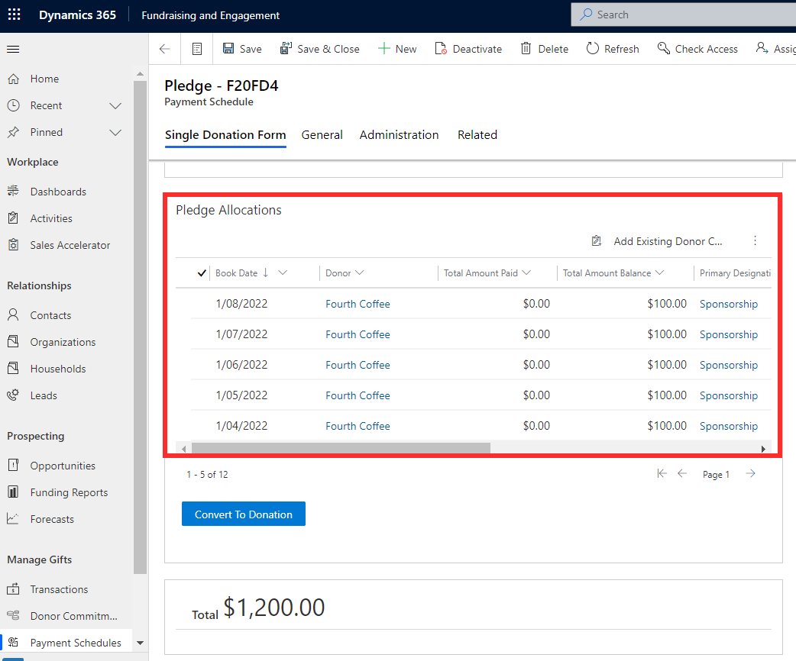](../media/4-13-allocations.png#lightbox)

## Convert a pledge into a donation

Once a pledge installment is ready to be converted into a donation that is, a transaction, the **Convert to Donation** button on the pledge schedule record will generate a corresponding transaction record. The dates entered in the list of pledge allocations are tentative donation dates based on discussions with or expectations of the donor. These will not automatically be converted into transactions on these dates, you need to do that each time when the funds are received.

> [!div class="mx-imgBorder"]
> [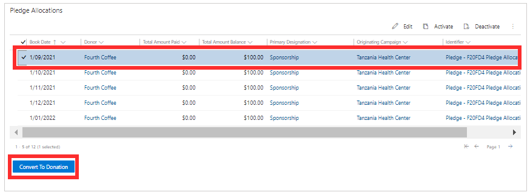](../media/4-14-convert.png#lightbox)

Details from the pledge allocation will carry over to a new transaction record for you to complete and process. In the top right of the transaction record, there's a link to the corresponding pledge record.

> [!div class="mx-imgBorder"]
> [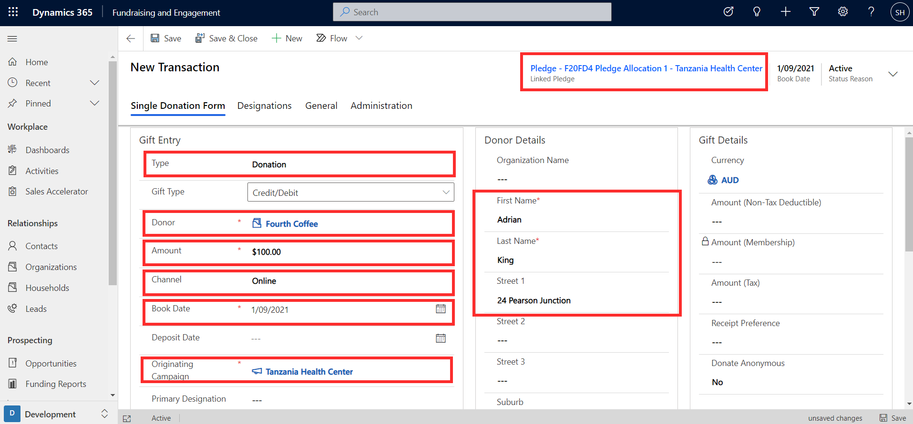](../media/4-15-pledge.png#lightbox)

On the transaction record, the relevant gift type (payment method) of the donation can be specified, and then processed by clicking the **Process** button.

> [!div class="mx-imgBorder"]
> [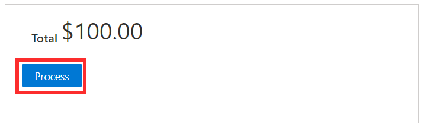](../media/4-16-process.png#lightbox)

This will process the payment through the payment gateway, and the created transaction record will display a link to the pledge allocation record.

> [!div class="mx-imgBorder"]
> [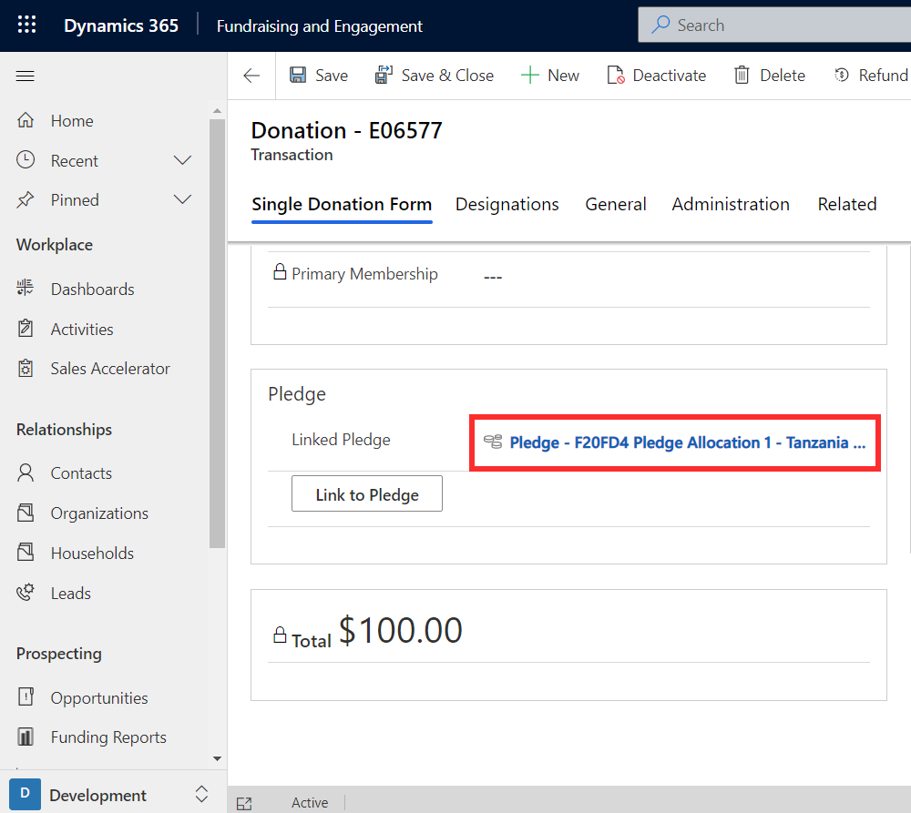](../media/4-17-link.png#lightbox)

Back on the overall payment schedule record that was created for the pledge schedule, the total amount of the donation processed in the installment will be displayed. The status will also show as completed.

> [!div class="mx-imgBorder"]
> [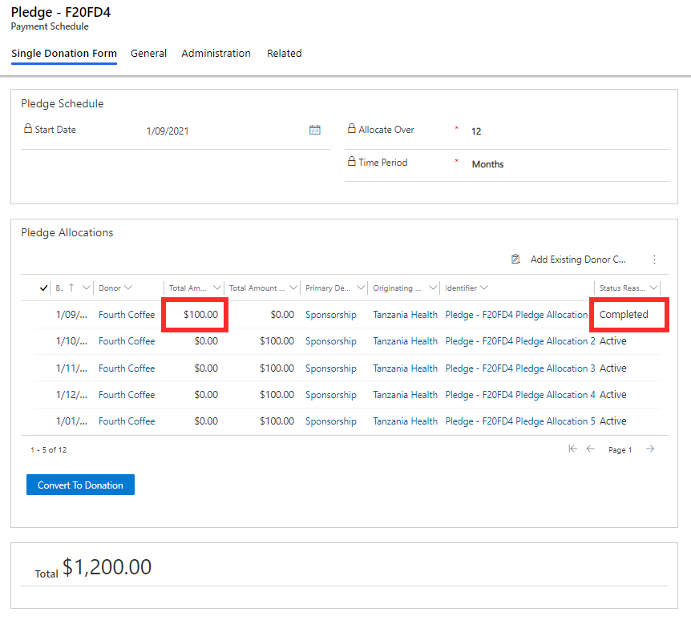](../media/4-18-completed.png#lightbox)
