In this exercise, you will assume the persona of a public user who is looking to register for your vaccination through Microsoft Vaccination Management. You will learn how to browse to the portal and become familiar with the eligibility questions and registration process.

## Task 1: Go to the portal and register for a vaccination
To go to the portal and register for a vaccination, follow these steps:

1. Launch an internet browser in **InPrivate** or **Incognito** mode and then go to [Power Apps](https://make.preview.powerapps.com/?azure-portal=true) by using the user credentials that were shared by your coach.

1. Select your allocated environment from the list of environments in the dropdown list.

	> [!div class="mx-imgBorder"]
	> 

1. Go to the **Apps** section, locate **Registration and booking portal**, select the ellipsis (**...**), and then select **Browse**.

	> [!div class="mx-imgBorder"]
	> [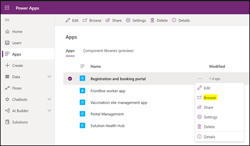](../media/registration-booking-portal.png#lightbox)

1. When the portal launches in another tab, select the **Start registration** button to begin the registration process.

	Alternately, you can enter a code in the **Enter event code if you have one** box and then select the **Start registration** button. For steps to generate an event code, go to Bonus Exercise 1. The overall registration process remains the same, regardless of the option that you choose.

	> [!div class="mx-imgBorder"]
	> [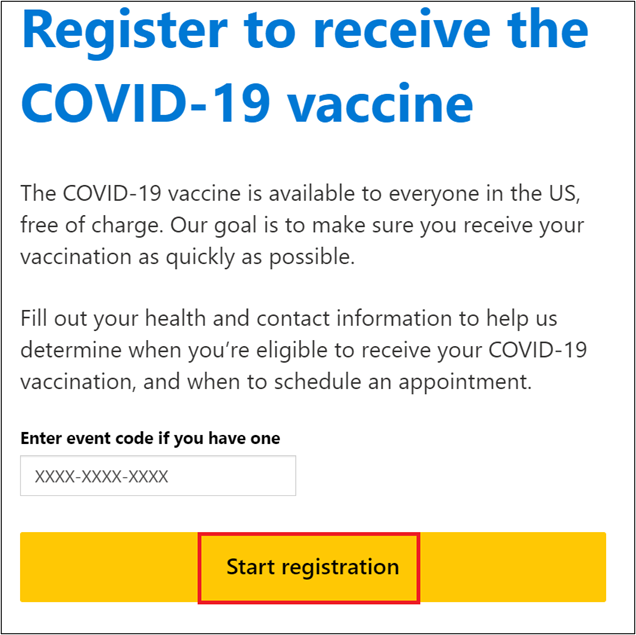](../media/start-registration.png#lightbox)

1. Select the responses to the eligibility questionnaire, as shown in the following screenshots, and then select **Next**.

    If you have not received your first dose, select **No** for the **Have you received any dose of a COVID-19 vaccine?** question.

	> [!div class="mx-imgBorder"]
	> [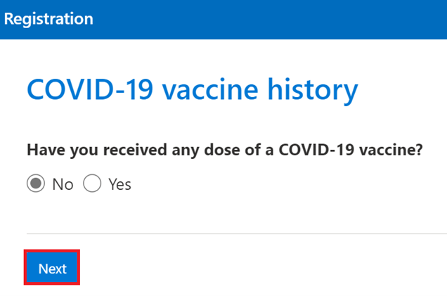](../media/vaccine-history.png#lightbox)

    Alternately, select **Yes** if you have already received the first dose. Then, set the following values (which are shown in the subsequent screenshot) and select **Next**.

	> [!NOTE]
	> You can complete step 5 or step 6 and then select **Next**.

	1. For the **Have you received any dose of the COVID-19 vaccine?** question, select **Yes**.

	1. For the **Did we administer that dose?** question, select **No**.

	1. For the **What was the date that you received the dose?** question, enter any date in the past.

	1. For the **What was the vaccine type?** question, choose any type from the list of options.

	> [!div class="mx-imgBorder"]
	> [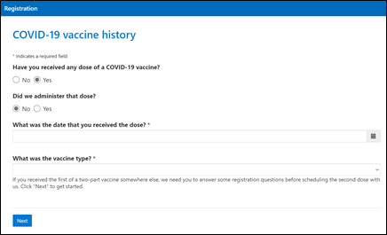](../media/vaccine-history-2.png#lightbox)

1. Select **Yes** only for the **Are you currently employed as a healthcare worker?** question. Keep the default, preselected **No** responses for the other questions and then select **Next**.

	> [!div class="mx-imgBorder"]
	> 

1. Select the following default, preselected responses and then select **Next**.

	> [!div class="mx-imgBorder"]
	> [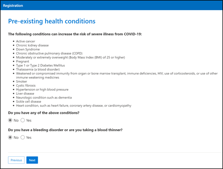](../media/health-conditions.png#lightbox)

1. Select the following default, preselected responses and then select **Next**.

	> [!div class="mx-imgBorder"]
	> [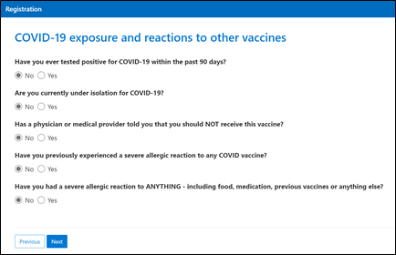](../media/exposure-reactions.png#lightbox)

1. Create **three** new resident records that you will book as appointments for today. Fill out the following values and then ensure that the email address is a valid one so that you can receive booking notifications and take action on the next steps.

    **Resident One**

	-  **First name** - Madison

    - **Last name** - Butler

    - **Race** - Asian

    - **Ethnicity** - Not Hispanic or Latino

    -  **Gender** - Female

    - **Date of birth** - February 01, 1967 (*Note this value and keep for reference; it will be required in later exercises*.)

    - **Street address** - 123 23rd Street

    - **City** - Redmond

    - **County** - King

    - **State/Province** - WA/Washington

    - **Zip/Postal Code** - 98052

    - **Country** - USA

		> [!div class="mx-imgBorder"]
		> [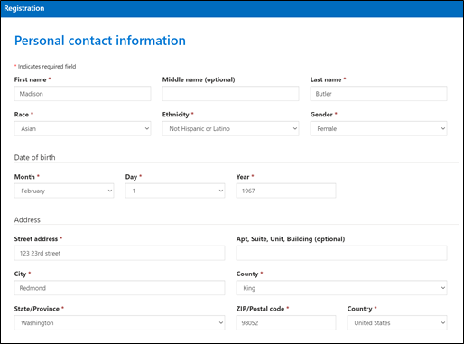](../media/contact-information.png#lightbox)

	- **Email Address** - Your valid email address (This email address is important and needs to be a valid email.)
		
	- **Confirm Email Address** - Same as the email address that you entered
		
	- **Primary phone** - This field can be left blank
		
	- **Special Assistance** - This option can be left blank

1. Select **Next**.

	> [!div class="mx-imgBorder"]
	> [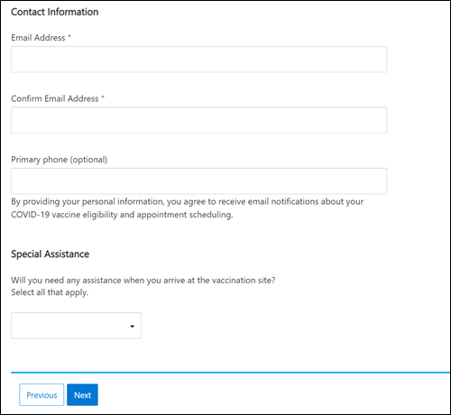](../media/contact-information-2.png#lightbox)

1. On the next page, review the summary screen and then select the check box for **I certify that the information I've provided is true to the best of my knowledge**. Select the **Complete registration** button.

	> [!div class="mx-imgBorder"]
	> [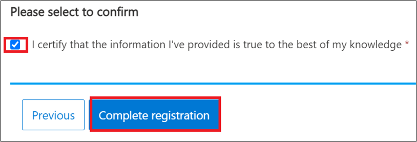](../media/complete-registration.png#lightbox)

   The following screen will display, indicating that your registration for the vaccine is complete.

	> [!div class="mx-imgBorder"]
	> [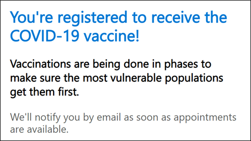](../media/success-message.png#lightbox)

1. Repeat **steps 10-11** to create registrations for two more residents:

    **Resident Two**

    - **First name** - Christopher

    - **Last name** - Reed

    - **Race** - Black or African American

    - **Ethnicity** - Not Hispanic or Latino

    - **Gender** - Male

    - **Date of birth** - March 01, 1967

    - **Street address** - 456 23rd Street

    - **City** - Redmond

    - **County** - King

    - **State/Province** - WA

    - **Zip/Postal Code** - 98052

    - **Country** - USA

    - **Email Address** - Your email address

    **Resident Three**

    - **First name** - Kayla

    - **Last name** - Lewis

    - **Race** - White

    - **Ethnicity** - Hispanic or Latino

    - **Gender** - Female

    - **Date of birth** - April 01, 1978

    - **Street address** - 789 23rd Street

    - **City** - Redmond

    - **County** - King

    - **State/Province** - WA

    - **Zip/Postal Code** - 98052

    - **Country** - USA

    - **Email Address** - Your email address

## Task 2: Verify Dataverse records that were created post registration process

In this task, you will assume the persona of a system user/administrator. You will sign in to the Microsoft Dataverse environment and view the records that are created/edited after the registration process.

1. Launch your internet browser in **InPrivate** or **Incognito** mode and then go to 'make.powerapps.com' by using the user credentials that were shared by your coach.

1. Select your allocated environment from the **Environments** dropdown list.

	> [!div class="mx-imgBorder"]
	> 

1. Go to the **Apps** section, locate **Vaccination site management app**, select the ellipsis (**...**), and then select **Play**.

	> [!div class="mx-imgBorder"]
	> 

1. The **Vaccination site management** app will launch in the next tab. Go to **Change area** on the navigation panel and then select the app to set it to **Registration**.

	> [!div class="mx-imgBorder"]
	> [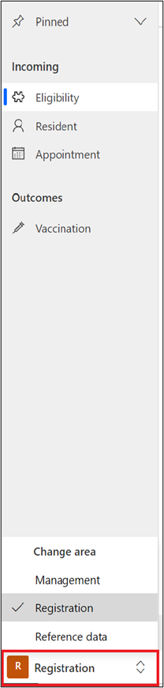](../media/registration.png#lightbox)

1. The default view will load to **Active Covid Vaccine Eligibilities**. You can select to view your **Vaccine Eligibility record** that was created as a result of your registration steps on the portal.

1. Open your **Vaccine Eligibility** record and select all tabs that are highlighted in the following screenshot: **General**, **Risk Factors**, and **COVID History**. Note that the values that you entered during the registration process reflect in the **COVID Vaccine Eligibility** record.

	> [!div class="mx-imgBorder"]
	> [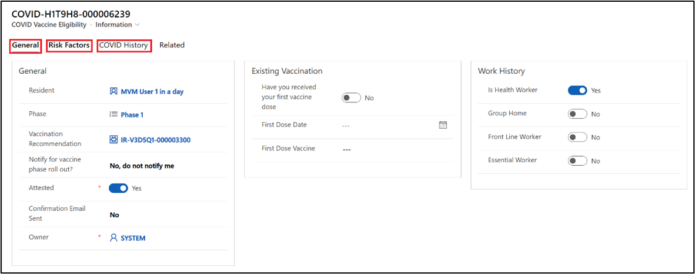](../media/tabs.png#lightbox)

1. Note the **Phase** that displays on the **COVID Vaccine Eligibility** record. This value will be used in the subsequent exercise. For example, the following screenshot shows this value as **Phase 1**.

	> [!div class="mx-imgBorder"]
	> 

1. Select the **Related** tab and select **Vaccine Recommendations**. A **Vaccine Recommendation** record will not be tagged to your **COVID Vaccine Eligibility** record; it will be created in the subsequent exercises.

	> [!div class="mx-imgBorder"]
	> [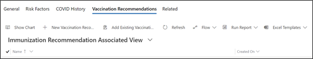](../media/recommendations.png#lightbox)

Congratulations, you have now completed your vaccine eligibility process and have verified how it manifests in Dataverse. Now that you are eligible, you can move on to the next exercises where you'll book your appointment for the vaccination.

