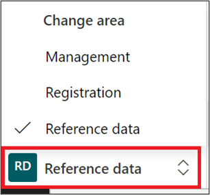
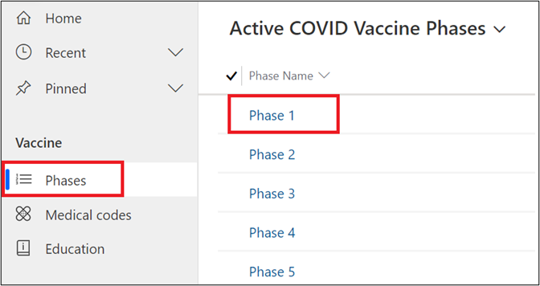
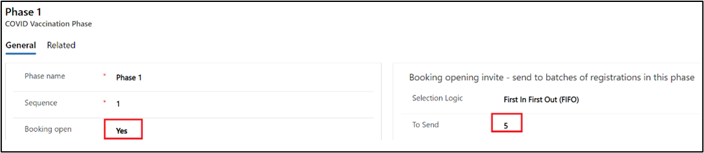
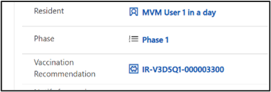

In this exercise, you will assume the persona of a Vaccine Program Administrator who will 'open' up a Vaccination Phase. This will trigger notifications to the registered residents against that phase and allow them to book their appointments via a booking link.

## Task 1: Open a phase to allow bookings for completed registrations

1.  Launch in-private/incognito mode in your browser and navigate to 'make.powerapps.com' using the user credentials shared by your coach.

1.  Select your allocated environment from the list of environments in the dropdown.

	> [!div class="mx-imgBorder"]
	> 

1.  Navigate to **Apps** and locate **Vaccination site management app** and click on '...', then **Play**.

	> [!div class="mx-imgBorder"]
	> 

1.  In the app that opens, go to the bottom-left corner and set the **Area** to **Reference Data**.

	> [!div class="mx-imgBorder"]
	> 

1.  Navigate to **Phases** and select the phase record that you noted in Exercise 1, Task 2, Step 6.

	> [!div class="mx-imgBorder"]
	> 

1.  Once the **Phase** record opens up, set the following field values and click on **Save and Close**.

	Booking open: **Yes**
	
	To Send = **5**

	**If the Booking open value is already set to Yes, then skip this step**.

	> [!div class="mx-imgBorder"]
	> 

> [!NOTE]
> The recommended 'To Send' batch size is around 500 per hour. This process ensures equity and determines the number of participants that will receive an invite for the booking process.

## Task 2: Verify Dataverse changes post phase opening

In this task, you will verify what changed on your **COVID Vaccination Eligibility** record after the phase opened up. You should see a **Vaccination Recommendation** record auto populated against the **COVID Vaccination Eligibility** record indicating that you can now book an appointment against your registration.

1.  In the **Vaccine Management app,** change the area on the application. Set it to **Registration**.

	> [!div class="mx-imgBorder"]
	> 

1.  Navigate to the same **COVID Vaccination Eligibility** record that you viewed in previous exercise.

Note the Immunization Recommendation record updated there now. If it does not appear immediately, give it a few minutes before you click refresh and it should show up on your record.

	> [!div class="mx-imgBorder"]
	> 

**Congratulations!** You have now opened up a phase to allow bookings for registered residents and also sent invites to them for booking process. Once you receive the mail notification to schedule the vaccine, you can move on to book your appointment for the vaccination in the next exercise.

