In this exercise, you will assume the persona of a public user who has registered for vaccination via the portal and now wants to book an appointment slot for vaccination. This exercise can be done after the eligibility notification mail has triggered so that you can kickoff the booking experience from the Appointment link embedded in the mail.

## Task 1: Navigate to portal and book an appointment

1.  At the end of exercise 3, you should receive a confirmation email with an appointment link. To launch the booking experience, click on **Schedule Appointment** in the mail.

	> [!div class="mx-imgBorder"]
	> [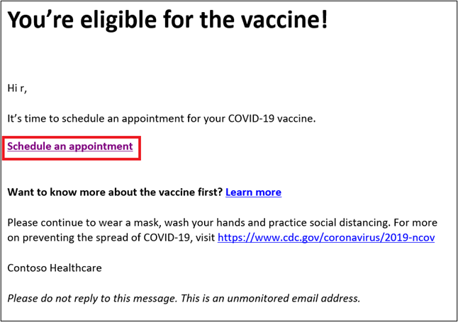](../media/schedule-appointment.png#lightbox)

1.  This should launch a portal page in your browser. In the form that shows, enter the same date of birth as mentioned in Exercise 1, Task1, Step 10 and click on **Submit**.

	> [!NOTE]
	> It is important that you mention the exact same date as the system validates you against this data.

	> [!div class="mx-imgBorder"]
	> [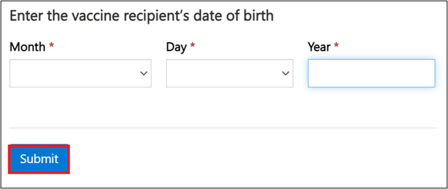](../media/birthdate.png#lightbox)

1.  If you registered using an Event code in Exercise 1, then you should see the pre-selected vaccination site show up automatically. Click **Select** to continue with the booking process.

If you did not use an Event Code during registration, skip this step and go to next step to search for vaccination sites.

	> [!div class="mx-imgBorder"]
	> [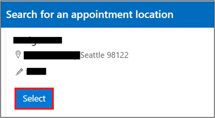](../media/location.png#lightbox)

1.  Enter **Zip/Postal code** = *98052* and **Vaccine type =** *Any* in the search boxex that appear and click on **Search.** In the search results, it should show up the vaccination sites open for booking.

	> [!div class="mx-imgBorder"]
	> [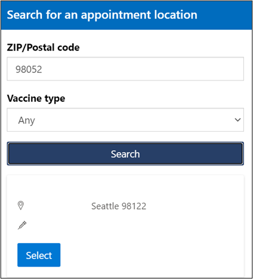](../media/search.png#lightbox)

1.  Once the vaccination site shows up with open slots, click on **Select** to choose your appointment slot at the vaccination site.

	> [!div class="mx-imgBorder"]
	> [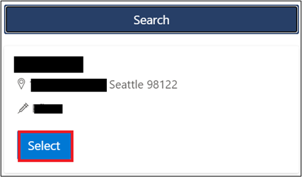](../media/select.png#lightbox)

1.  Set the **Date** to today's date and click on **Apply**.

	> [!div class="mx-imgBorder"]
	> [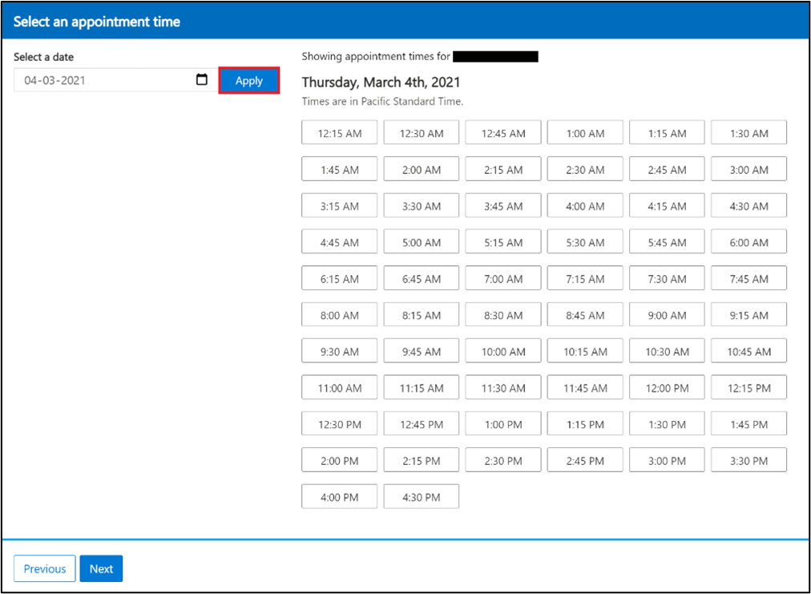](../media/set-date-apply.png#lightbox)

1.  Select any available slot to book and click **Next**.

	> [!div class="mx-imgBorder"]
	> [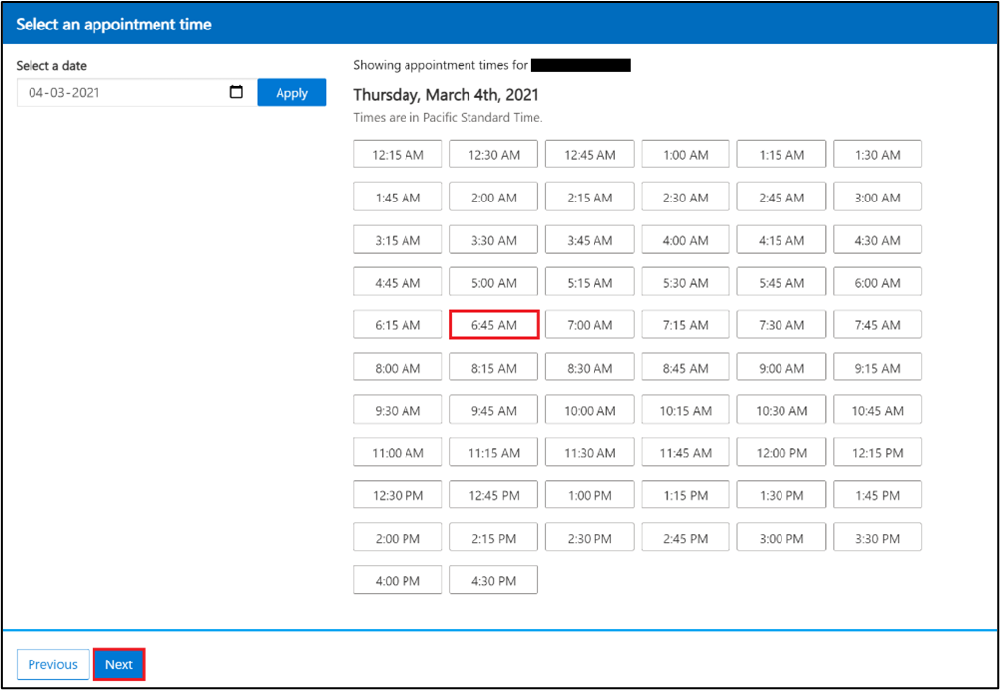](../media/book-time.png#lightbox)

1.  View the appointment confirmation and generated QR code.

	> [!div class="mx-imgBorder"]
	> [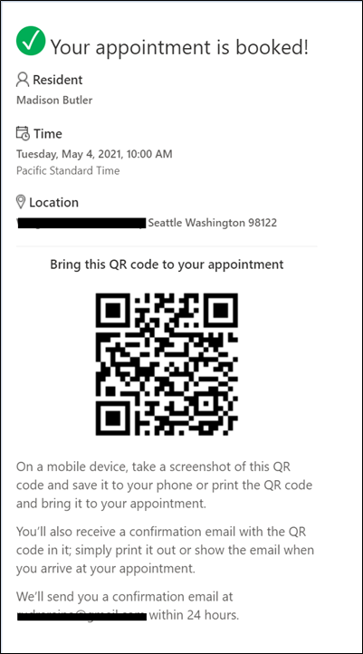](../media/appointment-booked.png#lightbox)

## Task 2: Verify Dataverse records created post booking process

In this task, you will assume the persona of a system user and login to the Dataverse environment and view the records that are created/edited post the booking process.

1.  Launch in-private/incognito mode in your browser and navigate to 'web.powerapps.com' using the user credentials shared by your coach.

1.  Select your allocated environment from the list of environments in the dropdown.

	> [!div class="mx-imgBorder"]
	> [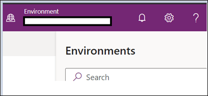](../media/environments.png#lightbox)

1.  Navigate to **Apps** and locate **Vaccination site management app** and click on '...', then **Play**.

	> [!div class="mx-imgBorder"]
	> [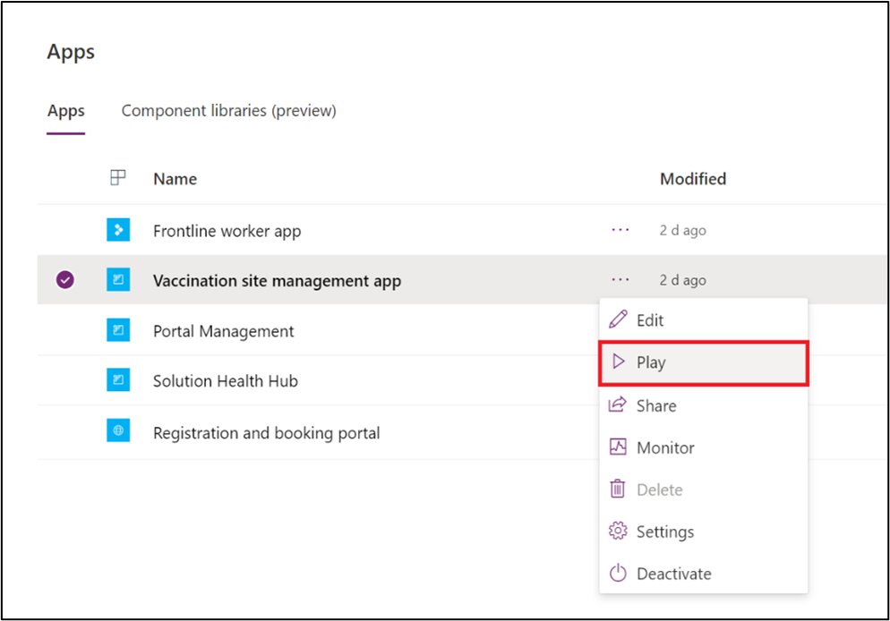](../media/play.png#lightbox)

1.  The Vaccination Site Management app launches in the next tab. Navigate to **Change area** in the navigation panel and click on it to set to **Registration**.

	> [!div class="mx-imgBorder"]
	> [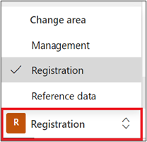](../media/registration-area.png#lightbox)

1.  Locate the **Covid Vaccine Eligibility** record you viewed in Exercise 1, Task2. Click on **Related** tab and select **Immunization Recommendations**.

	> [!div class="mx-imgBorder"]
	> [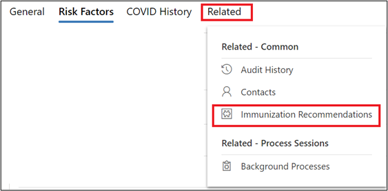](../media/immunizations-recommendations.png#lightbox)

1. Select and view the associated **Vaccination Recommendation** record and note an **Active Appointment** field in the record.

	> [!div class="mx-imgBorder"]
	> [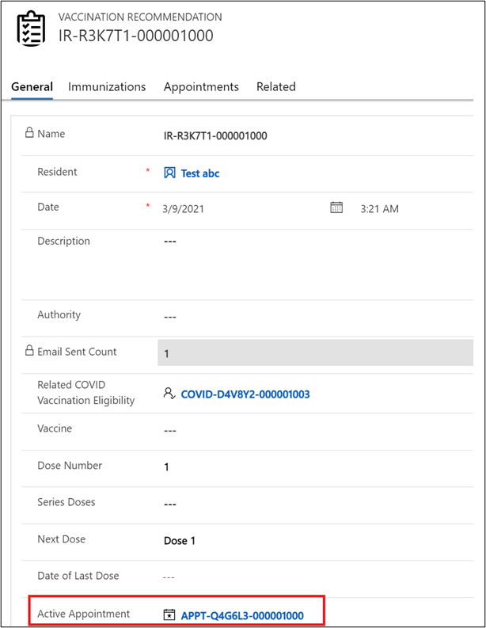](../media/active-appointment.png#lightbox)

This indicates that you have completed the booking process and have been associated to an **Appointment**. You can also click and open the Appointment record to view the details of the **Slot** and **Time**.

**Congratulations!** You have booked an appointment for vaccination in the portal and verified how it manifests in Dataverse. This completes the happy path scenarios for Registration and Booking process. Now we will move on to other scenarios supported in Microsoft Vaccine Management.

