In this exercise, you will create a new question on the eligibility questionnaire. The question is required to capture data from the user and save it in the system, but it doesn't impact the overall eligibility computation workflow. Hence, you will be making simple changes to the portal to reflect a new question in the existing questionnaire.

## Task 1: Customize existing components and add new components in a solution 

In this task, you will reuse the existing solution that you created in Exercise 1 and add components that will be customized to reflect the new question on the portal.

1. Go to the solution that you created in Exercise 1 called **MVM in a Day** and then select **+ Add existing > Table**.

	> [!div class="mx-imgBorder"]
	> [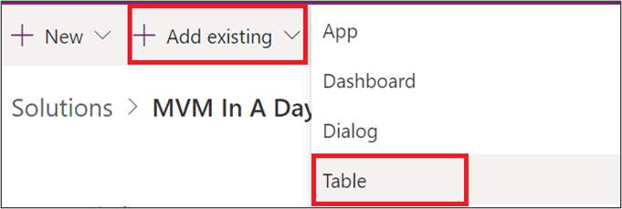](../media/add-table.png#lightbox)

1. In the list that displays, search for and select the **Covid Vaccination Eligibility** table and then select **Next**.

	> [!div class="mx-imgBorder"]
	> [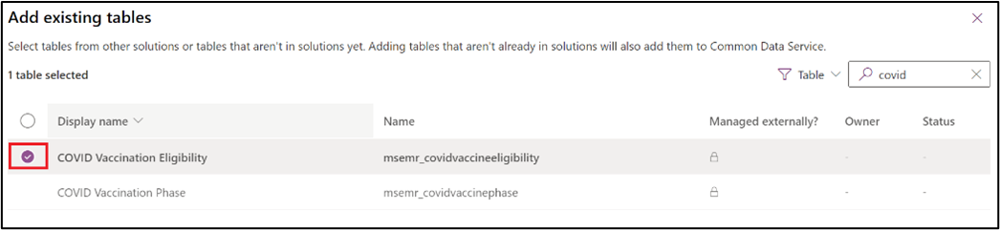](../media/eligibility-table.png#lightbox)

1. After the table has been added, select the **Select components** feature.

	> [!div class="mx-imgBorder"]
	> [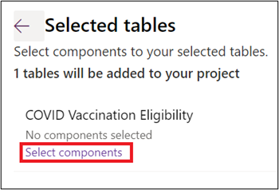](../media/select-components.png#lightbox)

1. In the list that appears, go to the **Forms** tab, select the **Vaccination Management - Portal Web Form** check box, and then select **Add**.

	> [!div class="mx-imgBorder"]
	> [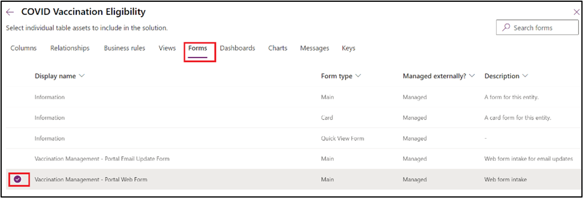](../media/checkbox.png#lightbox)

1. Select **Publish all customizations**.

	> [!div class="mx-imgBorder"]
	> [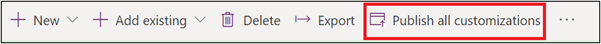](../media/publish.png#lightbox)

1. Add a new column with the following values:

    - **Display name** - Are you a part of paramilitary/armed forces?

    - **Data type** - Yes/No

    When you are finished entering the values, select **Done**.

	> [!div class="mx-imgBorder"]
	> [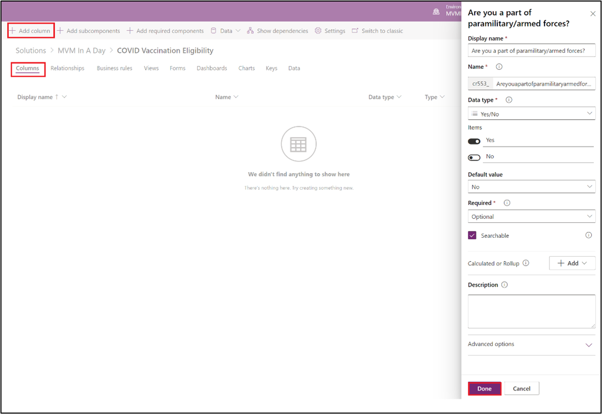](../media/new-column.png#lightbox)

1. After the column has been added, select **Save Table**.

1. Go to the **Forms** tab and select **Vaccination Management - Portal Web Form**.

1. When the form opens, go to **Table columns** in the left navigation and select the **Work History** tab.

1. Select **+ Form field** and then select the newly created **Are you a part of paramilitary/armed forces?** column.

	> [!div class="mx-imgBorder"]
	> [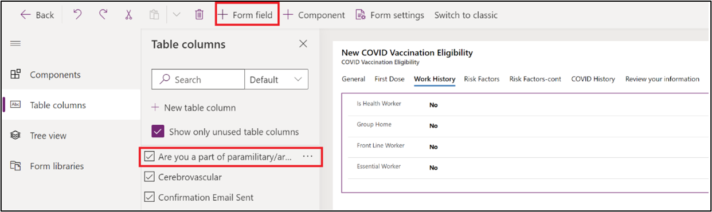](../media/form-field.png#lightbox)

   The new column will appear on the form.

	> [!div class="mx-imgBorder"]
	> [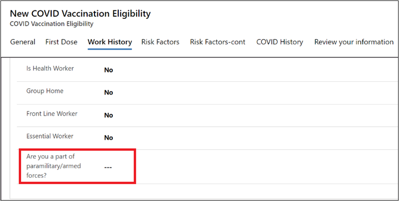](../media/form-column.png#lightbox)

1. Select **Save > Publish** to save the changes and then select **Back** to exit.

	> [!div class="mx-imgBorder"]
	> [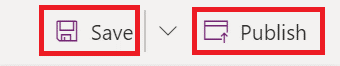](../media/save-publish.png#lightbox)

1. Return to the solution page and select **Publish all customizations**.

## Task 2: Restart the portal and verify your changes
In this task, you will restart the portal and then verify the changes that you have made.

1. In the same browser where you have signed in to the lab environment, open a new tab and go to [https://admin.powerplatform.microsoft.com/](https://admin.powerplatform.microsoft.com/).

1. In the navigation pane, select the **Resources** dropdown menu and then select **Portals**.

	> [!div class="mx-imgBorder"]
	> [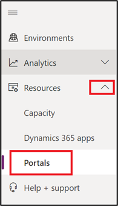](../media/portals.png#lightbox)

1. In the search box, search for \<Your allocated environment name\>. The **Registration and booking portal** should display as a search result. Select the ellipsis (**...**) and then select **Manage**.

	> [!div class="mx-imgBorder"]
	> [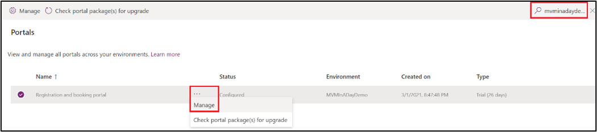](../media/manage.png#lightbox)

1. Power Apps portals admin center will launch in a new tab. In the admin center, select **Portal Actions > Restart** to restart this portal.

	> [!div class="mx-imgBorder"]
	> [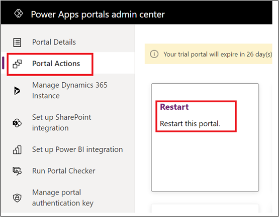](../media/restart.png#lightbox)

1. After the portal has restarted, return to your portal page and follow the process of checking eligibility as you did in Exercise 1. Follow through until you reach Step 2 of the eligibility questionnaire to verify that your new question now shows in the portal.

	> [!div class="mx-imgBorder"]
	> [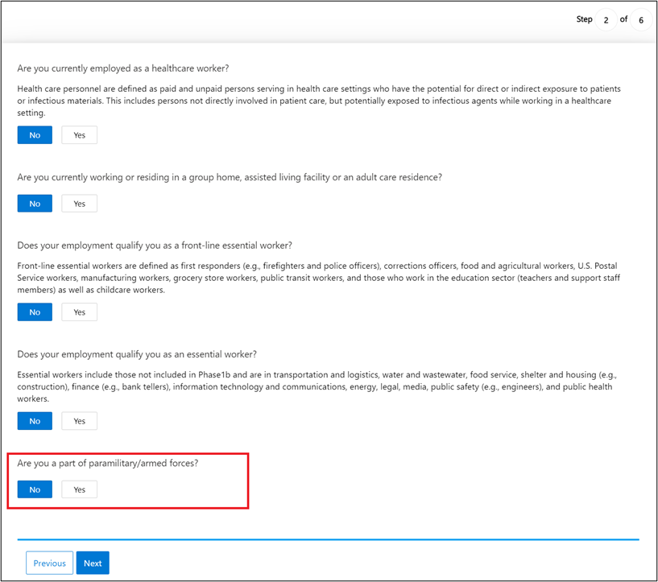](../media/question-verified.png#lightbox)

Congratulations, you have now learned how to add a new question to the eligibility questionnaire, and you can now track user responses in a Dataverse record.
