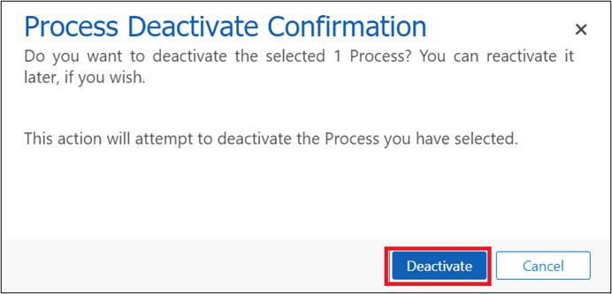

In this exercise, you will mimic adding the Microsoft Vaccination Management solution for a new locale/geographic region that has different COVID vaccination eligibility rules. In that scenario, you would be required to override most of the existing portal behavior and replace it with new rules. You would also be required to edit the overall eligibility workflow that evaluates whether a person is eligible according to the configured rules so that the new set of rules is honored during eligibility computation.

## Task 1: Customize existing components and add new components in a solution 

In this task, you will reuse the existing solution that you created in Exercise 1, and you will add components that will be customized to reflect the new question on the portal.

1. Go to the solution that you created in Exercise 1 called **MVM In A Day** and then search for and select the **Covid Vaccination Eligibility** table.

1. When the table opens, select **+ Add column** and then set the following details:

    - **Display name** - Question 1

    - **Data type** - Yes/No

   When you've finished entering the information, select **Done**.

	> [!div class="mx-imgBorder"]
	> 

1. After the column has been added, select **Save Table**.

1. Repeat steps 2 and 3 to add another column with the following details:

	- **Display name** - Question 2
	
	- **Data type** - Yes/No

    The following screenshot is an example of how your **Columns** table should appear.

	> [!div class="mx-imgBorder"]
	> 

1. Select the **MVM In A Day** solution name to go back and then select **Publish all customizations**.

	> [!div class="mx-imgBorder"]
	> 

1. When the customizations are published, select the **Covid Vaccination Eligibility** table in the solution.

1. In the list that appears, go to the **Forms** tab and select **Vaccination Management - Portal Web Form**.

	> [!div class="mx-imgBorder"]
	> 

1. The editing form should now launch. Select the **First Dose** tab and then select **+ Component** in the navigation bar.

	> [!div class="mx-imgBorder"]
	> 

1. Select **1-column tab** from the left navigation and then observe how it reflects on the form, as shown in the following screenshot.

	> [!div class="mx-imgBorder"]
	> 

1. Select **New Tab** and update the **Label** field to **New Questions**.

	> [!div class="mx-imgBorder"]
	> 

1. Select **+ Form field** in the navigation bar and select **Question 1** and **Question 2** to add them to the newly created tab.

	> [!div class="mx-imgBorder"]
	> 

   After the new questions have been added, your form tab should resemble the following screenshot.

	> [!div class="mx-imgBorder"]
	> 

1. Select **Save** and then **Publish**.

1. Select the **Back** button to exit out of the form, select the solution name, and then select **Publish all customizations**.

	> [!div class="mx-imgBorder"]
	> 

## Task 2: Edit portal webform steps to show your page

In this task, you will edit the portal settings to reflect a new page with your questions. While you move from one page to the other on the portal, you are essentially navigating from one tab to the other on the form. To achieve this task, you need to make sure that each tab on the form is bound as a web form step on the portal. Introducing a new page requires changing the flow of the tabs and inserting a web form step in between, which is what you will do in this next task. The original form step sequence is **Welcome > Work History** followed by other tabs. You will alter the sequence to **Welcome > New Questions > Work History** followed by other tabs.

1. Launch **web.powerapps.com** by using your user credentials and then ensure that the **Environment** is showing up correctly.

1. Select **Apps**, locate the **Portal Management** app, select the ellipsis (**...**), and then select **Play**.

	> [!div class="mx-imgBorder"]
	> 

   The **Portal Management** app will launch in another tab.

1. In the **Portal Management** app, select **Web Forms** in the left navigation bar.

	> [!div class="mx-imgBorder"]
	> 

1. In the list that appears, select **Vaccination Management - Eligibility**.

	> [!div class="mx-imgBorder"]
	> 

1. When the web form opens, select the **Welcome** start step to open the web form step.

	> [!div class="mx-imgBorder"]
	> 

1. The web form step should open. In the start step value that shows **Work History**, select the **X** to clear the value and then select the search icon to create a new web form step.

	> [!div class="mx-imgBorder"]
	> 

1. Select **New Web Form Step** to launch a create form for the web form step.

	> [!div class="mx-imgBorder"]
	> 

1. Set the following values on the **New Web Form Step** page and then select **Save**.

    - **Name** - New Questions

    - **Web Form** - Vaccination Management - Eligibility

    - **Type** - Load Form

    - **Target Entity Logical Name** - COVID Vaccination Eligibility

    - **Next Step** - Work History

    - **Move Previous Permitted** - Yes

    - **Enable Entity Permissions** - Yes

	> [!div class="mx-imgBorder"]
	> 

1. Go to the **Form Definition** tab on the form, set the following values, and then select **Save and Close**.

    - **Form Name** - Vaccination Management - Portal Web Form

    - **Tab Name** - New Questions

	> [!div class="mx-imgBorder"]
	> 

1. You will be directed to the **Welcome** web form step again. Now, set **Next Step** to the web form that you created: **New Questions**.

	> [!div class="mx-imgBorder"]
	> 

1. When you are finished, **Save** the form and close it.

## Task 3: Edit workflow to change eligibility logic

In this task, you will edit the current eligibility logic to consider the responses to your new questions and compute eligibility accordingly.

1. Return to your **MVM In A Day** solution, select **+ Add existing**, and then select **Process**.

	> [!div class="mx-imgBorder"]
	> 

1. Search for **eligibility phase**. Select **Vaccination - Eligibility Phase Determination** and then select **Add**.

	> [!div class="mx-imgBorder"]
	> 

1. When the process has been added, select **Vaccination - Eligibility Phase Determination**, which will launch the process designer in a new tab.

1. Select the **Deactivate** button in the top ribbon. In the **Process Deactivate Confirmation** dialog box that opens, select **Deactivate**.

	> [!div class="mx-imgBorder"]
	> 

	> [!div class="mx-imgBorder"]
	> 

    The process designer will open with the editable version of the process.

1. In the process designer, select **Insert > After Step**. If this option is preselected, then move to the next step.

	> [!div class="mx-imgBorder"]
	> 

1. Select the **Otherwise, if** statement that is written on the step that says **Phase 2**. This action will highlight the whole conditional step, as shown in the following screenshot.

	> [!div class="mx-imgBorder"]
	> 

1. After you have selected the step, select **Add Step > Conditional Branch**, which will insert a new step after the selected conditional step.

	> [!div class="mx-imgBorder"]
	> 

1. The step appears in the workflow, as shown in the following screenshot. Select **condition (click to configure)**.

	> [!div class="mx-imgBorder"]
	> 

1. In the dialog box that opens, select the first condition. Set the **Primary Entity** dropdown list to **COVID Vaccination Eligibility**.

	> [!div class="mx-imgBorder"]
	> 

1. Select the next dropdown list and then select **Question 1** from the list.

	> [!div class="mx-imgBorder"]
	> 

1. Add the conditions that are shown in the following screenshot and then select **Equals**.

	> [!div class="mx-imgBorder"]
	> 

1. Select the ellipsis (**...**) to select values from the shown options.

	> [!div class="mx-imgBorder"]
	> 

1. In the **Select Values** dialog box, select **Yes** under **Available Values**, select the **\>\>** button, and then select **OK**.

	> [!div class="mx-imgBorder"]
	> 

   Your workflow step should resemble the following screenshot.

	> [!div class="mx-imgBorder"]
	> 

1. Repeat steps 9-13 for **Question 2**. Afterward, your workflow step should resemble the following screenshot. Select **Save and Close**.

	> [!div class="mx-imgBorder"]
	> 

1. When the dialog box closes, your workflow designer should resemble the following screenshot. Select the row that is shown in the following screenshot and then select **Add step > Update record**.

	> [!div class="mx-imgBorder"]
	> 

1. In the window that opens, set the **Phase** to **Phase 3**, as shown in the following screenshot. Select **Save and Close**.

	> [!div class="mx-imgBorder"]
	> 

1. Your final workflow should resemble the following screenshot. Select **Save** and then **Activate**.

	> [!div class="mx-imgBorder"]
	> 

## Task 4: Restart the portal and verify your changes

1. In the same browser where you have signed in to the lab environment, open a new tab and go to [https://admin.powerplatform.microsoft.com/](https://admin.powerplatform.microsoft.com/).

1. In the navigation pane, select the **Resources** dropdown list and then select **Portals**.

	> [!div class="mx-imgBorder"]
	> 

1. In the search box, search for \<Your allocated environment name\>. The **Registration and booking portal** should display as a search result. Select the ellipsis (**...**) and then select **Manage**.

	> [!div class="mx-imgBorder"]
	> 

1.  Power Apps portals admin center should launch in a new tab. In the admin center, select **Portal Actions > Restart** to restart this portal.

	> [!div class="mx-imgBorder"]
	> 

1.  When the portal restarts, return to your portal page and follow the process of checking eligibility, as you did in Exercise 1. Follow through until you reach step 2 of the eligibility questionnaire to verify that your new question shows in the portal.

	> [!div class="mx-imgBorder"]
	> 

Congratulations, you have created a new eligibility questionnaire and added it to activate the eligibility process according to the response.

