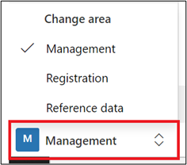
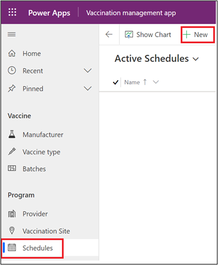
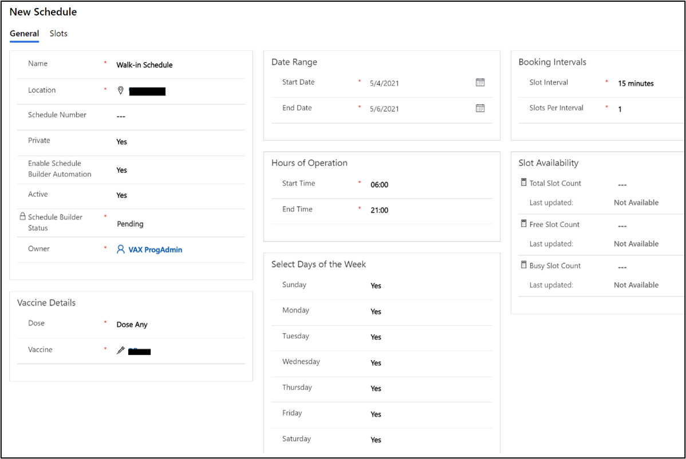
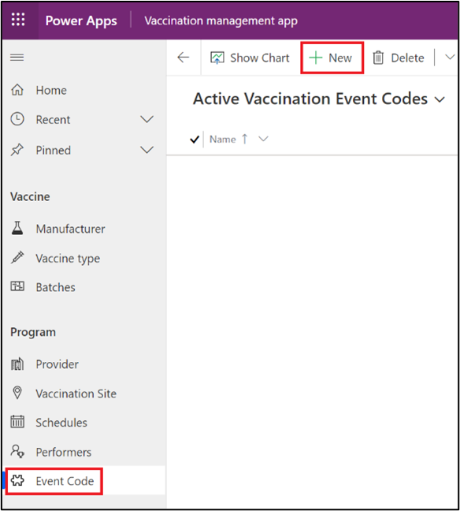
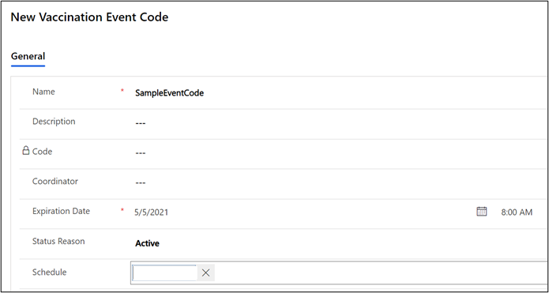

In this exercise, you will assume the persona of a vaccine program administrator who wants to open a vaccination site for walk-ins. To enable this walk-in site, you will create a new private schedule for a vaccination site and generate an event code that is tagged to that schedule. After the event code has been shared with residents, they can use it to register and book their appointments. The slots that are generated on this schedule would not be visible to residents who don't have the event code, which will prevent anyone else from booking against them.

## Task 1: Create a private schedule with open slots

In this task, you will assume the persona of a system user. You will sign in to the Dataverse environment and create a new private schedule with open slots.

1. Launch an internet browser in **InPrivate** or **Incognito** mode and then go to 'web.powerapps.com' by using the user credentials that were shared by your coach.

1. Select your allocated environment from the **Environments** dropdown list.

	> [!div class="mx-imgBorder"]
	> 

1. Go to the **Apps** section, locate **Vaccination site management app**, select the ellipsis (**...**), and then select **Play**.

	> [!div class="mx-imgBorder"]
	> 

1. The **Vaccination site management** app will launch in the next tab. Go to the **Change area** in the navigation panel and set it to **Management**.

	> [!div class="mx-imgBorder"]
	> 

1. In the left navigation, select **Schedules > + New**.

	> [!div class="mx-imgBorder"]
	> 

1. In the form that opens, set the following field values and then select **Save and close**.

    - **Name** - Walk-in Schedule

    - **Location** - Select any location that was created in previous labs

    - **Private** - Yes

    - **Dose** - Dose Any

    - **Vaccine** - Select any vaccine that was created in previous labs

    - **Start Date** - Select today's date

    - **End Date** - Select today's date + 2

    - **Start Time** - 06:00

    - **End Time** - 21:00

    - **Days of the Week** - Select **Yes** for all days of the week, Sunday through Saturday

    - **Slot Interval** - 15 minutes

    - **Slots Per Interval** - 1

	> [!div class="mx-imgBorder"]
	> 

## Task 2: Create an event code to share with walk-in residents
In this task, you will create an event code to share with walk-in residents.

1. In the **Vaccination site management** app, select **Event Code** in the navigation pane and then select **+ New**.

	> [!div class="mx-imgBorder"]
	> 

1. In the **New Vaccination Event Code** record that opens, set the following fields and then select **Save**.

    - **Name** - SampleEventCode

    - **Expiration Date** - Set any date in the future

    - **Schedule** - Select the schedule record that was created in Task 1 

	> [!div class="mx-imgBorder"]
	> 

1. After you save the **SampleEventCode** record, the **Code** field would be auto populated with a generated code. Copy and save the code.

	> [!div class="mx-imgBorder"]
	> 

Congratulations, you have now created an event code that can be used to register residents against a specific schedule.

