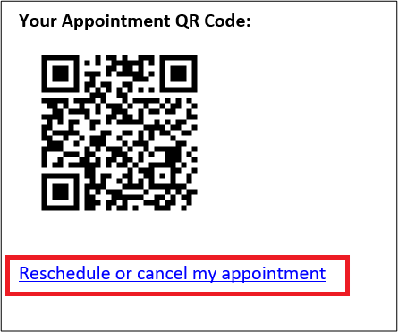
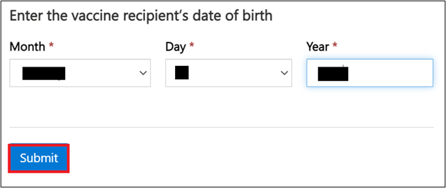
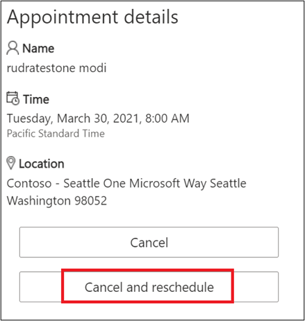
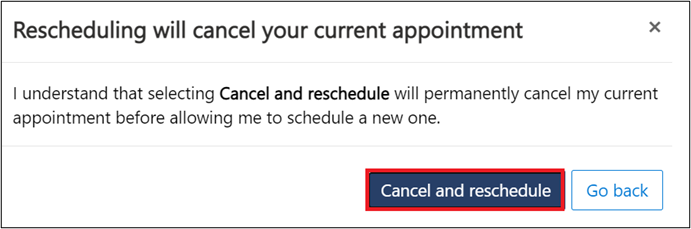
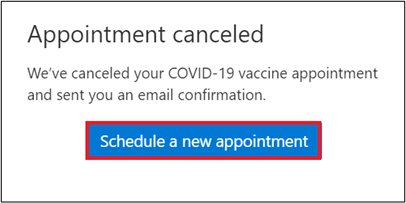

In this exercise, you will assume the persona of a public user who has registered and booked an appointment for vaccination via the portal but now wants to reschedule the appointment slot for vaccination. This exercise can be done only after you have completed Exercise 3 and the eligibility appointment mail has triggered so that you can kickoff the cancellation and rescheduling experience from the link embedded in the mail.

## Task 1: Navigate to portal and book an appointment

1.  At the end of exercise 3, you should receive a confirmation email with an appointment confirmation QR code and a cancellation link. To launch the cancel and reschedule experience, click on **Cancel and reschedule** link in the mail

	> [!div class="mx-imgBorder"]
	> 

1.  It should launch the portal on your browser. Enter the same date of birth that you mentioned while registration.

	> [!NOTE]
	> It is important that you mention the exact same date as the system validates you against this data.

	> [!div class="mx-imgBorder"]
	> 

1.  Once the appointment details are loaded, click on **Cancel and Reschedule**.

	> [!div class="mx-imgBorder"]
	> 

1.  A dialog box asking for confirmation will appear. Click on **Cancel and reschedule**.

	> [!div class="mx-imgBorder"]
	> 

1.  Confirm your date of birth again using the same date of birth value as provided during registration.

	> [!div class="mx-imgBorder"]
	> 

1.  Your appointment will be canceled with a confirmation message. Click on **Schedule a new appointment**.

	> [!div class="mx-imgBorder"]
	> 

1.  It will now launch the booking experience, which can be completed using steps in Exercise 3 as reference.

	> [!div class="mx-imgBorder"]
	> 

**Congratulations!** You have now canceled and rescheduled your appointment for vaccination.

