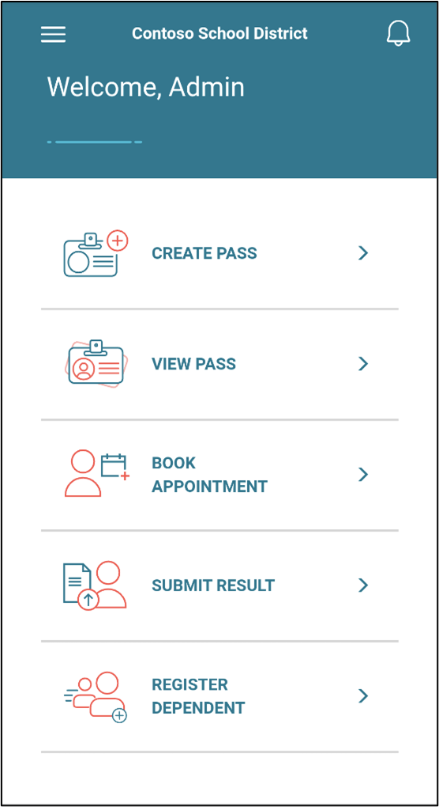
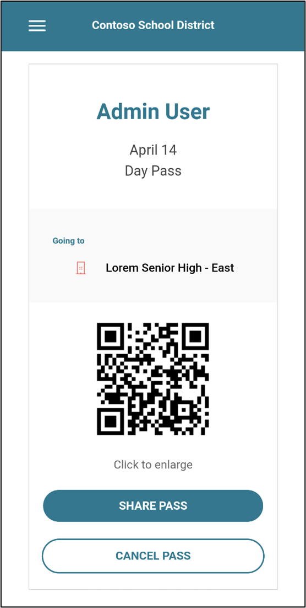
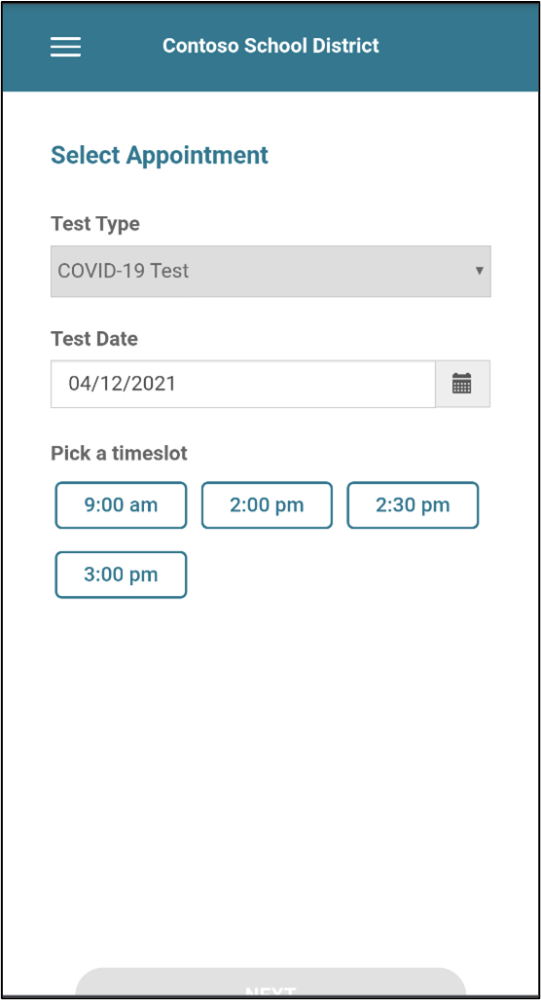
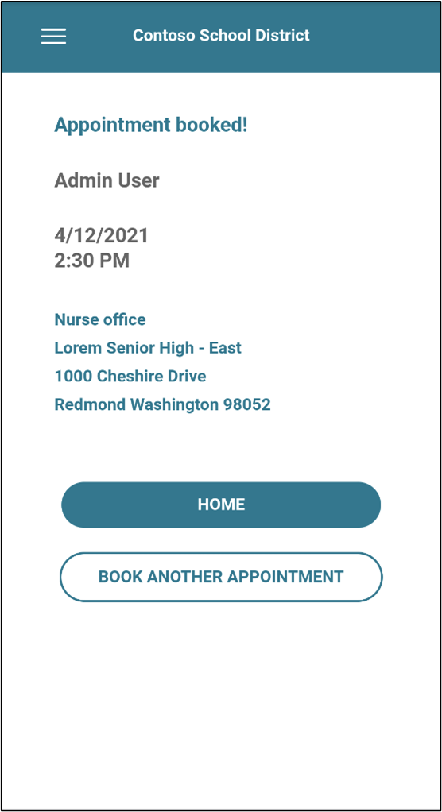
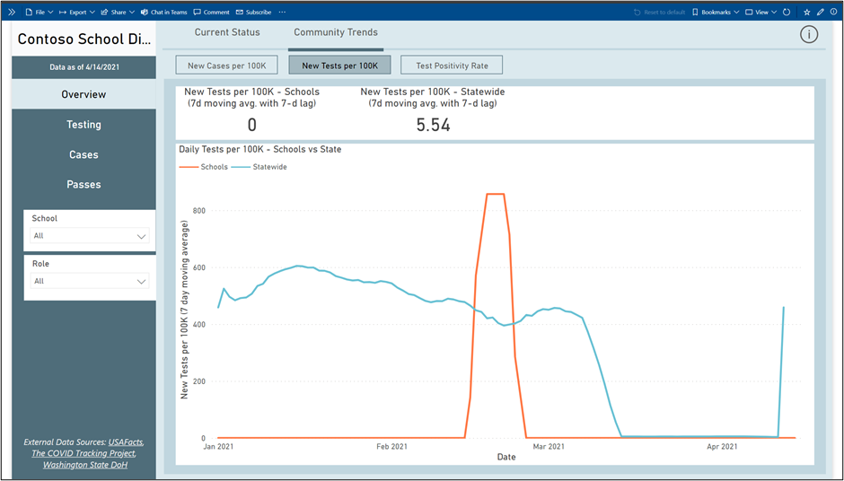
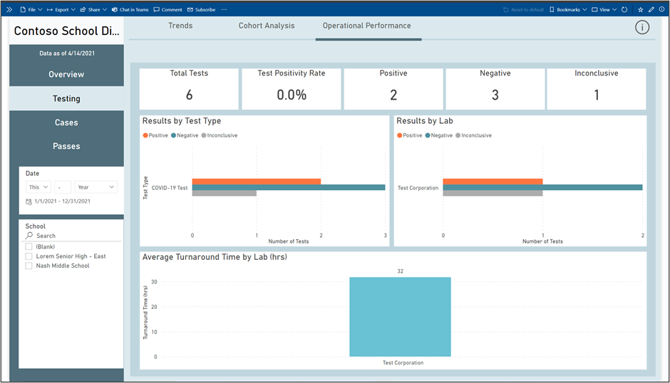
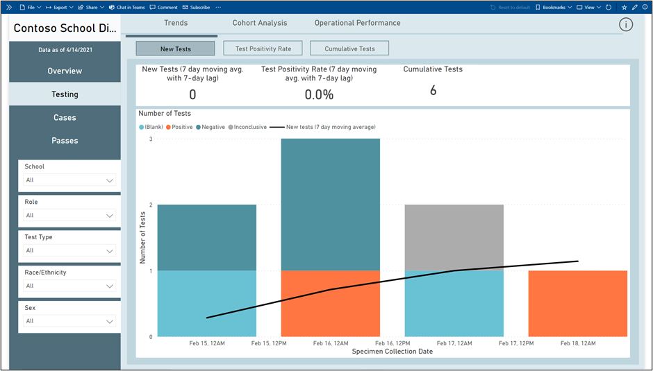
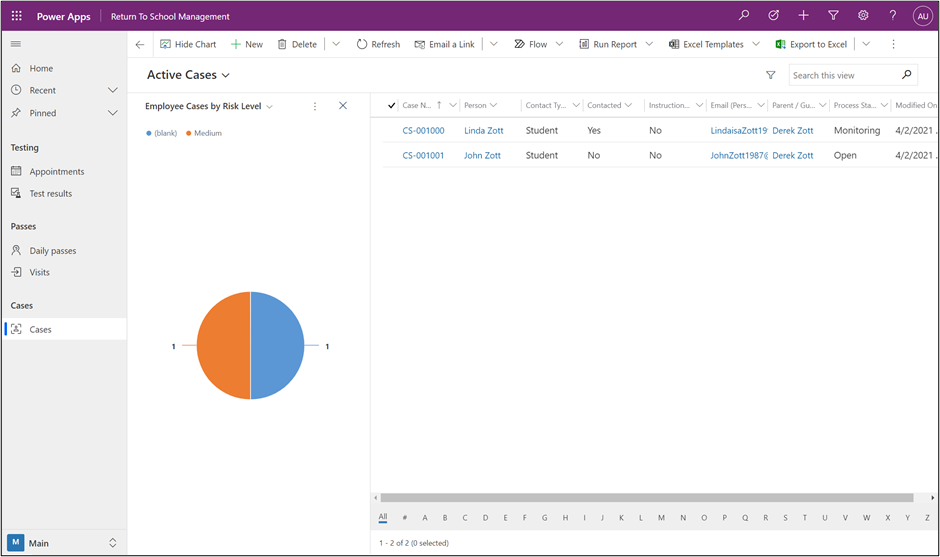

The Return to School solution features an app from Microsoft Power Apps and a Power Apps portal that is designed to facilitate many tasks that enable you to build entry for activities such as appointments or testing. Based on your location's specific expectations for returning, you can make several options available to help with a safe return.

The **School Management** app and the **Power Apps portal** app give school administrators the tools that they need to monitor and manage the return of students and staff to school. These apps help schools with daily attestation and access controls, periodic testing, case management, and manual contact tracing. The portal app is designed as a self-service tool for students, parents, guardians, and staff.

The Return to School solution offers a dashboard and analytics to help school administrators view historical trends of key program measurements, such as daily attestations and cases. Dashboards show metrics for reopening, and analytics measure testing efficacy and operational performance.

## Return to School Management app and portal

**Return to School Management** is a model-driven app that allows you to directly control the settings for your portal and configure details such as the definition of your reopening phases, schools, and services. Access to a school can be determined by using many different settings. A school might have reopening phases to define total allowed occupancy and available entry times to stagger access to reduce bottlenecks at entry points. An individual user can be flagged for **no entry allowed** after a positive test result or failed attestation.

Then, the portal will provide building visitors with a series of options for obtaining and using a building entry pass, scheduling testing appointments, submitting results, or registering dependents to do the same.

> [!div class="mx-imgBorder"]
> 

The portal is a web-based application that is presented to a user in a standard internet browser like Microsoft Edge. The application has a responsive design so that your users will have a good experience if it's consumed on a mobile phone, tablet, or a desktop with a full-sized browser. You can configure the appearance and behavior of your portal by using the portal studio and the portal management app. For more information, see [Work with Power Apps portals](/learn/paths/work-power-apps-portals/?azure-portal=true).

A school might need to control the flow of visitors to their buildings. Students, faculty, parents, and other guests can use the portal to request a building pass to comply with these expectations. Only authenticated users can request building access. A user will be presented with a set of questions to confirm eligibility for a pass. The answers will be saved in an attestation record.

A building pass will be created for a same day visit.

The following image shows an example of a building pass with a QR code. This setting has been enabled to allow for contactless building access. If your facility doesn't support the scanning of such codes, you can disable this setting. You will learn more about the settings later in this module.

> [!div class="mx-imgBorder"]
> 

A portal user might also need to schedule an appointment for a test time. After you have configured your testing locations and available times, the portal user can book an appointment for their test. As part of the booking process, they will be presented with a series of questions, that you have defined, to help confirm test eligibility before the appointment can be confirmed. These questions can have yes/no, date/time, or text answers.

After answering the questions, the user will be presented with available appointments.

> [!div class="mx-imgBorder"]
> 

The user will receive a confirmed appointment screen after the selection has been made.

> [!div class="mx-imgBorder"]
> 

A building pass will not be created automatically for this user for their confirmed appointment. Appointments can be scheduled days in advance, and passes are created for same-day entry. Microsoft Power Automate would make it possible to automate the creation of this building pass by using a flow. Additionally, you could consider other automations such as emailing a confirmation of or reminders for the appointment. For more information, see [Automate a business process using Power Automate](/learn/paths/automate-process-power-automate/?azure-portal=true).

## Dashboards and analytics

The Return to School solution has a Microsoft Power BI dashboard ready for you to use. This dashboard is comprehensive and presents you with data analysis from your data, including regional and federal trends. The more information that you track in your system, the more comparative analysis you will have available. The following screenshot shows an example of some of the available information.

The dashboard contains the **Overview**, **Testing**, **Case**, and **Passes** analytics and data areas. Each of these areas has other available groupings to help you keep track of statuses and continue making plans for reopening phases.

> [!div class="mx-imgBorder"]
> 

> [!div class="mx-imgBorder"]
> 

> [!div class="mx-imgBorder"]
> 

Often, the first analysis that is performed is the simplest. The model-driven app provides views that display information about the relevant data that is being tracked for returning to school. Appointments, test results, daily passes, visits, and cases are available in the app and display current data to help you keep track. Standard features of model-driven apps allow an administrator to customize these views for all users or allow individual users to create their own personal views to see the data that is relevant to them.

The solution comes with charts, where you can view information about the status of your active cases. The chart can be viewed directly in line with the records, as shown in the following image.

> [!div class="mx-imgBorder"]
> 
