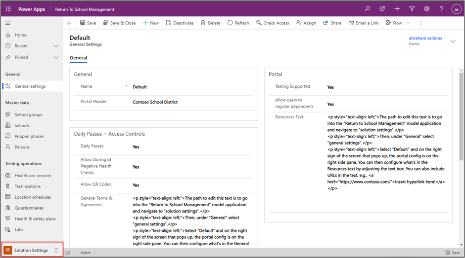
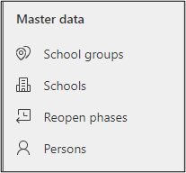
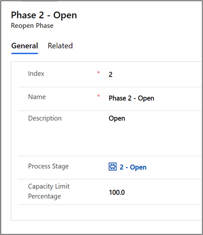
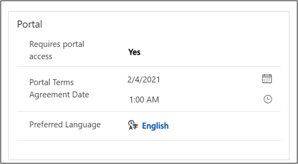
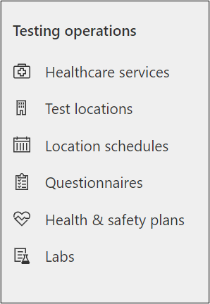
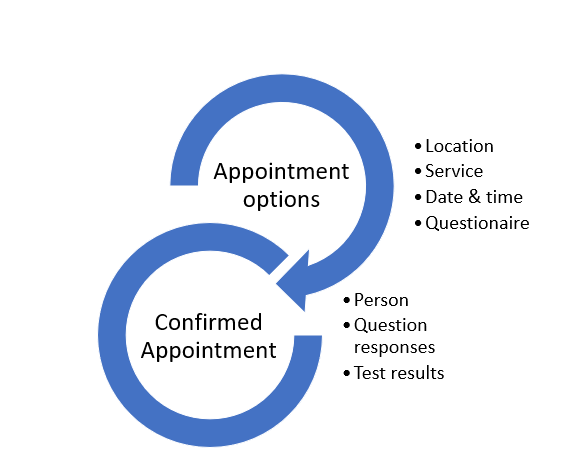
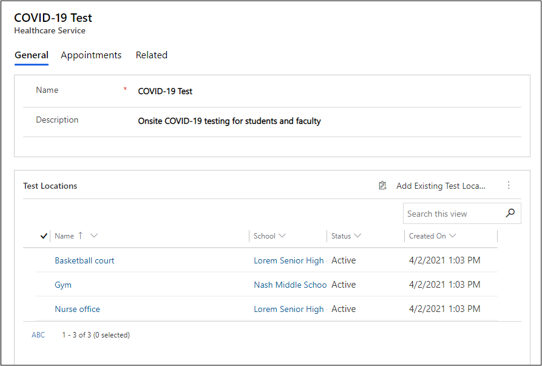
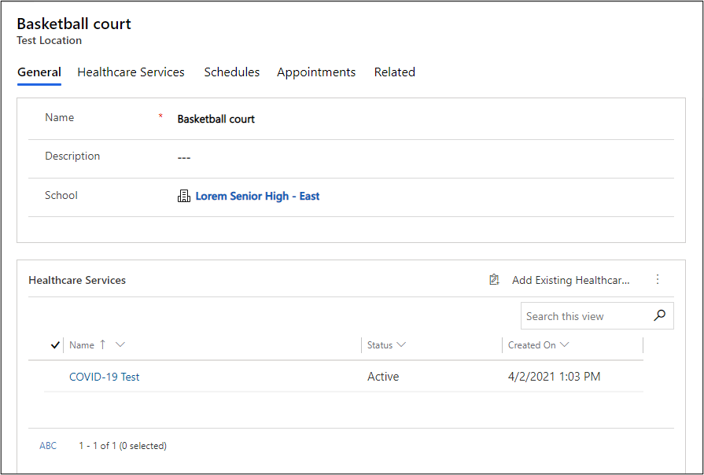
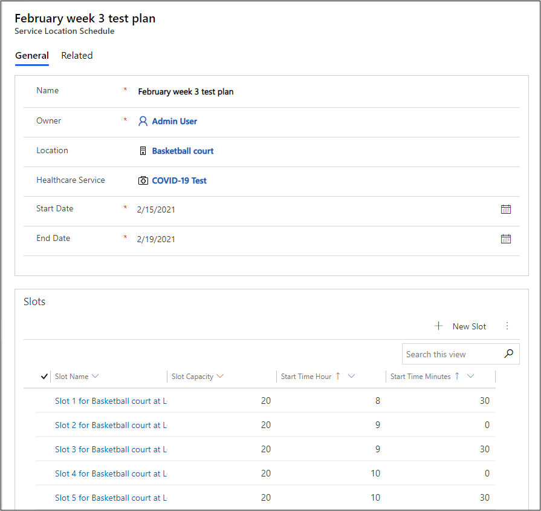
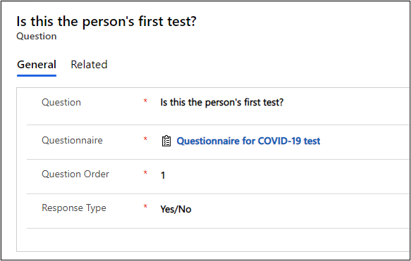

The Return to School apps have several settings to configure. Some items can be found in the Return to School Management app, while others are configured in the portal management app or Power Apps portal studio.

## Return to School management

The following configurations are completed in the **Return to School Management** model-driven app, in the **Solutions Settings** area. You can go to this area from the selector in the lower-left corner of the app, as shown in the following image.

> [!div class="mx-imgBorder"]
> 

### General settings

**General settings** is a record that you create that holds important data to help define options for the user experience. Items such as the text in the **General Terms and Agreement**, **Health Terms and Agreement**, or **Resources Text** columns allow you to place formatted text by using HTML. The following table describes other information that you can include on this record.

|     Information                                |     Details                                                                                                                                                                                                   |
|------------------------------------------------|---------------------------------------------------------------------------------------------------------------------------------------------------------------------------------------------------------------|
|     Name                                       |     Name the solution settings record.                                                                                                                                                                        |
|     Portal header                              |     The text that will be displayed in the header of the portal   application.                                                                                                                                |
|     Daily passes                               |     Set to **Yes** to enable the **Daily Passes** menu item on the portal   application's home page.                                                                                                                  |
|     Allow storing of negative health checks    |     Set to **Yes** to have the application create a record when a user   doesn't agree to the attestation statement so that you can follow up with that   user later.                                                 |
|     Allow QR codes                             |     Set to **Yes** to have the application add a QR code to the daily   pass.  If your facility or guests don't have the equipment to support scanning of codes, make sure that you select **No**   for this setting.    |
|     Allow users to register dependents         |     Enables users to register guests under their contact.                                                                                                                                                     |
|     Testing supported                          |     Enables the scheduling of an appointment, submission of test results, and   viewing test results.                                                                                                                |

### Master data

You can configure your master data in the **Solution Settings** area, which will also include details about your schools, school groups, reopen phases, and persons.

> [!div class="mx-imgBorder"]
> 

#### Schools and school groups

Schools can belong to school groups. School groups allow you to logically organize schools that might have similar characteristics and similar reopening phases. One example would be to group schools by grade levels because different ages might have different reopening phases based on regional guidelines. Alternatively, if a school district crosses county lines, they might want to group schools by geography instead.

For an individual school, you will capture standard information, such as location, but also other data that is specific to the purposes of helping you define your safe return criteria. A school record will also include its reopen phase, test locations, and more that is captured on the record.

> [!div class="mx-imgBorder"]
> 

#### Reopen phases

As you plan the reopening, you can capture those requirements on the **Reopen Phase** form and build the supporting information so that you can enforce expected policy for staff and guests to return to school. Several steps are involved in creating and managing the reopening phase records. Before you can add guidance or automation, you must first define the phases. A phase will contain a relationship to the process stage and a capacity limit that will be used for calculations and policy enforcement.

> [!div class="mx-imgBorder"]
> 

#### Persons

The **Persons** option in the **Master data** section is where you would track contacts. In addition to the standard contact data that you might expect, in this solution, you will find portal access settings, dependent information, and a record of their access, notification, appointments, test results, and other related records to support their return. To invite a person to use the portal, set the **Requires portal access** option to **Yes**.

> [!div class="mx-imgBorder"]
> 

### Testing operations

As part of the reopening of your school, you can set up testing operations. You can configure and set up options in the **Testing operations** group of the **Solution Settings** area.

> [!div class="mx-imgBorder"]
> 

The exact configuration of the test plans can vary, but all share some common elements. In this section, you will create the options such as locations and services that are offered at a location, available time slots for appointments, and the questions for the user questionnaire that is presented during the appointment booking process. Additionally, you will build and maintain the appointment options that are presented to persons who want an appointment. After the appointment has been confirmed, that record will contain their question responses and test results when they're available.

> [!div class="mx-imgBorder"]
> 

#### Configure healthcare services

The system will allow you to build the services that are offered for any given location. The following image shows a service that has been configured for COVID-19 testing. You might also want to build a service for temperature checks to take place in another room of the school. Each service can happen at any location that you have created. After you have created the offered services, you won't have to add more items in the **Healthcare Service** form unless you add services.

> [!div class="mx-imgBorder"]
> 

#### Configure test locations

The test location will define what services are offered there. You will also have the related records for schedules and appointments. After you have completed a list of locations, you won't have to add more records unless you add more testing locations.

> [!div class="mx-imgBorder"]
> 

#### Configure test location schedule 

Each location will have its own schedule. Any school can have more than one available location for services and appointments, and each will need to have its appointments and timeslots configured. These schedules will need to be kept current. You can add or remove capacity and that might affect appointment availability. Consider creating a regular cadence of options that are based on anticipated needs. People who want an appointment will be bound by the constraints that you have defined in the **Service Location Schedule** form.

> [!div class="mx-imgBorder"]
> 

#### Configure questionnaires and questions

When a person who wants an appointment is in the process of booking that appointment, they will be presented with a list of questions to complete prior to the appointment being finalized. These questions are based on the selected service. In the following example, the questions that are asked relate to testing and potential exposure. If you added another service, you would likely need different questions, and you can define those different questions for a new service.

> [!div class="mx-imgBorder"]
> 

## Return to School portal user configuration

The Return to School portal allows administrators to provide a user-friendly, web-based way to register and manage building access. This portal is intended for simple setup and use. For more information, go to [Work with Power Apps portals](https://docs.microsoft.com/learn/paths/work-power-apps-portals/?azure-portal=true).

Configuration of some features has already been completed through the Back to School model-driven app, where you can enable and disable features for daily passes, QR codes, and  a dependent's access. Additionally, the data in that app will be available for users in the portal, such as contact information, schools, school access, appointments, and more.

Because the portal might contain sensitive information, make sure that you provide access only to properly authenticated users. Those authenticated users can perform the following tasks:

-   Create a pass

-   View existing passes

-   Book an appointment

-   Submit test results

-   Register dependents

-   View appointments

-   View test results

-   View resources

-   Update their profile

For more information, see [Return to School Portal app](https://docs.microsoft.com/dynamics365/industry/return-to-school/portal-app#authenticated-access-to-the-portal/?azure-portal=true).

