In this exercise, we will configure the prerequisite applications and then deploy Microsoft Cloud for Healthcare in our Microsoft 365 tenant.

> [!NOTE]
> Configuring Dynamics 365 Omnichannel for Customer Service and Power Apps Portals will each take several hours to complete (each estimated at 3-4 hours to complete). We recommend configuring both applications concurrently. All configuration steps must be finished before deploying Microsoft Cloud for Healthcare.

## Task 1: Configure Omnichannel for Customer Service

In this task, you will configure Omnichannel for Customer Service to deploy and use the Patient Service Center application.

1.  Go to [Microsoft Power Platform admin center](https://admin.powerplatform.microsoft.com/?azure-portal=true).

1.  Expand **Resources** on the left navigation bar and select **Dynamics 365 apps**.

	> [!div class="mx-imgBorder"]
	> [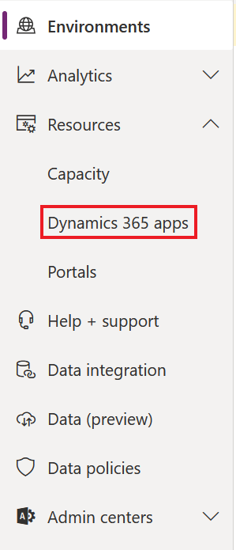](../media/dynamics-365-apps.png#lightbox)

1.  Search for **Omni**, select **Omnichannel for Customer Service**, select **Manage**, and then select **OK**.

	> [!NOTE]
	> If you do not see the application available, it may not yet be reflected after adding the digital messaging add-on trial license in the previous exercise. It may take up to 24 hours to become available in the Dynamics 365 apps list.

	> [!div class="mx-imgBorder"]
	> 

	> [!div class="mx-imgBorder"]
	> [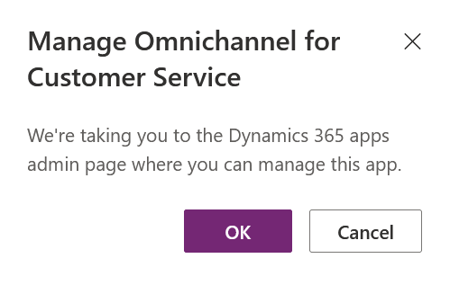](../media/ok-button.png#lightbox)

1.  In the new window, select **+ Add environment**, select your environment from the dropdown menu, and then select **Next**.

	> [!div class="mx-imgBorder"]
	> 

	> [!div class="mx-imgBorder"]
	> [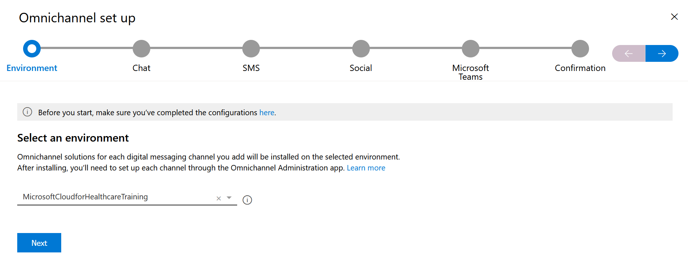](../media/next.png#lightbox)

1.  Set the **Add chat** toggle switch to **Yes**. Select **Next** through to **Confirmation** and then select **Finish**. You only need to enable the chat channel for setup.

	> [!div class="mx-imgBorder"]
	> [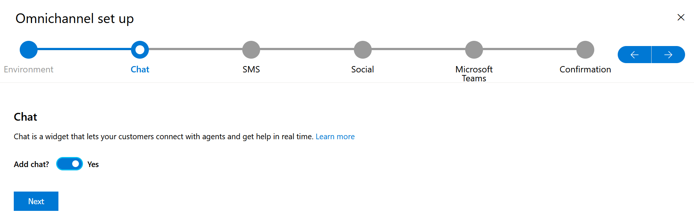](../media/chat.png#lightbox)

	> [!div class="mx-imgBorder"]
	> [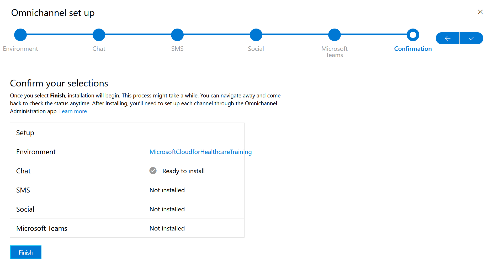](../media/finish.png#lightbox)

    The installation will take several hours to complete. Once finished, you may proceed to the next task

## Task 2: Create a Power Apps portal

In this task, you will create a Microsoft Power Apps portal that will be used as a Patient Access Portal by Microsoft Cloud for Healthcare.

1.  While signed in to your Microsoft 365 tenant, open a new tab and go to [https://make.powerapps.com](https://make.powerapps.com/?azure-portal=true).

1.  Change your **Environment** from the default to the trial environment that you created in the previous exercise, and then select **All templates**.

	> [!div class="mx-imgBorder"]
	> [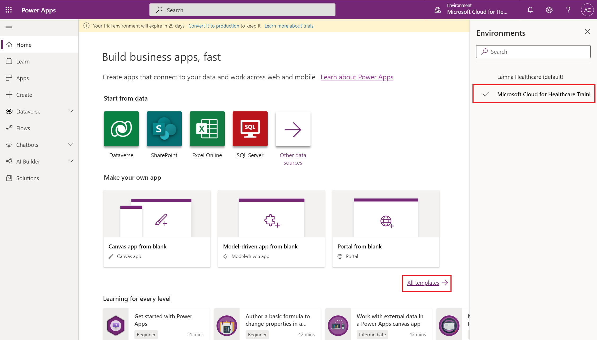](../media/all-templates.png#lightbox)

1.  Scroll down and select **Customer self-service**.

	> [!div class="mx-imgBorder"]
	> [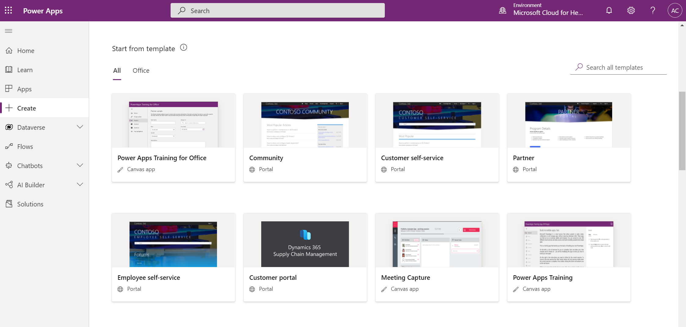](../media/customer-self-service.png#lightbox)

1.  Enter a name for your portal, provide a valid URL, and then select **Create**. This portal will become the external website patients can use to access medical records and communicate with healthcare organizations.

	> [!div class="mx-imgBorder"]
	> [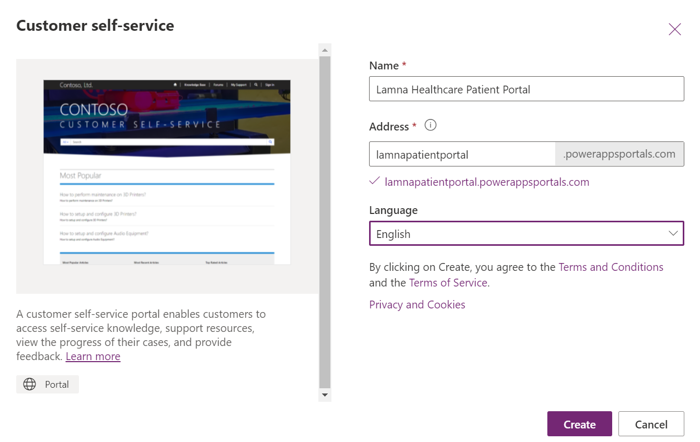](../media/create.png#lightbox)

    Your portal will now begin to provision.  You can track the progress of your portal under the Apps page.  This will take a few hours to complete. Once finished, you may proceed to the next task to deploy Microsoft Cloud for Healthcare.

	> [!div class="mx-imgBorder"]
	> [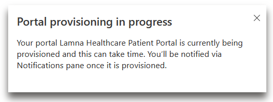](../media/provision-progress.png#lightbox)

	> [!div class="mx-imgBorder"]
	> [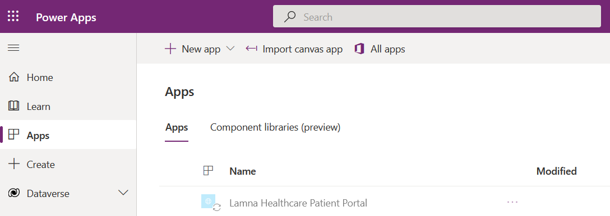](../media/apps-page.png#lightbox)

## Task 3: Deploy Microsoft Cloud for Healthcare

In this task, you will deploy the necessary Microsoft Cloud for Healthcare solution modules for this training.

Once you have completed all the previous tasks to install and configure the prerequisite licenses, you are ready to deploy Microsoft Cloud for Healthcare.

1.  While signed in to your Microsoft 365 tenant, open a new tab and access [Microsoft Cloud Solution Center](https://solutions.microsoft.com/?azure-portal=true). Select the **Microsoft Cloud for Healthcare** button to begin the setup.

	> [!div class="mx-imgBorder"]
	> [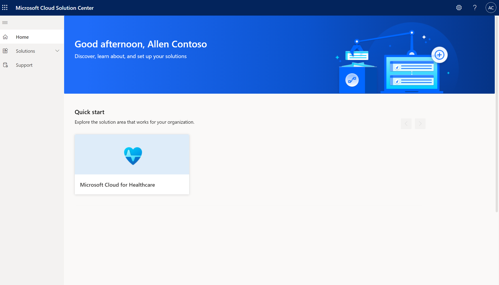](../media/cloud-for-healthcare.png#lightbox)

1.  Select any of the Microsoft Cloud for Healthcare capabilities.

	> [!div class="mx-imgBorder"]
	> [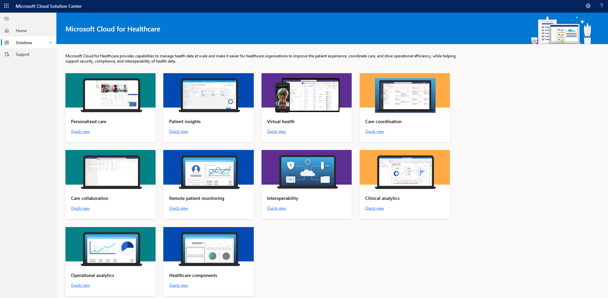](../media/capabilities.png#lightbox)

1.  Select **All** from the **Filter by capability** drop-down menu. Select the **Add all Healthcare solutions** checkbox to add all Microsoft Cloud for Healthcare capabilities that are required for this training.

	> [!div class="mx-imgBorder"]
	> [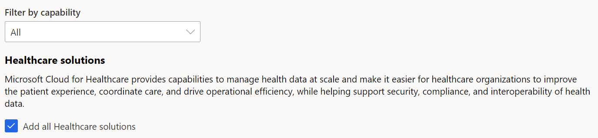](../media/healthcare-solutions.png#lightbox)

1.  Select the **Deploy** button in the upper right.

	> [!NOTE]
	> Patient insights is not a required Healthcare solution to complete any lab in this series. If you do want to deploy Patient insights, Sales Insights is a required license.

1.  In Additional Components, select both **sample data** and **codeable concepts** to include them in installation. This is important as the lab content is based off this data. Select **Next**.

	> [!div class="mx-imgBorder"]
	> [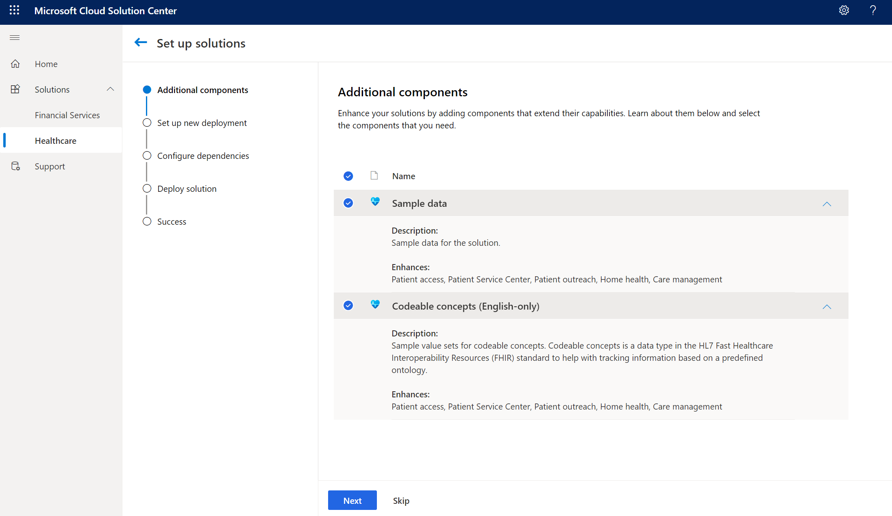](../media/additional-components.png#lightbox)

1.  Select your **environment** from the drop-down menu, enter a **name** for the deployment, **accept** the Terms of service, and select **Next**.

	> [!div class="mx-imgBorder"]
	> [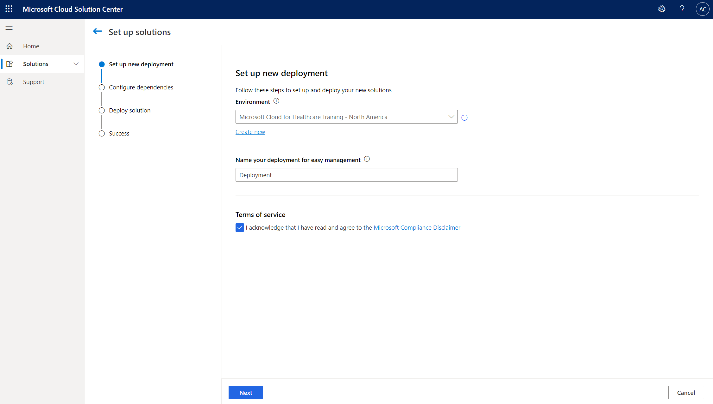](../media/deployment-accept-next.png#lightbox)

1.  You will now see that all pre-deployment dependencies are installed and configured. Select **Deploy** to complete the deployment process.

	> [!div class="mx-imgBorder"]
	> [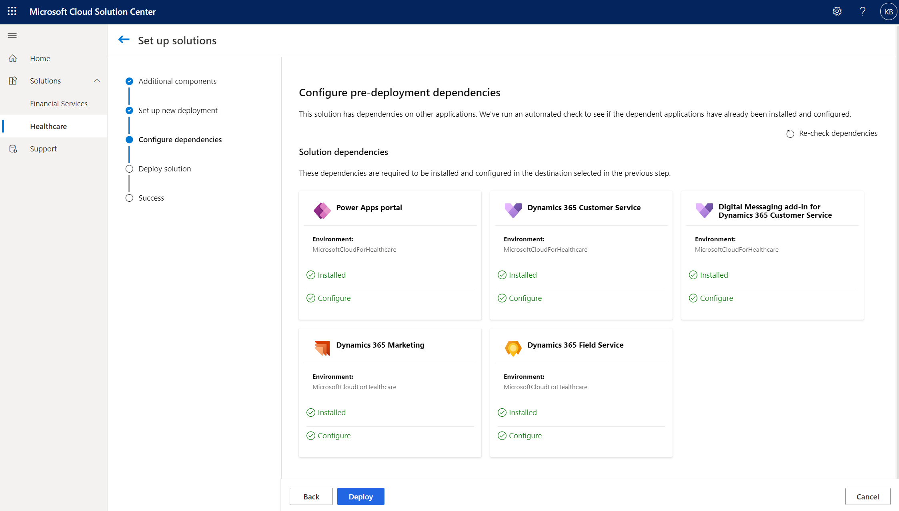](../media/deployment-process.png#lightbox)

Congratulations! Deployment is underway. The Microsoft Cloud for Healthcare deployment will take several hours to complete. You can monitor this screen to check the deployment status.

> [!div class="mx-imgBorder"]
> [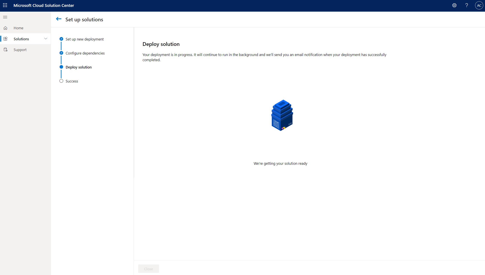](../media/deployment-status.png#lightbox)

Healthcare apps will also appear in the Apps page in [Power Apps](https://make.powerapps.com/?azure-portal=true) as they are deployed.

> [!div class="mx-imgBorder"]
> [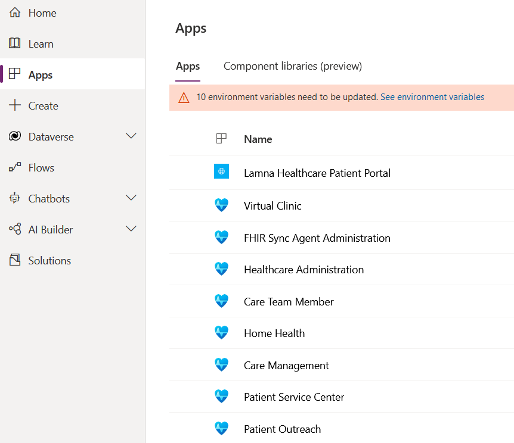](../media/healthcare-apps-page.png#lightbox)
