An active Azure subscription is required in your Microsoft 365 tenant to light up certain Microsoft Cloud for Healthcare components such as Azure Health Bot and FHIR Sync Agent. This module will walk through the steps to obtain a free trial Azure subscription and create a resource group, which will be used in the subsequent labs.

> [!NOTE]
> The Azure Terms of Use agreement limits free trial activation only for a user that's new to Azure. If you have already had any other type of Azure subscription, you will not be able to activate a free trial.

## Task 1:  Obtain a trial Azure subscription

In this task, we will walk through the steps to obtain a trial Azure subscription to utilize Azure Health Bot and FHIR sync capabilities in Microsoft Cloud for Healthcare.   

1.  Sign into [Azure portal](https://portal.azure.com/?azure-portal=true) with the new credentials obtained while creating a new tenant in the earlier tasks and then select the **Start** button. 

	> [!div class="mx-imgBorder"]
	> [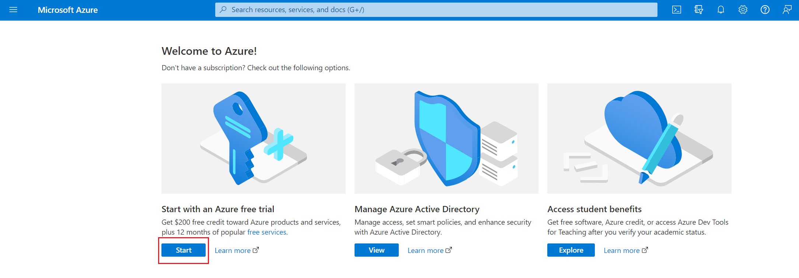](../media/start-button.png#lightbox)

1.  It will open the sign-up page in a new tab page in the browser. The details entered while creating the new tenant in the earlier tasks will be auto populated on the sign-up screen. Verify the profile details, provide the phone number, and validate it either by Text or call, accept the customer agreement and select the **Next** button.

	> [!div class="mx-imgBorder"]
	> [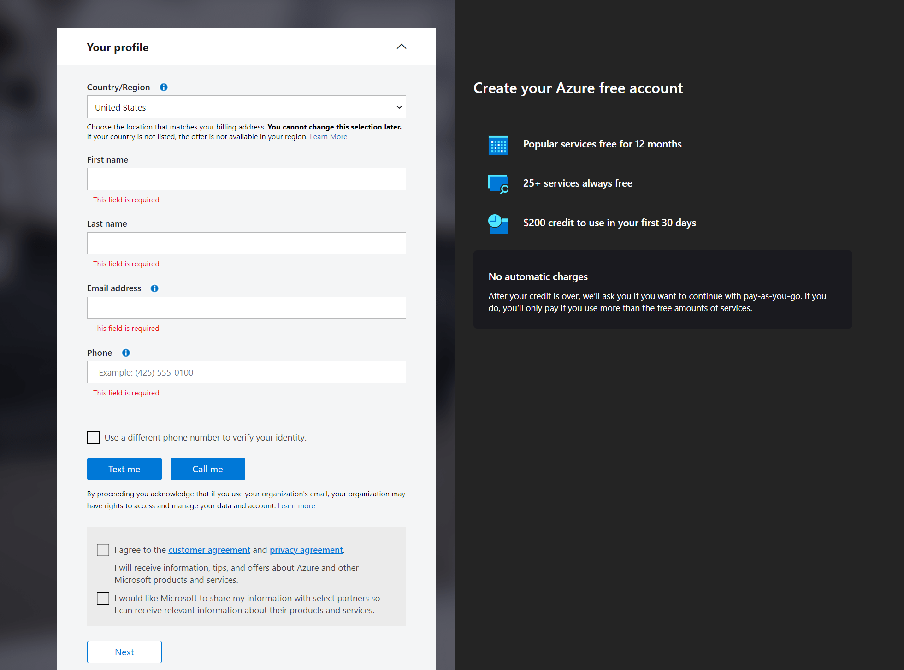](../media/profile-details.png#lightbox)

1.  Provide your credit card details and select **Sign up**.

	> [!NOTE]
	>  A credit card is only required to verify your identity. You will not be charged unless you upgrade your subscription. Please read the following Microsoft Docs to understand how to [Avoid charges with your Azure free account](/azure/cost-management-billing/manage/avoid-charges-free-account/?azure-portal=true).
	
	> [!div class="mx-imgBorder"]
	> [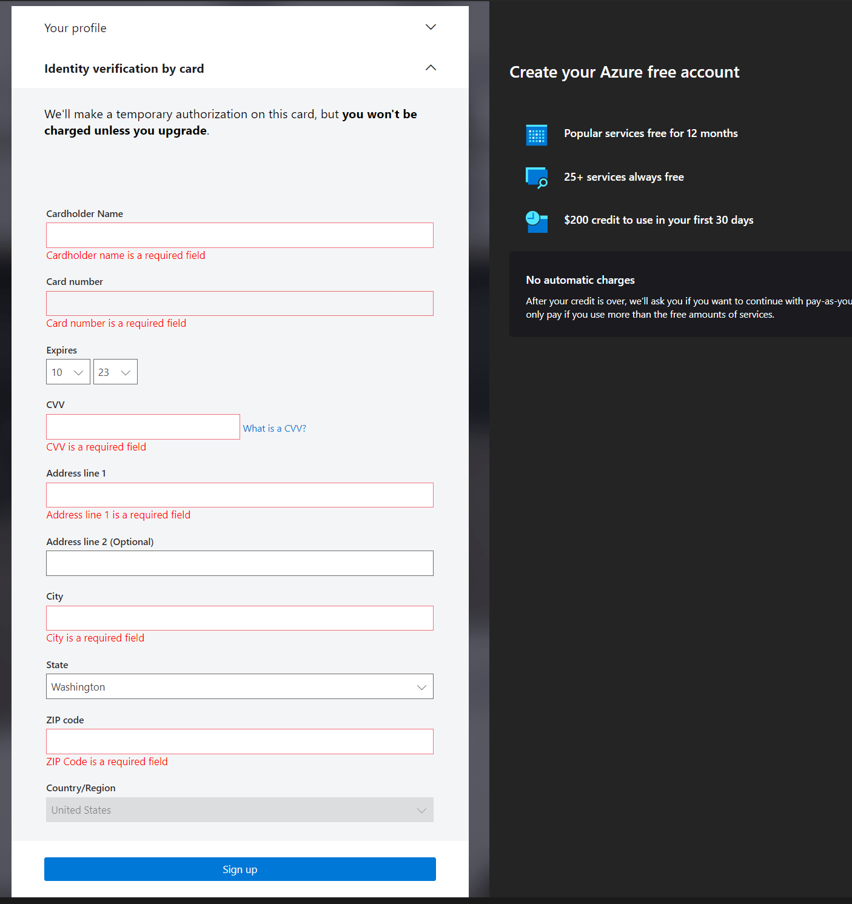](../media/card-details.png#lightbox)

**Congratulations!** You have successfully set up your Trial Azure Subscription.

## Task 2: Create a resource group

> [!NOTE]
> It may take 1-2 hours for the Azure Subscription to appear after creation.

In this task, you will learn the steps to create a resource group, which will be used in the subsequent labs. 

1.  In [Azure portal](https://portal.azure.com/?azure-portal=true), search for **Resource groups**.

	> [!div class="mx-imgBorder"]
	> [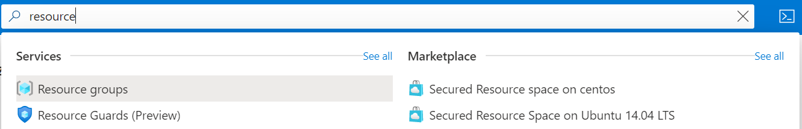](../media/resource-groups-search.png#lightbox)

1.  You may also find Resource groups in the upper left flyout menu.

	> [!div class="mx-imgBorder"]
	> 

1.  Select **Create**.

	> [!div class="mx-imgBorder"]
	> [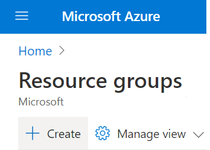](../media/create-button.png#lightbox)

1.  Enter the following for your new resource group:

    -   **Subscription**: Select your Azure subscription.

    -   **Resource group**: Enter a new resource group name. (for example, Training)

    -   **Region**: Select an Azure location.

1.  Select **Review + create**.

	> [!div class="mx-imgBorder"]
	> 

1.  Select **Create**. It takes a few seconds to create a resource group.
 
	> [!div class="mx-imgBorder"]
	> [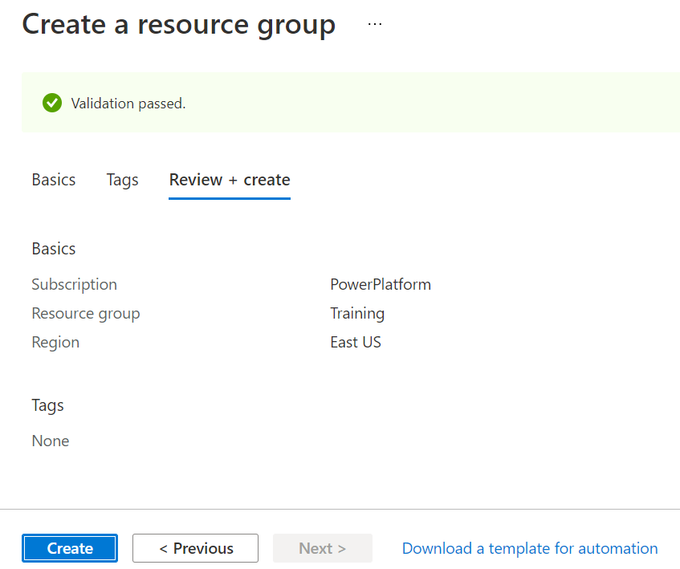](../media/create-resource-group.png#lightbox)

1.  Select **Refresh** from the top menu to refresh the resource group list, and then select the newly created resource group to open it. Or select **Notification** (the bell icon) from the top and select **Go to resource group** to open the newly created resource group.

	> [!div class="mx-imgBorder"]
	> [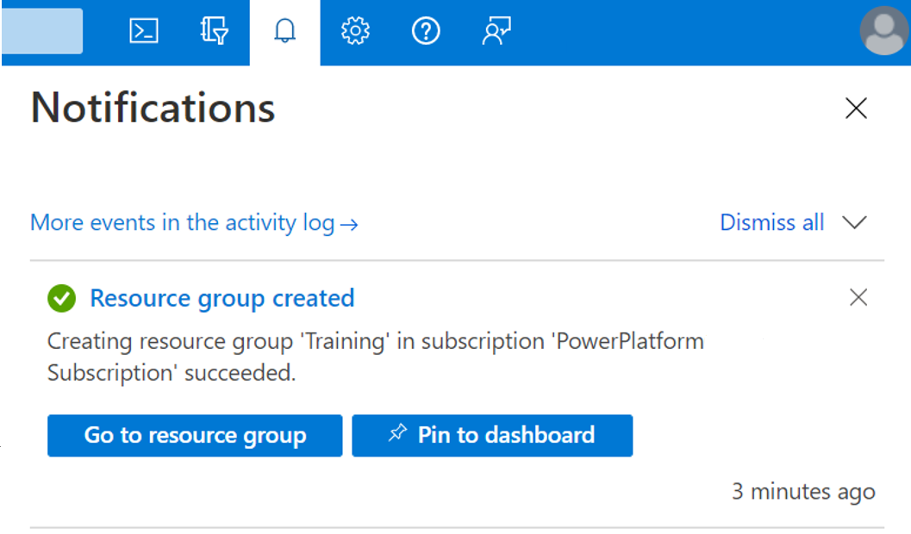](../media/bell.png#lightbox)

**Congratulations!** You have successfully created a Resource Group in your Azure subscription. You will use this resource group when creating Azure resources, such as the Azure Health Bot.

## Task 3: Register a new application using the Azure portal

In this task, you will register an application in Azure portal, which will be used in this learning path. 

1. In [Azure portal](https://portal.azure.com/?azure-portal=true), search for **App registrations**.

	> [!div class="mx-imgBorder"]
	> [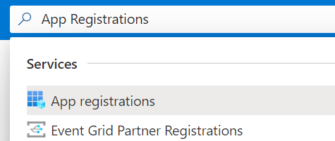](../media/app-registrations.png#lightbox)

1. You may also find Application Registration from the left-hand navigation pane. Select the **Azure Active Directory** service and then select **App registrations**.

	> [!div class="mx-imgBorder"]
	> [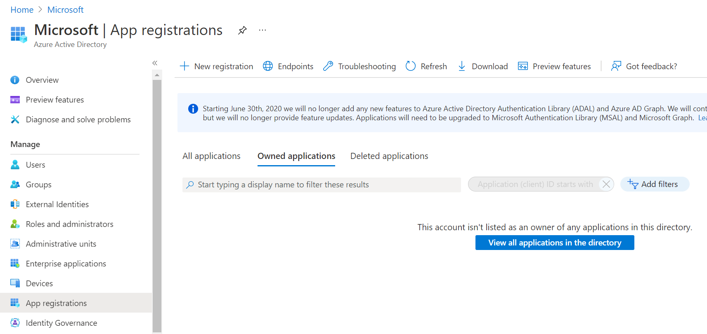](../media/app-registrations-navigation.png#lightbox)

1. Select **New Registration**.

	> [!div class="mx-imgBorder"]
	> [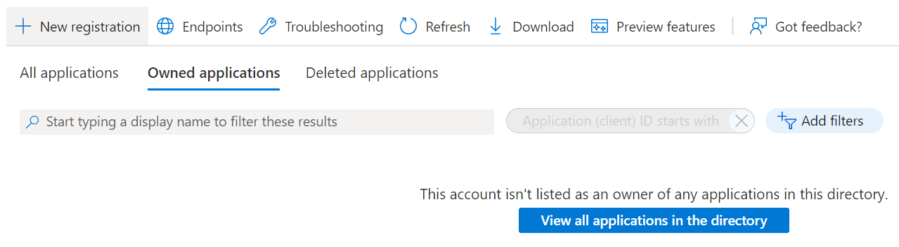](../media/new-registration.png#lightbox)

1. When the **Register an application** page appears, enter your application's registration information:

    -   **Name**: "MCH Application ID" (MCH = Microsoft Cloud for Healthcare)

    -   **Supported account types**: Select which accounts you would like your application to support. For example, **Accounts in any organizational directory**.

	> [!div class="mx-imgBorder"]
	> [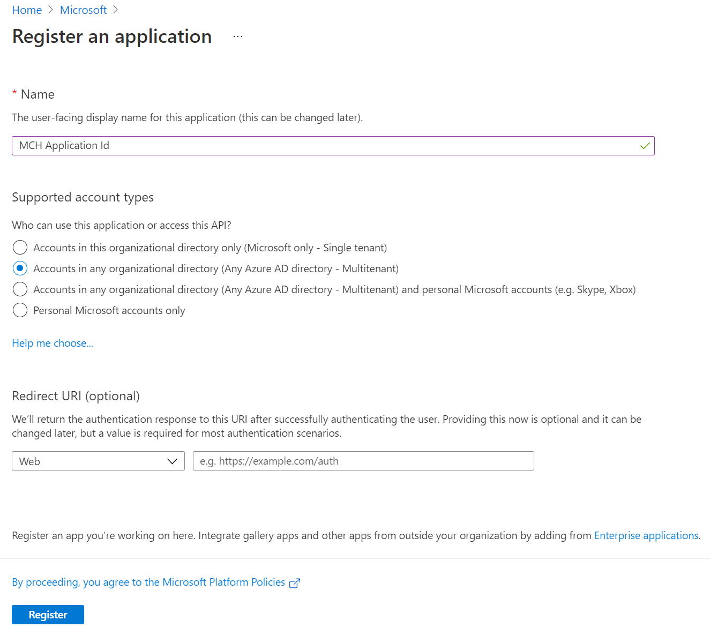](../media/register-application.png#lightbox)

1. When finished, select **Register** to create the application.

1. Once the App registration is created, select **API permissions** tab, select **Add a permission**.

	> [!div class="mx-imgBorder"]
	> [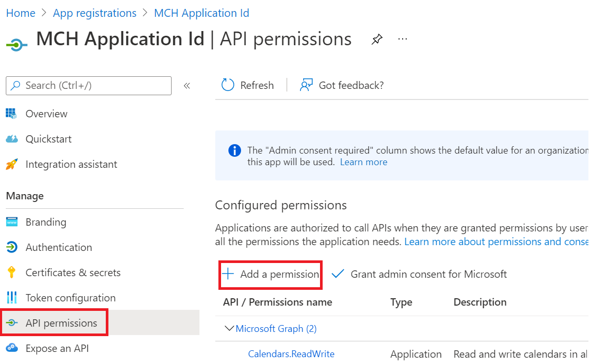](../media/add-permission.png#lightbox)

1. Search for and choose **Dataverse** under the **APIs my organization uses** tab. If "Dataverse" is not found, then search for "Common Data Service".

	> [!div class="mx-imgBorder"]
	> 

1. Select **Delegated permissions** and check the options and select **Add permission**.

	> [!div class="mx-imgBorder"]
	> 

1. Select **Add a permission** again to add another permission.

1. Select **Microsoft Graph** from **Microsoft APIs**.

	> [!div class="mx-imgBorder"]
	> [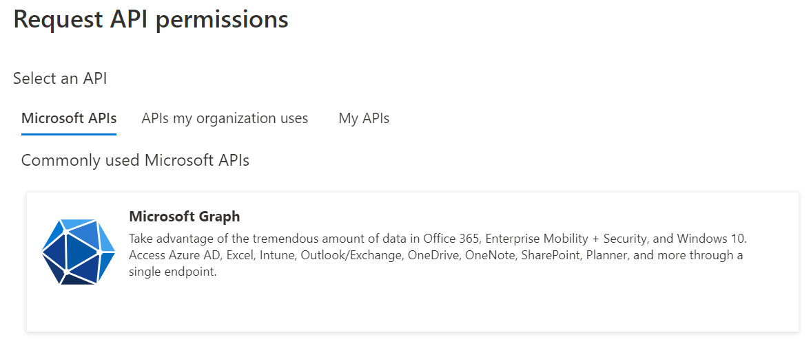](../media/graph.png#lightbox)

1. Select **Application permissions**.

	> [!div class="mx-imgBorder"]
	> [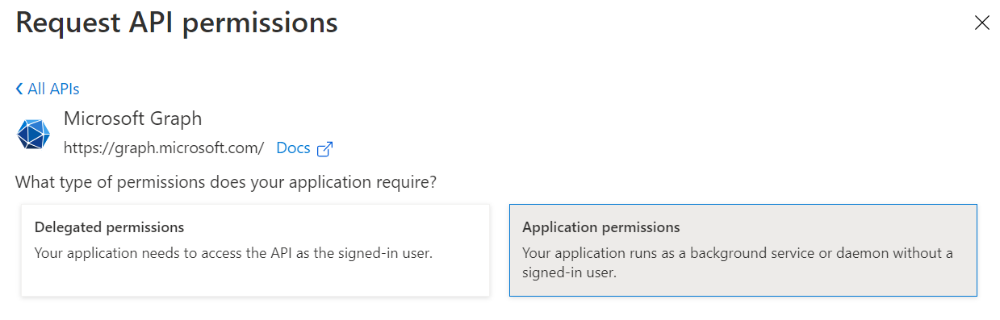](../media/application-permissions.png#lightbox)

1. Expand **Calendars** from the list of APIs and select **Calendars.ReadWrite** API permission and then select **Add permissions** button.

	> [!div class="mx-imgBorder"]
	> [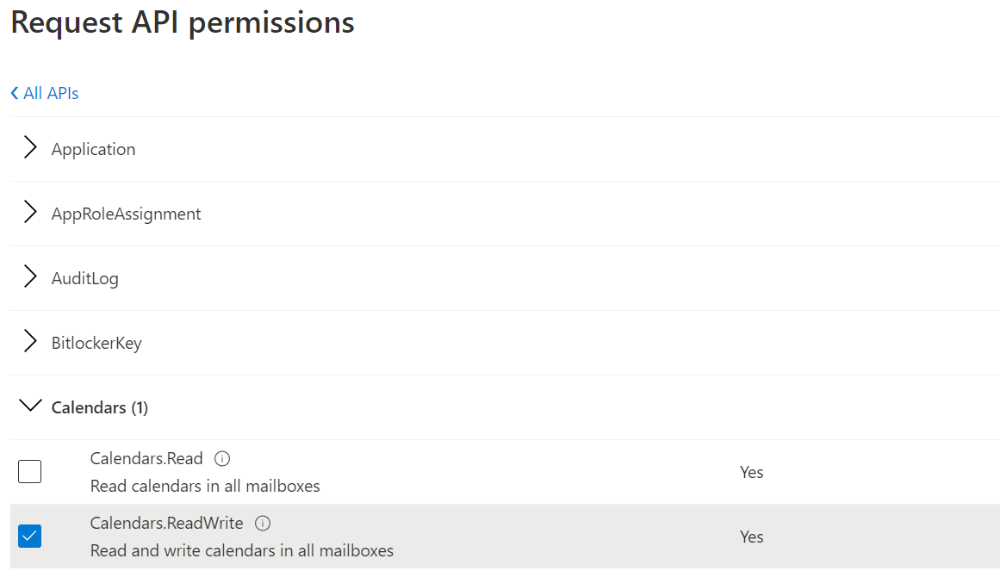](../media/request-permission.png#lightbox)

1. Once the permission has been added, select **Grant admin consent for Microsoft**.

	> [!div class="mx-imgBorder"]
	> [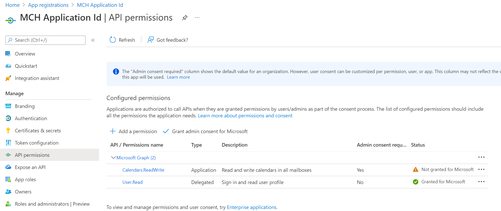](../media/consent.png#lightbox)

**Congratulations!** You have successfully created an App registration in your Azure subscription. You will use this App registration in the Azure Health Bot and Virtual Visit labs.

