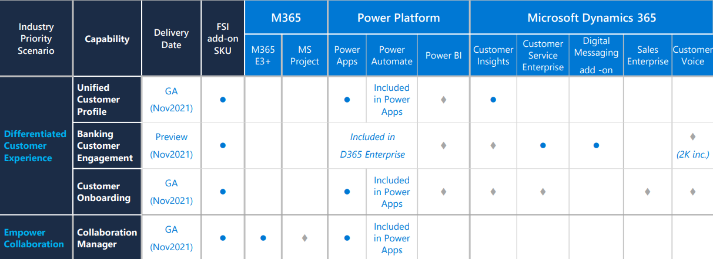

The Microsoft Cloud for Financial Services solution is composed of various integrated Microsoft technologies that are tailored specifically for retail banking financial institutions, such as:

- Dynamics 365

- Microsoft 365

To learn more on how to use and set up and the various components in Microsoft Cloud for Financial Services, reference this article on Microsoft Docs: [Set up and configure Microsoft Cloud for Financial Services](https://docs.microsoft.com/industry/financial-services/configure-cloud-for-financial-services).

This learning path will require the following features and license dependencies:

> [!div class="mx-imgBorder"]
> 
