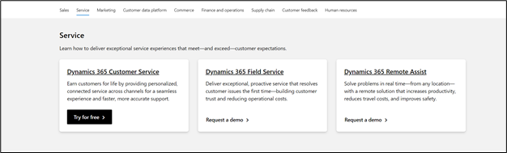
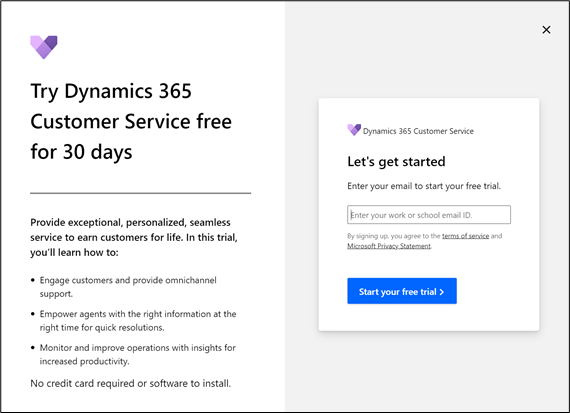
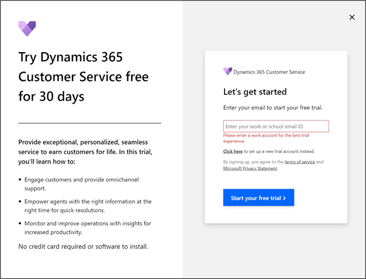
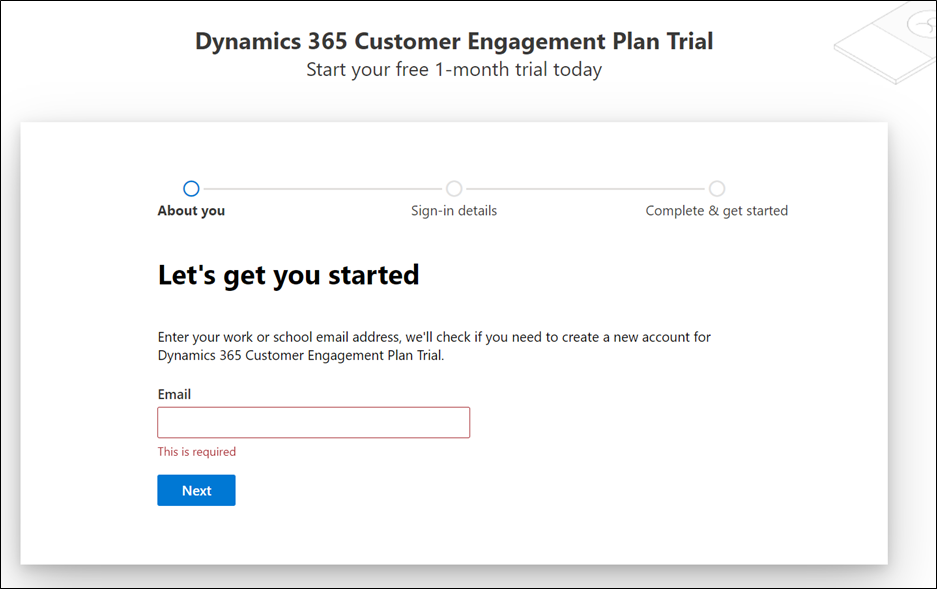
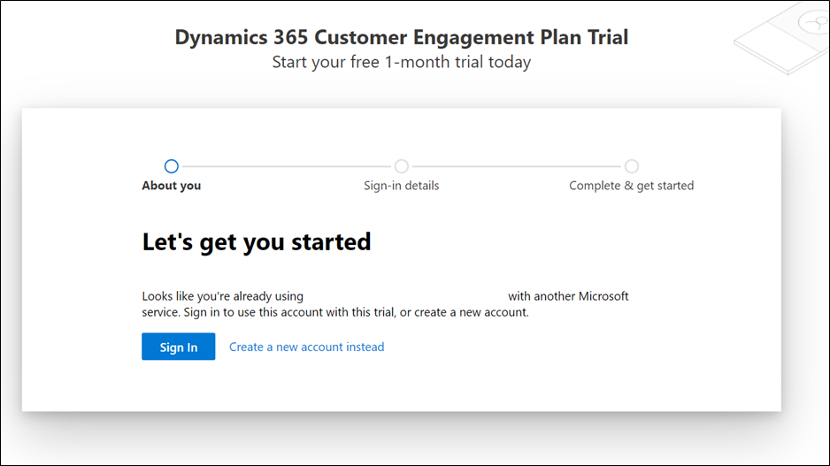
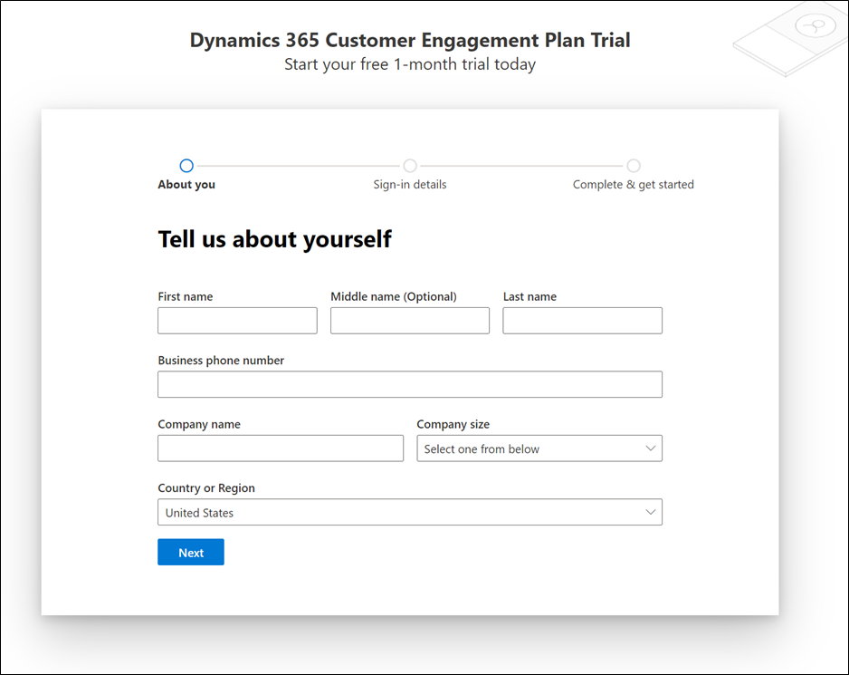
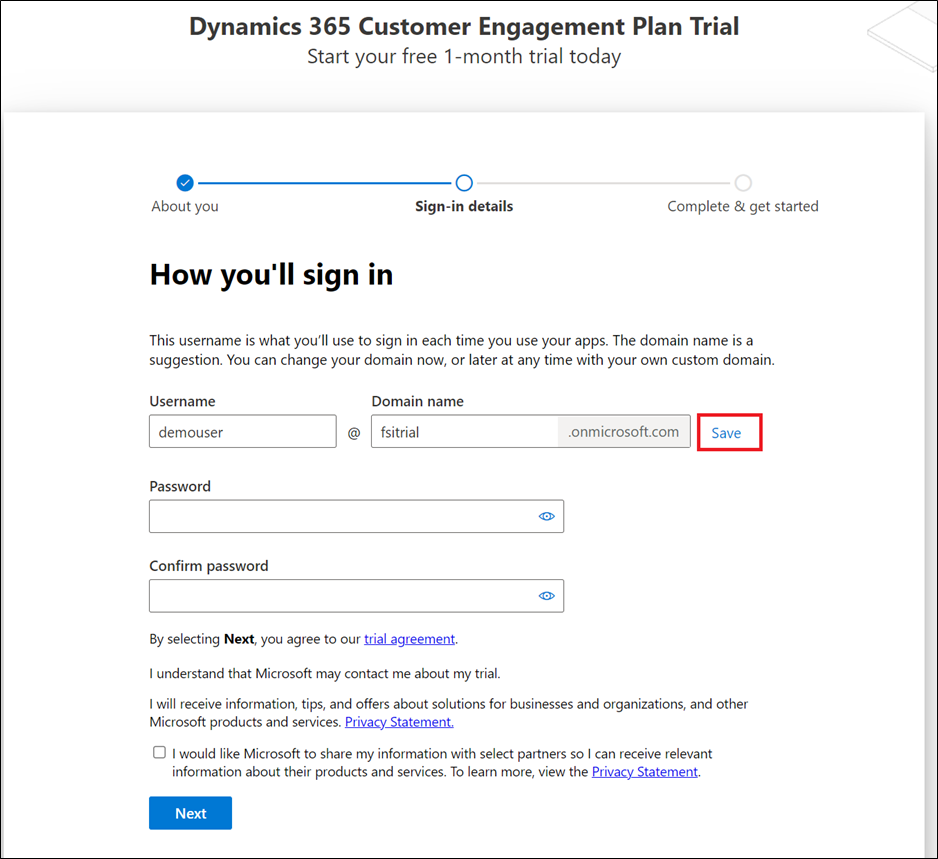
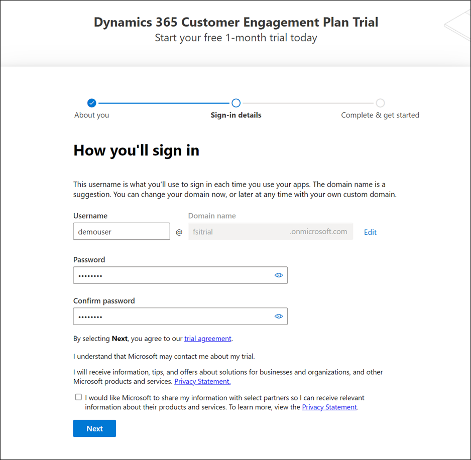
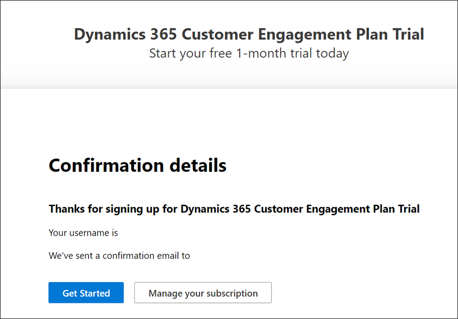

To deploy Microsoft Cloud for Financial Services in a Microsoft Dataverse environment, you need to create a tenant with the prerequisite licenses.

In this exercise, you'll learn how to create a demo tenant. You can skip this exercise if you've already created a demo tenant and have added the trial licenses.

## Create a Microsoft 365 tenant

In this task, you'll learn how to create a trial tenant along with the required Microsoft Dynamics 365 and Microsoft 365 trial licenses. You can skip this task if you already have a tenant.

1. Open an internet browser in In-Private or Incognito mode.

1. Go to [https://trials.dynamics.com](https://trials.dynamics.com/?azure-portal=true), scroll down, and then select **Try for free** in the **Dynamics 365 Customer Service** card.

    > [!div class="mx-imgBorder"]
    > 

1. A pop-up window will appear, asking you to enter your email to start your free trial. Leave the **email ID** field blank and then select **Start your free trial**.

    > [!div class="mx-imgBorder"]
    > 

1. An error will display, asking you to provide a valid work or school email ID with a link below to select for setting up a new trial account instead. Select **Click here to set up a new trial account instead**.

    > [!div class="mx-imgBorder"]
    > 

1. A new account creation flow for Dynamics 365 Customer Engagement Plan will display. Get started by entering your email address.

    > [!div class="mx-imgBorder"]
    > 

   If the email is already using other Microsoft services, the following warning will appear.

    > [!div class="mx-imgBorder"]
    > 

1. Select **Create a new account instead**, which will open the following page. Provide the necessary information. Enter a valid phone number where you can receive a text message to validate the sign-up process.

    > [!div class="mx-imgBorder"]
    > 

1. After the verification has completed, you can request a valid domain name and then select **Save** to check availability. If an error doesn't appear, the domain is ready to be used.

    > [!div class="mx-imgBorder"]
    > 

1. Set up a username and password and then sign in.

    > [!div class="mx-imgBorder"]
    > 

Your Microsoft 365 tenant has been successfully created along with the Dynamics 365 Customer Engagement Plan license that includes a Microsoft Power Apps license as well.

   > [!div class="mx-imgBorder"]
   > 

You have successfully set up your Dynamics 365 trial environment. In the next module, you'll learn how to obtain the various trial licenses that are required to fully run Microsoft Cloud for Financial Services.
