In this exercise, we'll deploy Microsoft Cloud for Financial Services in our Microsoft 365 tenant.

## Task 1: Create a Power Apps portal

In this task, we'll create a Power Apps Portal that will be used as a sample portal by the Customer onboarding capability.

1. While signed into your Microsoft 365 tenant, open a new tab and go to [https://make.powerapps.com](https://make.powerapps.com/?azure-portal=true).

1. Change your **Environment** from default to the Trial environment you created in the previous section.

    > [!div class="mx-imgBorder"]
    > [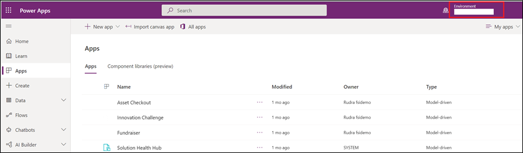](../media/trial-environment.png#lightbox)

1. In the left nav, select **Apps** and then select **+New app** then **Portal**.

    > [!div class="mx-imgBorder"]
    > 

1. Set the new portal properties as shown below and select **Create**.

    - **Name:** Woodgrove Banking Portal

    - **Address :** fsitrialdemo

1. Select **Use data from existing website record**.

    > [!div class="mx-imgBorder"]
    > [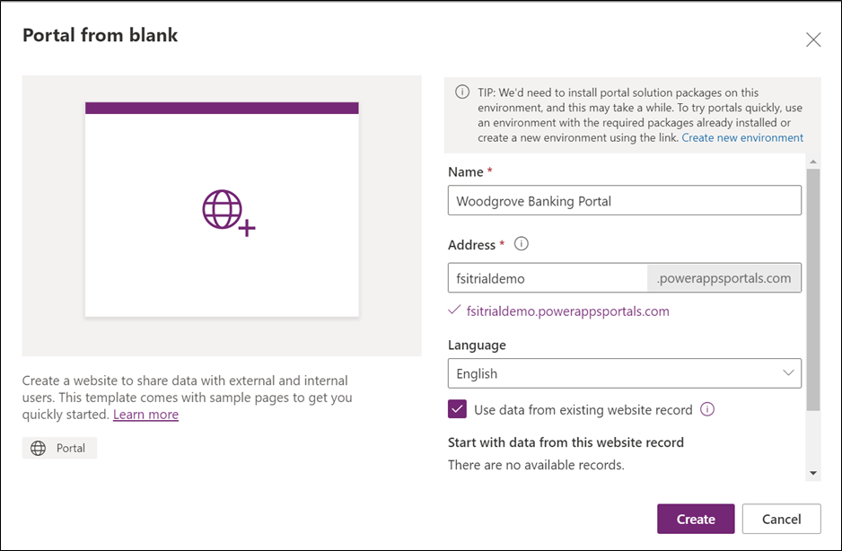](../media/portal.png#lightbox)

Your portal will provision in the background. This will take several minutes so you can pause before proceeding to the next task.

## Task 2: Enable advanced Teams integration

In this task, we'll enable advanced Teams in integration used in Collaboration Manager for Loans application.

1. Using your tenant credentials, navigate to [https://make.powerapps.com](https://make.powerapps.com/?azure-portal=true) and select your environment. Select the settings icon and then on **Advanced settings**.

    > [!div class="mx-imgBorder"]
    > [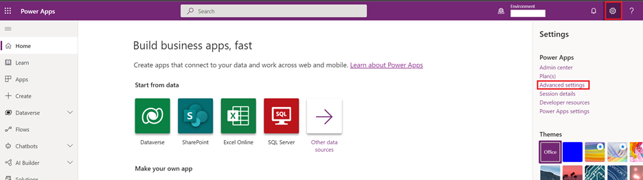](../media/advanced.png#lightbox)

1. This will launch the Dynamics application in another tab. Select **Settings -> Administration**.

    > [!div class="mx-imgBorder"]
    > [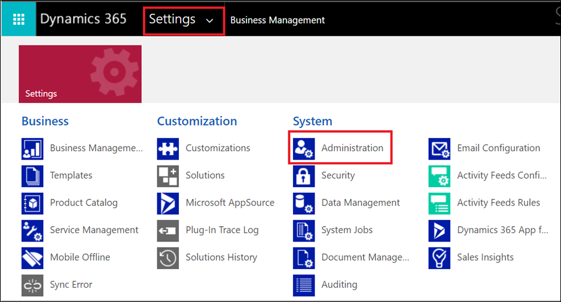](../media/administration.png#lightbox)

1. Select **System settings**.

    > [!div class="mx-imgBorder"]
    > [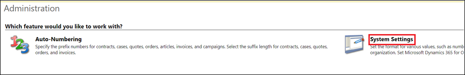](../media/system.png#lightbox)

1. This will launch the settings window. Set the below checkboxes one by one and select **OK**.

    > [!div class="mx-imgBorder"]
    > 

## Task 3: Deploy Microsoft Cloud for Financial Services

In this task, we'll deploy all of the Microsoft Cloud for Financial Services capabilities.

1. While logged into your Microsoft 365 tenant, open a new tab and navigate to [https://aka.ms/solutioncenter](https://aka.ms/solutioncenter/?azure-portal=true) to access the Microsoft Cloud Solution Center. Select the Microsoft Cloud for Financial Services button to begin the setup.

    > [!div class="mx-imgBorder"]
    > 

1. Select **Unified customer profile** capability.

    > [!div class="mx-imgBorder"]
    > [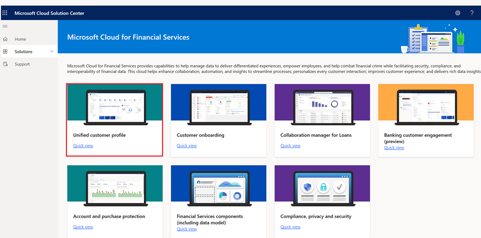](../media/unified.png#lightbox)

1. In the **Filter by capability** dropdown, select **All**.

    > [!div class="mx-imgBorder"]
    > [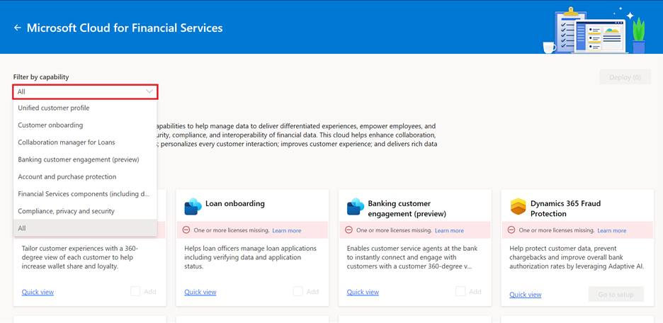](../media/capability.png#lightbox)

1. Select **Add all FSI capabilities** checkbox and unselect **Customer intelligence**. Then select **Deploy**.

    > [!div class="mx-imgBorder"]
    > [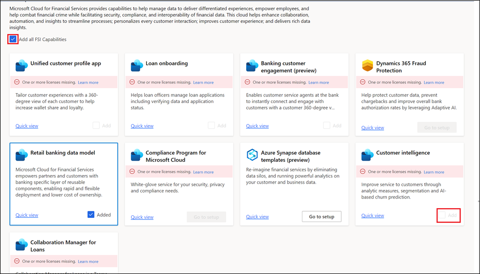](../media/add-all.png#lightbox)

1. Select both checkboxes for Sample data and Sample portal and select **Next**.

    > [!div class="mx-imgBorder"]
    > [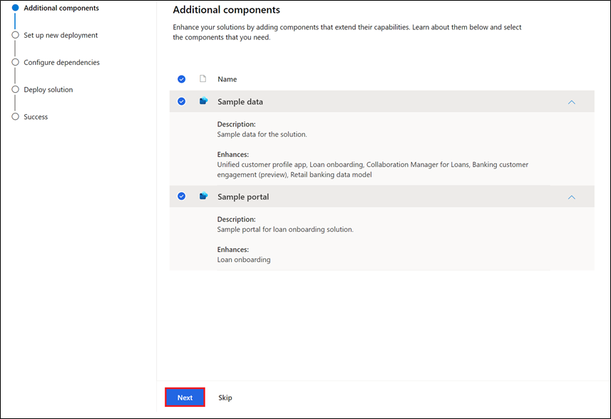](../media/sample.png#lightbox)

1. Select your environment from the dropdown, check **Terms of service**, and select **Next**.

    > [!div class="mx-imgBorder"]
    > [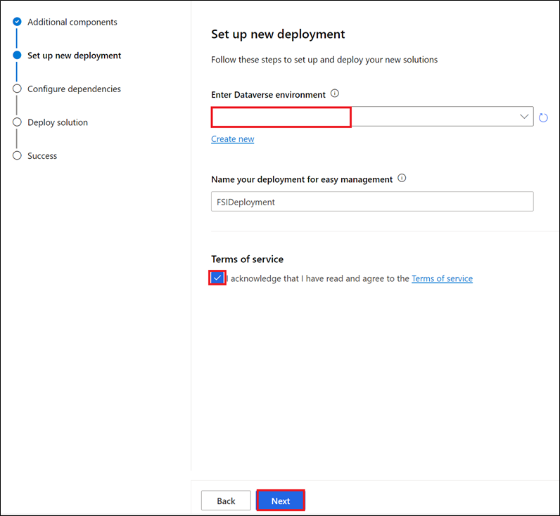](../media/deployment.png#lightbox)

1. You'll now see that all pre-deployment dependencies are installed and configured. Select **Deploy** to complete the installation.

    > [!div class="mx-imgBorder"]
    > [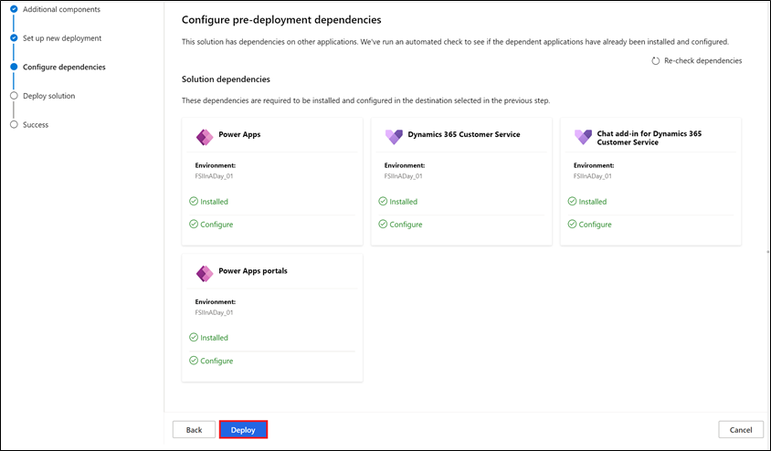](../media/deploy.png#lightbox)

1. Congratulations! You're done! The Microsoft Cloud for Financial Services deployment will take several hours to complete. You can monitor this screen to check the deployment status, or you can view the status of the apps in [https://aka.ms/ppac](https://aka.ms/ppac/?azure-portal=true).
