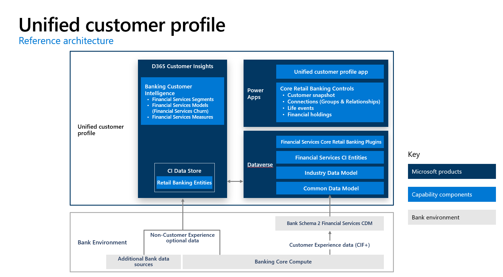

The **Unified customer profile** application shows a 360-degree perspective of the customer consolidated into a unified dashboard. It offers an accurate, consistent, and cohesive source of truth about the customer. This customer information can be used to provide personalized experiences, reveal important opportunities, prevent potential loss, or churn, and improve customer satisfaction.

Key capabilities of Unified customer profile include:

-   **Summary:** Consists of an at-a-glance summary of the customer, their personal details, life moments, financial holdings, and credit and debit cards.

-   **Connections:** Help capture relationships between a customer and its related Groups and contacts. This helps in understanding the overall financial strength of the customer in reference to the relationships/groups (such as household) that they participate in.

-   **Financial holdings:** View detailed information about all the financial holdings associated with the customer.

## Industry prioritized scenarios

Unified customer profile focuses on both **Deliver differentiated Customer Experience and Empower Employees** priority scenarios. It helps you benefit from a data-first experience that brings together financial details, Life events, and household information into a single view. It also helps centralize your customer data in a single place via Microsoft Dataverse and the industry data model.

> [!div class="mx-imgBorder"]
> 

## Reference architecture

Below is the reference architecture of Unified customer profile

> [!div class="mx-imgBorder"]
> 
